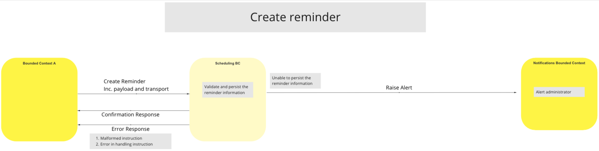
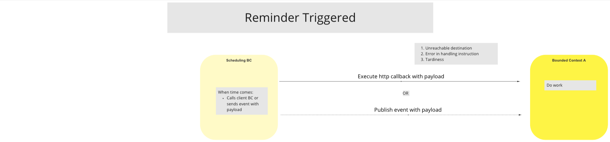
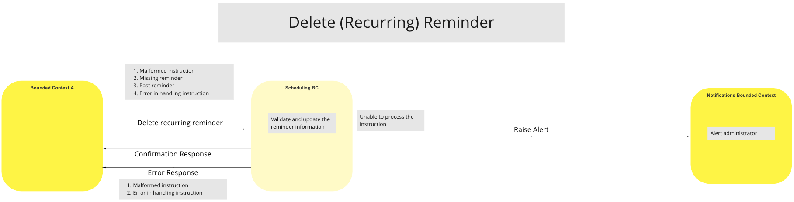

# BC de Planification (Scheduling BC)

De nombreux processus et événements dans les différents BCs de la plateforme Mojaloop Switch nécessitent une fonctionnalité permettant de déclencher des actions à des moments précis ou selon un calendrier défini. Afin de prendre en charge ce besoin de manière centralisée et d’éviter d’implémenter cette fonctionnalité dans chaque BC, un seul BC dédié à la planification sera introduit et mis en œuvre sur la plateforme Switch.

Pour planifier un processus ou un événement, un BC Client soumet une demande au Scheduling BC pour créer un rappel destiné à être déclenché à un horaire précis ou selon une récurrence. Le Scheduling BC maintient un registre de tous les rappels reçus et, lorsque le moment fixé arrive, il envoie une notification du rappel au BC Client concerné.

De plus, le Scheduling BC fournit aussi des services permettant aux BC Clients et aux administrateurs du Switch de gérer les rappels enregistrés dans le Scheduling BC.

## Termes

Le(s) terme(s) suivant(s) sont utilisés dans ce BC :

| Terme | Description |
|---|---|
| **BC Client** | Tout autre BC utilisant les services du Scheduling BC |

## Cas d’Utilisation

<!--***Remarque:*** *Un cas d’utilisation “Mise à jour de rappel” (Update Reminder) n’est pas inclus. La recommandation est de supprimer et de créer un nouveau rappel.*
-->
L’état des cas d’utilisation (UC) pour le Scheduling BC est le suivant :

| UCs Disponibles |  |  | UCs Prévu(e)s |  |
| --- | :-- | --- | --- | :-- |
| **Cas d’Utilisation** | **Description** | | **Cas d’Utilisation** | **Description** |
| **Créer un rappel** | Le BC Client demande la création d’un rappel | | **Requête rappel du client** | Le BC Client interroge ses propres rappels |
| **Supprimer un rappel** | Le BC Client demande la suppression d’un rappel | | **Requête rappel de l’admin** | L’administrateur de la plateforme interroge tous les rappels |
| **Déclenchement du rappel** | Le Scheduling BC déclenche le rappel lorsque le moment est venu | | |
| **Mettre à jour un rappel** | *Non fourni. Solution recommandée : supprimer puis recréer un rappel* | | |  |  |

<!---Les cas d’utilisation suivants sont prévus pour le Scheduling BC :

| Cas d’Utilisation | Description |
| --- | :-- |
| Requête rappel du client | Le BC Client interroge ses propres rappels |
| Requête rappel de l’admin | L’administrateur de la plateforme interroge tous les rappels |
| Déclenchement du rappel | Le Scheduling BC déclenche le rappel lorsque le moment est venu |
--->
### Créer un rappel

#### Description
Ce flux permet au Switch de traiter les demandes autorisées des BC Clients pour créer des rappels.

#### Diagramme de flux

>
### Rappel déclenché

#### Description
Ce flux permet au Switch de traiter les rappels envoyés du Scheduling BC à un BC Client pour déclencher une tâche, ou simplement comme rappel.

#### Diagramme de flux

>
### Suppression d’un rappel (récurrent)

#### Description
Ce flux permet au Switch de gérer la suppression d’un rappel par un BC Client autorisé. Si le Scheduling BC ne parvient pas à traiter l’instruction, il envoie un message d’alerte au BC Notifications.

#### Diagramme de flux

>

<!-- Les notes de bas de page sont situées en bas. -->
## Notes

#### Créer un rappel – Données requises

La demande de création de rappel doit comporter les données suivantes :

| Donnée | Description |
| --- | ---- |
| **Identifiant** | nom/id |
| **Définition Cron** | récurrence ?, intervalle ? |
| **Transport de déclenchement** | Callback HTTP/Événement ; URL de Callback ou sujet d’événement |
| **Payload spécial** | opaque pour le Scheduling BC |
| **Conditions de reprise** | nouvelle tentative, replanification, abandon, annulation |
| **Alertes** | notification, journalisation en cas d’exception |
| **Actions** | registre des processus BC automatisables/planifiables |

#### Scheduling BC – Exigences

Le Scheduling BC doit répondre aux exigences suivantes :

* Les rappels ne doivent être déclenchés qu’une seule fois

* Le BC doit conserver l’historique des rappels déclenchés

* Le BC doit garder l’historique des opérations de Création/Lecture/Suppression

    * Les mises à jour seront réalisées via les actions Suppression/Création, comme indiqué dans la section [UC disponibles](#use-cases)

* Prise en charge de lots de tâches

* Offrir plusieurs options d’interface (gRPC, REST, HTTP, etc.)

* Les rappels doivent être déclenchés par un callback HTTP, pas par appel gRPC, ni vers un sujet spécifique

* Ne pas prendre en charge le traitement de logique externe au Scheduling BC lui-même

* Utiliser exclusivement les timestamps UTC basés sur Linux pour éviter les problèmes de synchronisation

***Remarque :*** *Le système sous-jacent est supposé conserver une mesure du temps exacte.*

#### Scheduling BC – Exigences en suspens

Les exigences d’accès pour le Scheduling BC restent à définir.

#### Scheduling BC – Exceptions

* Instructions malformées
    * Date/heure invalide, y compris dans le passé
    * BC ou commande invalide
* Échec d’exécution (identifié via le callback)
* Autorité insuffisante du BC Client pour réaliser l’opération C/S/S (CRD)
* Échec du traitement/déclenchement du rappel

#### Questions

Certaines questions sont apparues lors des sessions d’architecture de référence. Jugées utiles pour le plus grand nombre, elles sont incluses ci-dessous :

* Après que la tâche planifiée a été lancée, le Scheduling BC reste-t-il responsable du suivi de sa progression ?

    * Réponse : Non. Lorsque le rappel est dû, il est communiqué au BC Client selon la méthode prévue, et la responsabilité du rappel est alors transférée au BC Client.

* Est-ce le BC Client ou la personne qui a planifié le rappel qui est noté comme « Utilisateur » par le Scheduling BC ? En d’autres termes, quelle ID est inscrite dans l’audit trail ?

    * Réponse : Cela doit être déterminé par le BC Client, selon l’action qu’il entreprend à la réception du rappel.