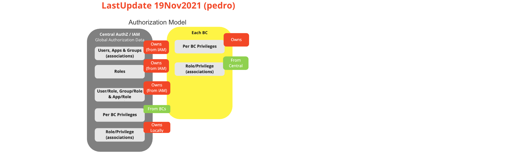
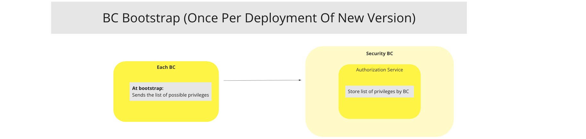
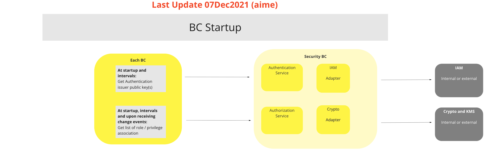
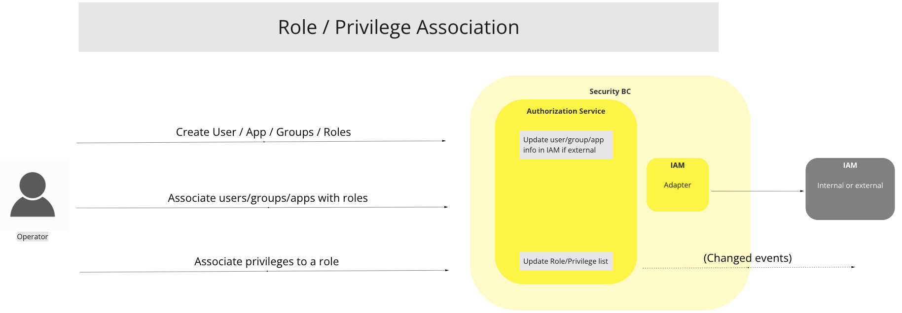
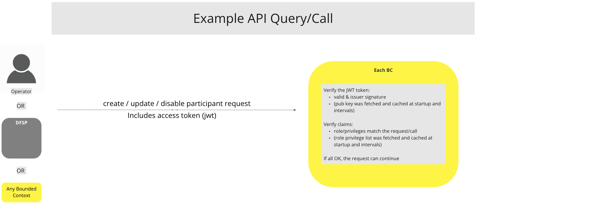

# BC Sécurité

## Vue d'ensemble

Le protocole est basé sur le modèle requête-réponse, utilisant le protocole sécurisé Hypertext Transfer Protocol Secure (HTTPS). Tous les services utilisent les méthodes HTTP POST et GET. Les corps des requêtes et des réponses sont encodés en texte formaté JSON.

## Termes

Termes ayant une signification spécifique et communément acceptée dans le Contexte Borné Sécurité.

| Module | Description |
|---|---|
| **Fournisseurs Crypto** | Adaptateur qui fournit les services cryptographiques et les services de gestion de clés (KMS) |
| **IAM** | Gestion des Identités et des Accès (Identity and Access Management). Adaptateur qui fournit les services de gestion des utilisateurs, menus, profils, rôles et permissions.  |
| **AuthN** | Module d’authentification. Nécessite un identifiant utilisateur et un mot de passe, et retourne un jeton JWT. |
| **AuthZ** | Module d’autorisation. Nécessite un JWT et un certificat (clé publique). Vérifie les ROLES du JWT et la signature. |
| **JWT** | JSON Web Token. Renvoyé après une authentification utilisateur réussie. Contient les détails de l’utilisateur, les ROLES et la signature.   |
| **KMS** | Système de Gestion de Clés (Key Management System). Gère le cycle de vie des clés cryptographiques (définition, création et retrait). Fait partie du sous-système Crypto. |

## Cas d’Utilisation

### Connexion Utilisateur / Opérateur du BC (AuthN)

#### Description

La fonction de connexion requiert que l’identifiant utilisateur et une clé secrète soient transmis dans le corps http. La réponse contient un jeton JWT signé. La signature est générée par le sous-système Crypto. La connexion est réalisée par les services d’autorisation ou l’IAM.

#### Diagramme de flux

_Apr22_1829.png)
> Diagramme de workflow CU : Connexion Utilisateur / Opérateur du BC (AuthN)

### Modèle d’Autorisation du BC (AuthZ)

#### Description

IAM fournit l'association des utilisateurs/groupes, rôles et privilèges. Chaque BC dispose également d’une liste de rôles correspondants. Lorsqu’une fonction API ou un microservice est appelé, la signature du JWT est vérifiée à l’aide de la clé publique et le rôle renseigné dans le JWT est comparé au rôle associé au BC. Si la vérification de la signature et celle du rôle sont réussies, la fonction API ou le microservice est exécuté.

#### Diagramme de flux

> Diagramme de workflow CU : Modèle d’Autorisation du BC (AuthZ)

### Bootstrap du BC

#### Description

Au démarrage ("bootstrap"), le BC envoie la liste des privilèges possibles. Cette opération est effectuée une fois à chaque déploiement d’une nouvelle version.

#### Diagramme de flux

> Diagramme de workflow CU : Bootstrap du BC

### Démarrage du BC

#### Description

Au lancement, le BC demande les clés publiques de l’émetteur d’authentification auprès des sous-systèmes Crypto / KMS du BC Sécurité ainsi que la liste des rôles/privilèges auprès du sous-système IAM du BC Sécurité. Une fonction locale de vérification de signature via une librairie cryptographique vérifie la signature JWT et les rôles dans le JWT sont comparés à la liste locale de rôles obtenue du service central d’autorisation.

##### Diagramme de flux

> Diagramme de workflow CU : Démarrage du BC

### Association Rôle / Privilège

#### Description

Les rôles sont associés à un certain nombre de privilèges.

#### Diagramme de flux

> Diagramme de workflow CU : Association Rôle / Privilège

### Exemple de Requête / Appel

#### Description

L’autorisation client doit être réalisée à l’aide d’un jeton d’accès (access token). Un client doit d’abord demander au service d’autorisation de générer un jeton d’accès pour l’utilisateur qui souhaite accéder à l’interface. Cet utilisateur est authentifié dans le service d’autorisation. Le jeton d’accès généré est ensuite utilisé pour l’autorisation sur l’interface.
Pour utiliser le jeton d’accès, le client doit positionner l’entête HTTP Authorization à Bearer [access_token] sur chaque requête adressée à l’interface.

#### Diagramme de flux

> Diagramme de workflow CU : Exemple de Requête API / Appel

<!-- Les notes de bas de page placées en bas. -->
<!--## Notes

[^1]: Interfaces communes : [Liste d’interfaces communes Mojaloop](../../commonInterfaces.md)
-->