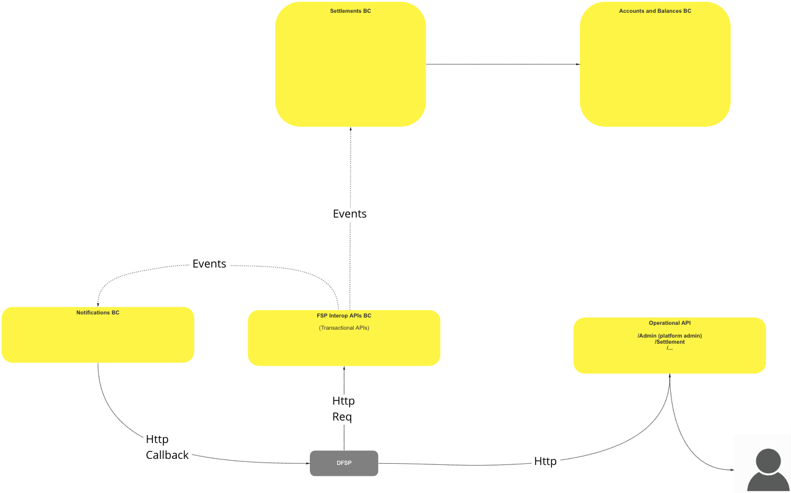
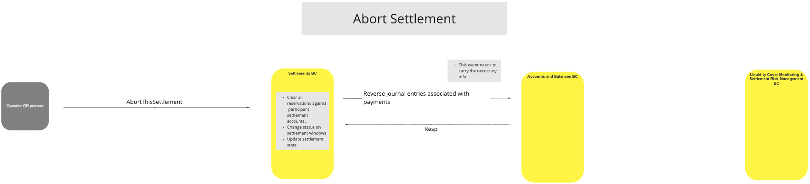
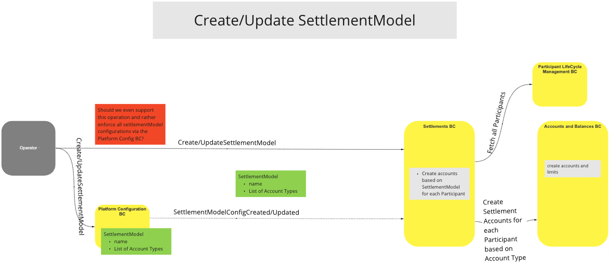
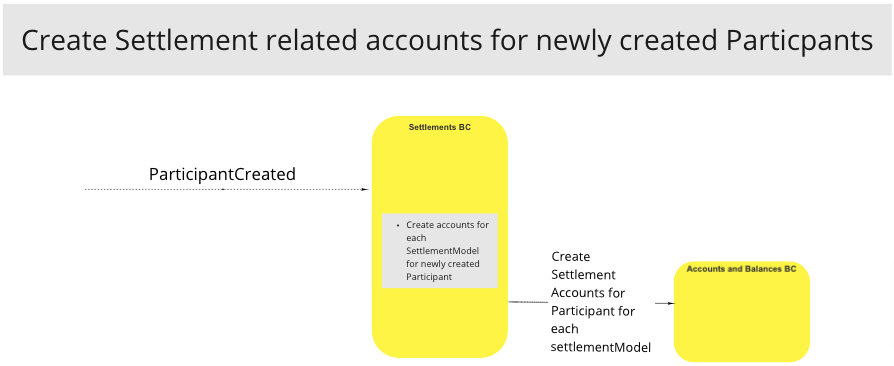

# BC Règlements (Settlements BC)

Le BC Règlements est essentiel pour le règlement des transferts des Participants, en utilisant soit la méthode de Règlement Net Différé (DNS), soit celle de Règlement Brut Immédiat (IGS). Il est responsable de la création des fenêtres de règlement, de l’identification et du déploiement de la méthode de règlement requise (DNS/IGS), du règlement, de la clôture et de la mise à jour des lots, ainsi que de l’enregistrement de tous les dépôts et retraits sur les comptes appropriés dans le BC Comptes et Soldes.

## Termes

Les termes suivants sont utilisés dans ce BC, aussi appelé domaine.

| Terme         | Description  |
| ------------- | ------------ |
| **DNS** | Règlement Net Différé (Deferred Net Settlement) |
| **IGS/RTGS** | Règlement Brut Immédiat/Règlement Brut en Temps Réel (Immediate Gross Settlement/Real-Time Gross Settlement) |
| **Opérateur** | Personne ou système émettant des instructions/demandes |
| **Participant** | FSP/PISP ou client FSP |
| **Compte** | Compte général de registre (Cr/Dr) |

## Vue Fonctionnelle

>

## Cas d’Utilisation

### Règlement Net Différé (DNS)

#### Description
Méthode permettant de différer les paiements afin de procéder au règlement sur plusieurs lots selon un calendrier prédéfini. Ceci est utile pour les environnements impliquant plusieurs Participants à une transaction nécessitant une approche de règlement du solde à payer.

#### Diagramme de flux

>Diagramme du parcours UC : Règlement Net Différé - 19/10/2021

### Règlement Brut Immédiat (IGS)

#### Description
Méthode permettant le règlement immédiat des lots. Ceci est utile pour les environnements PME où des paiements rapides sont souvent souhaités afin de maximiser la liquidité. IGS est également connu sous le nom de Règlement Brut en Temps Réel (RTGS).

#### Diagramme de flux

>Diagramme du parcours UC : Règlement Brut Immédiat

### Annulation du Règlement

#### Description
Méthode permettant au BC Règlements d’annuler un règlement si nécessaire, en inversant les comptes de règlement des Participants, en mettant à jour le statut du règlement pour les fenêtres de règlement et en mettant à jour l’état du règlement.

#### Diagramme de flux

>

### Création/Mise à jour du modèle de règlement (DNS/IGS)

#### Description
Méthode permettant au BC Règlements de créer ou mettre à jour la méthode de règlement pour un lot de règlement, en fonction du type de compte Participant. Utile dans les cas où des méthodes de règlement mixtes sont nécessaires.

#### Diagramme de flux

>

### Initialisation du modèle de règlement via configuration

#### Description
Méthode configurant la méthode de règlement (DNS/IGS) sur la base de la configuration de démarrage du système. Utile dans les cas où tous les modèles de règlement sont identiques, par exemple, tous en DNS ou tous en IGS.

#### Diagramme de flux

>Diagramme du parcours UC : Initialisation du modèle de règlement via configuration

### Création de comptes liés au règlement pour les nouveaux Participants

#### Description
Le système crée des comptes de règlement pour les nouveaux Participants afin de permettre la gestion des transferts de fonds par le Switch. Cela permet au Switch d'assurer la gestion de bout en bout de tous les transferts, quel que soit le mode de règlement utilisé.

#### Diagramme de flux

>

<!-- Notes en bas de page. -->
<!-- ## Notes -->

[^1]: Interfaces communes : [Liste des Interfaces Communes Mojaloop](../../commonInterfaces.md)
