# BC Third Party API

Le Third Party API BC a été implémenté dans le cadre de l’architecture de référence Mojaloop 2.0 afin de permettre aux opérateurs PISP tiers (généralement des applications) d’interagir avec la plateforme. Veuillez noter que, sauf indication contraire, toutes les références aux BC concernent les différents composants ou Bounded Contexts (BCs) de Mojaloop.

## Termes

Les termes communs suivants sont utilisés dans ce BC :

| Terme      | Description  |
| ---------- | ------------ |
| **PISP**   | PISP (Payment Initiation Service Provider) (par exemple PayPal, ApplePay, GooglePay, etc.) |
| **DFSP**   | DFSP (Digital Financial Service Provider) (par exemple Banque, Opérateur de Mobile Money) |
| **Utilisateur** | Client DFSP/PISP (selon indication) |

## Cas d’Utilisation

**Remarque :** Nos cas d’usage couvrent deux scénarios spécifiques :

| Scénarios   | Description                 |
| ----------- | -------------------------- |
| [Liaison](#linking-scenarios)           | Activités de maintenance PISP       |
| [Transfert](#transfer-scenarios)        | Activités d’initiation de transfert PISP |

## Scénarios de Liaison

### Obtention par le PISP des DFSP pris en charge

#### Description

Ce flux permet au Switch de traiter les demandes autorisées d’utilisateurs PISP pour obtenir une liste de DFSP Account Holders pris en charge par le système.

#### Schéma de Flux

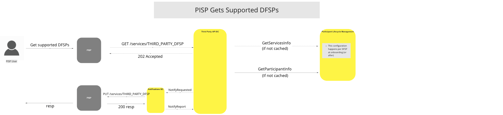
>Schéma de workflow UC : Obtention par le PISP des DFSP pris en charge

### Obtention par le PISP de la liste des comptes pour un DFSP + Identifiant

#### Description

Ce flux permet au Switch de traiter les cas où des utilisateurs PISP autorisés souhaitent rechercher les détails de leurs comptes de titulaire DFSP à l’aide de leur DFSP Account Holder Identifier. Généralement, l’Identifier est intégré dans une application ou un processus émanant du PISP.

#### Schéma de Flux

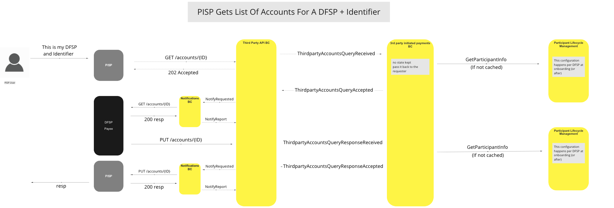
>Schéma de workflow UC : Obtention par le PISP de la liste des comptes pour un DFSP + Identifiant

### PISP Consent Request

#### Description

Ce flux permet au Switch de gérer les cas où un utilisateur PISP autorisé notifie son DFSP Account Holder de son intention de lier un ou plusieurs de ses comptes à un PISP via une Consent Request. Cette demande est satisfaite via un processus d’émission de consentement hors bande, suite à la réception d’une réponse à une demande de confirmation d’autorisation. Ce processus établit une relation de confiance entre le PISP User, le PISP, et le DFSP Account Holder. Le Switch met à jour les détails des comptes participants en conséquence.

#### Schéma de Flux

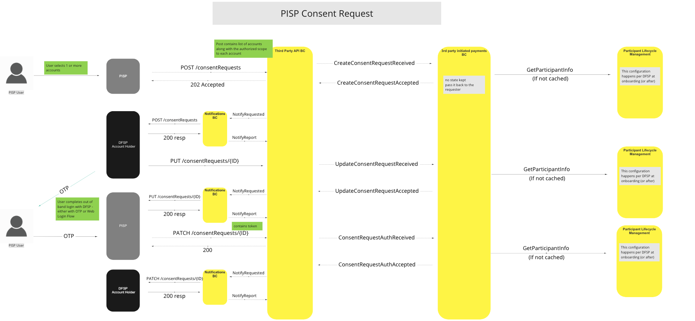
>Schéma de workflow UC : PISP Consent Request

### DFSP Issue Consent

#### Description

Ce flux permet au Switch de gérer les cas où un DFSP Account Holder répond à une Consent Request reçue d’un PISP User autorisé et authentifié. Le DFSP Account Holder émet une demande au PISP via le Switch pour que le PISP User crée un Credential sur son appareil. Une fois le Credential reçu et vérifié par le DFSP Account Holder émetteur, le Switch et les enregistrements de compte DFSP Account Holder sont mis à jour avec le PISP User Credential et les Accounts liés, et le PISP User est notifié que son/ses DFSP Account Holder Account/s a/ont été lié(s) avec succès à son PISP profile.

***Remarque :*** *L’Issue Consent est en réponse à une Consent Request faite par un PISP User autorisé pour lier un ou plusieurs de ses DFSP Account Holder Accounts à son PISP profile et suit le flux décrit dans la section [PISP Consent Request](#pisp-consent-request) ci-dessus.*

#### Schéma de Flux

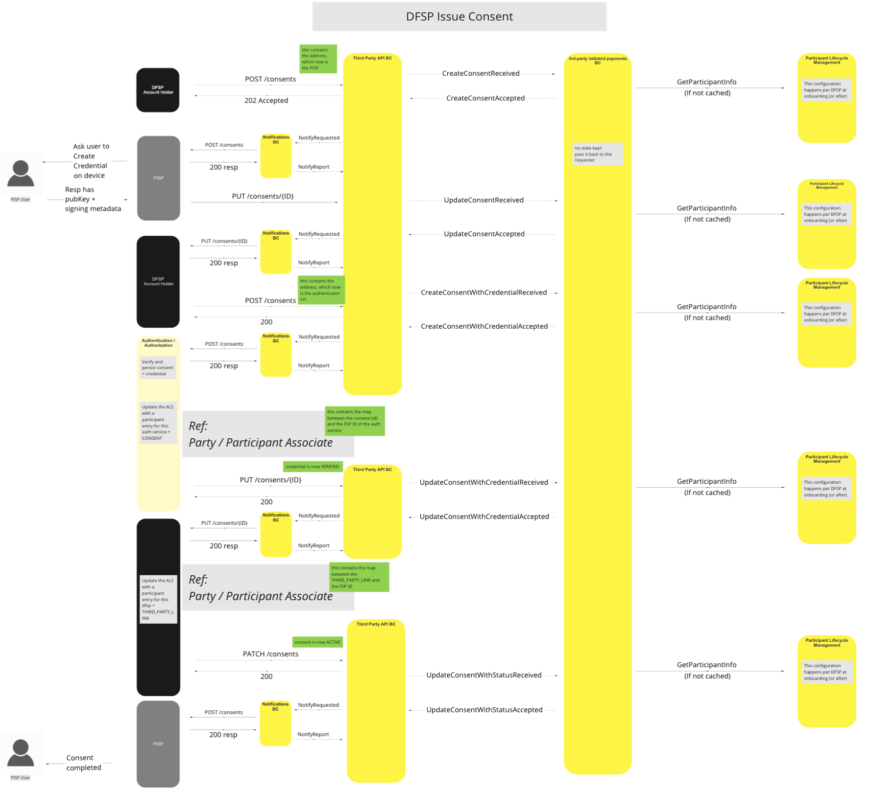
>Schéma de workflow UC : DFSP Issue Consent

### Unlink Accounts : Hub Hosted Auth

#### Description

Ce flux permet au Switch de gérer une demande autorisée de PISP/DFSP Account Holder pour révoquer le consentement pour qu’un DFSP Account Holder Account soit lié à son PISP Profile. Le Switch traite en mettant à jour le Account Lookup Service du système pour dissocier l’association PISP Participant/DFSP Account, notifiant le DFSP Account Holder (qui retire l’entrée ALS Participant et le Link de son système), et le PISP Host qui envoie une notification de réalisation au User.

#### Schéma de Flux

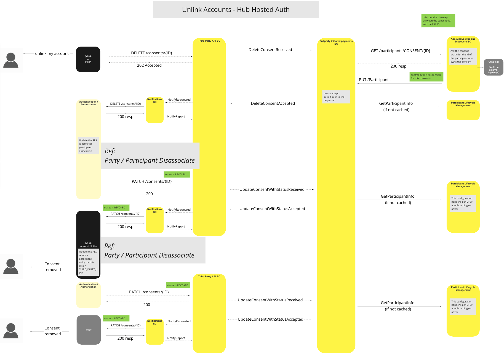
>Schéma de workflow UC : Unlink Accounts - Hub Hosted Auth

### Link Accounts - Account Discovery Failure

#### Description

Ce flux permet au Switch de gérer les cas où un PISP User autorisé initie une demande pour lier un DFSP Account à son PISP Profile en utilisant une paire DFSP/Identifier invalide non reconnue par le DFSP. Le DFSP envoie un message au Switch avec une erreur, qui notifie le PISP approprié, et le User reçoit un message pour essayer une autre paire DFSP/Identifier.

#### Schéma de Flux

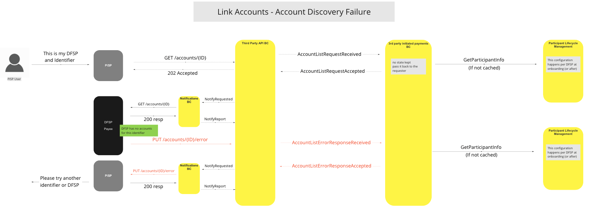
>Schéma de workflow UC : Link Accounts - Account Discovery Failure

### Link Accounts - DFSP Rejects Consent Request

#### Description

Ce flux permet au Switch de gérer les cas où un PISP User autorisé demande qu'un ou plusieurs accounts soient liés à son PISP Profile par le DFSP Account Holder. Lorsque le DFSP Account Holder refuse le consentement pour la liaison pour une raison quelconque, par exemple : un account sélectionné ne prend pas en charge la liaison, il enverra un message au Switch avec une condition d’erreur. Le Switch notifie le PISP approprié, et le PISP User reçoit un message, in-app ou autrement, pour réessayer sa demande car la demande de liaison de compte précédente a échoué.

#### Schéma de Flux

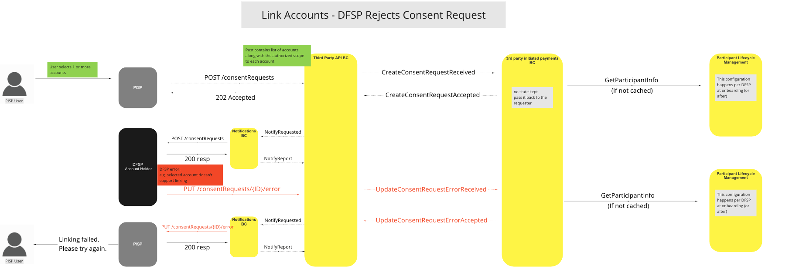
>Schéma de workflow UC : Link Accounts - DFSP Rejects Consent Request

### Credential Registration Error

#### Description

Ce flux permet au Switch de gérer les cas où un DFSP Account Holder fournit à un PISP une demande pour qu'un (PISP) User crée un credential embarqué sur appareil pour confirmer une Consent Request, où le credential, qui lorsqu'il est envoyé au DFSP inclut soit un signed challenge invalide soit des signed metadata rejetées. Dans cette instance le DFSP envoie un message de la condition d'erreur au Switch, qui envoie un message au PISP approprié qui notifie le (PISP) User que le Consent credential a été rejeté.

#### Schéma de Flux

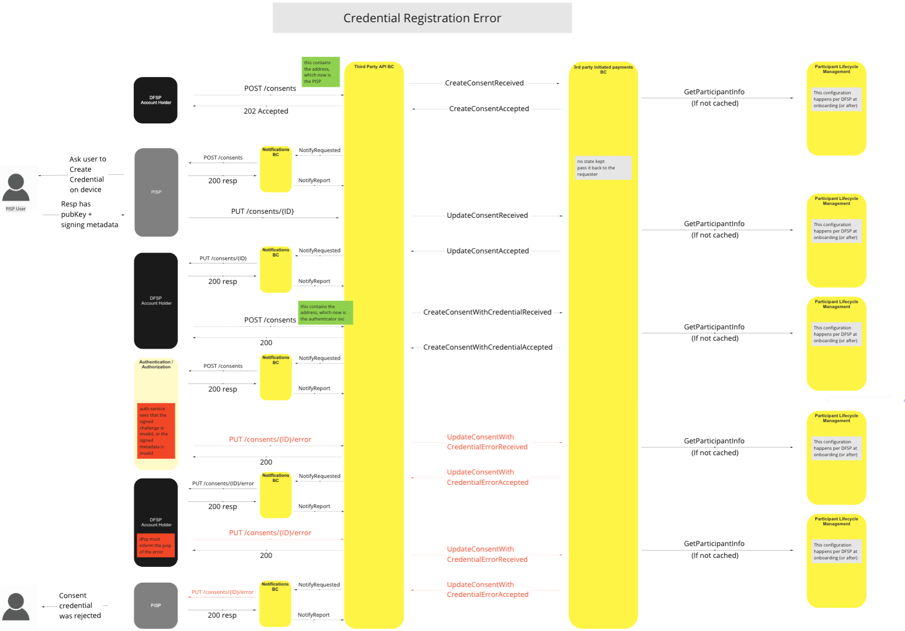
>Schéma de workflow UC : Credential Registration Error

### Unlink Accounts - Consent Not Found

#### Description

Ce flux permet au Switch de gérer les cas où un PISP User autorisé est demandé de confirmer une consent request émise via soit le PISP soit le DFSP Account Holder pour unlink son DFSP Account de son PISP Profile. Le Switch réfère la consent request response au Consent Oracle pour confirmation du Consent Owner ID. Dans les instances où l’Oracle est incapable de confirmer l’ID du Consent Owner, la demande échoue. Le PISP User est alerté via le DFSP Account Holder ou le PISP profile holder, que le DFSP Account qu’il a cherché à unlink de son PISP profile n’a pas été trouvé.

#### Schéma de Flux

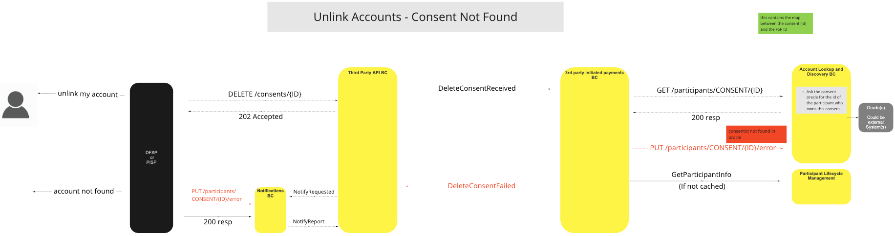
>Schéma de workflow UC : Unlink Accounts - Consent Not Found

### DFSP Rejects OTP/Auth Token from PISP

#### Description

Ce flux permet au Switch de gérer les cas où un PISP User autorisé demande qu’un ou plusieurs de ses DFSP Account Holder Accounts soient liés à son PISP Profile. La demande est dirigée par le Switch vers le DFSP Account Holder qui émet un OTP/Web Login Flow au PISP User pour des fins de vérification qui est retourné via le PISP au Switch, et ensuite au DFSP Account Holder pour consent. Dans les instances où le token de réponse est altéré ou expiré, le DFSP Account Holder émet un message de condition d’erreur au Switch et le PISP User est notifié que la demande de liaison de DFSP Account a échoué.

#### Schéma de Flux

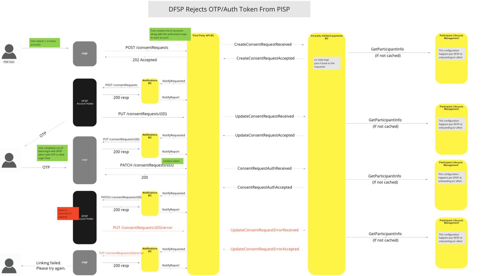
>Schéma de workflow UC : DFSP Rejects OTP/Auth Token from PISP

### Unlink Accounts - Downstream Failure

#### Description

Ce flux permet au Switch de gérer les cas où la confirmation de consentement de unlink de DFSP Account d’un PISP User autorisé échoue à l’étape d’Authentication/Authorisation du Switch pour une raison quelconque, exemple : une erreur downstream FSPIOP API. L’erreur est messagée par le Switch au DFSP Account Holder qui examinera l’erreur et déterminera comment répondre. Lorsqu’une erreur s’est produite, le PISP User est notifié par le Switch via le PISP que sa demande pour unlink son DFSP Account a échoué.

#### Schéma de Flux

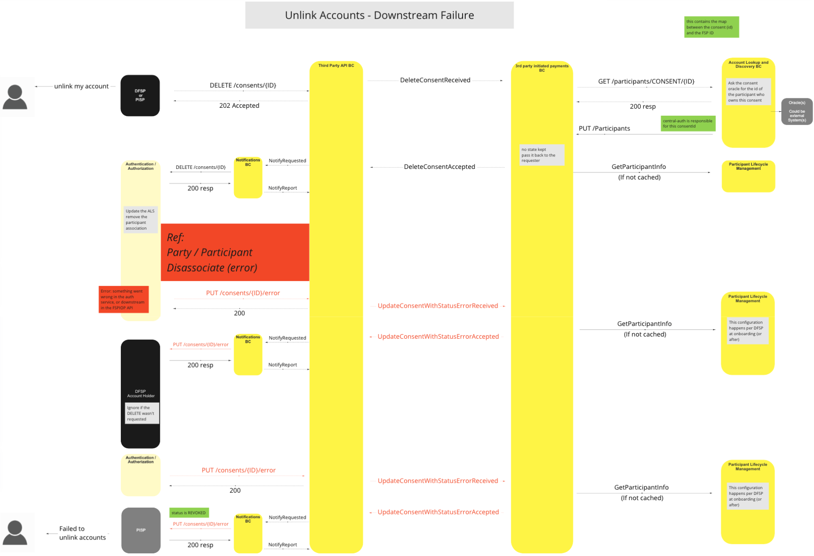
>Schéma de workflow UC : Unlink Accounts - Downstream Failure

## Scénarios de Transfert

***Remarque :*** *Pour alléger la description du flux, le lecteur doit noter que le BC API Tiers Partie et le BC Paiements Initiés par Tiers travaillent de concert pour maintenir le Participant Information – l’interaction n’est pas toujours précisée ici, mais se fait ainsi : lorsque le Third Party API BC met à jour le Transaction state, et où le Participant Information n’est pas en cache, le BC Paiements Initiés par Tiers sollicitera le Participant Information manquant du BC Gestion du Cycle de Vie des Participants et le livrera au Third Party API BC pour inclusion dans le Transaction information présenté aux systèmes DFSP/PISP.*

### Third Party Initiated Transaction Request

#### Description

Ce flux permet au Switch d’autoriser les PISP Users/Apps autorisés à émettre une demande à un DFSP pour exécuter une transaction au nom d’un Account Holder, typiquement le PISP User/App, en faveur d’un third-party recipient ou recipients. La transaction est vétérinée via une DFSP confirmation request à l’Account Holder, et conclue sur réception réussie de confirmation. Le Switch, selon les instructions DFSP, gère la transaction et met à jour tous les accounts en conséquence.

Quelques applications suggérées de Third Party Payment Initiation UC incluent :

 - Paiements pair à pair (ex. : GPay en Inde)
 - Paiements en ligne pour une expérience utilisateur finale fluide (UX) (ex. : PayPal)
 - Logiciels de liquidation de paie

#### Schéma de Flux

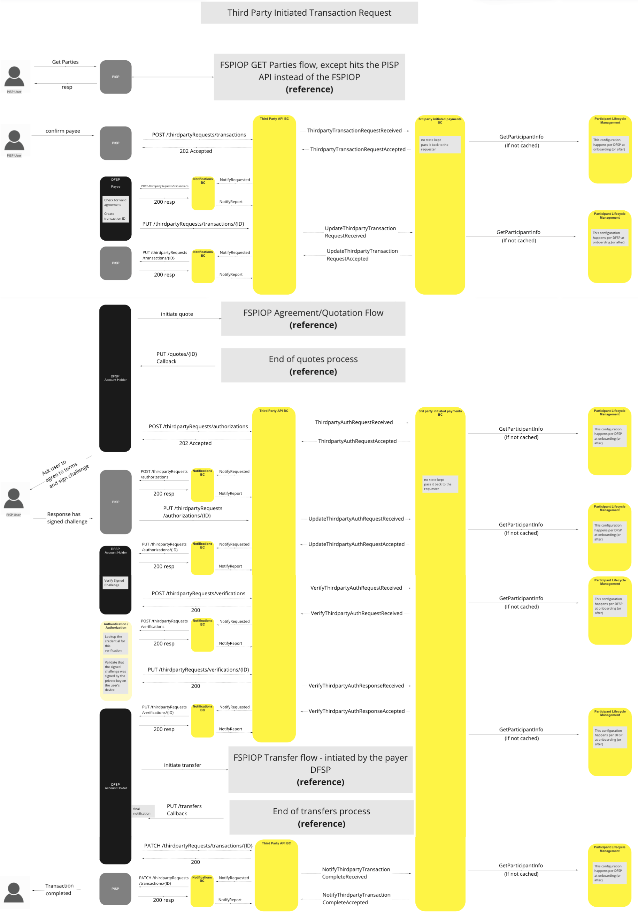
>Schéma de workflow UC : Third Party Initiated Transaction Request

### PISP Bulk Transaction Request

#### Description

Ce flux permet au Switch de traiter les cas où des PISP Users/Apps autorisés émettent une demande à un DFSP pour exécuter un nombre de bulk transactions au nom d’un Account Holder, typiquement le PISP User/App, en faveur d’un groupe de third-party recipients. La transaction est vétérinée via une DFSP confirmation request envoyée à l’Account Holder, et conclue sur réception réussie de confirmation. Le Switch, selon les instructions DFSP, gère la transaction et met à jour tous les accounts en conséquence.

#### Schéma de Flux

>Schéma de workflow UC : PISP Bulk Transaction Request

### Pay To A PISP - PISP As A Payee

#### Description

Ce flux permet au Switch d’autoriser les DFSP Users autorisés à initier et exécuter des paiements en faveur de PISPs en tant que Payees via le Switch. Le flux prend en charge les paiements vers un ou plusieurs PISP en tant que Bénéficiaire (Payee).

#### Schéma de Flux

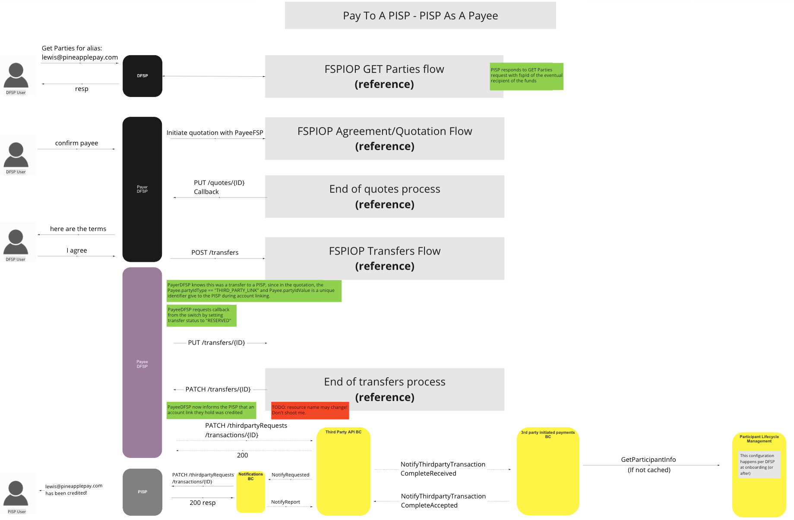
>Schéma de workflow UC : Pay To A PISP - PISP As A Payee

### Échec de la recherche de participant

#### Description

Ce flux permet au Switch de gérer les cas où un PISP User autorisé initie une transaction avec un identifiant de Participant invalide. L’erreur est détectée à l’étape Get Parties de la préparation de la transaction et la demande est automatiquement terminée, avec notification envoyée au User initiateur de la demande indiquant l’échec et la raison.

#### Schéma de Flux

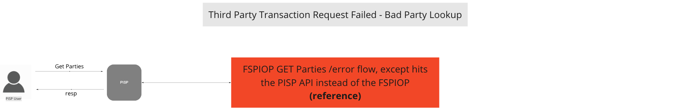
>Schéma de workflow UC : Échec de la recherche de participant

### Third Party Transaction Request Failure - Invalid Transaction Request

#### Description

Ce flux permet au Switch de gérer les cas où un PISP User autorisé initie une Third Party Transaction Request, confirme correctement les détails du Payee, mais où le DFSP du bénéficiaire ne trouve pas d’accord (Agreement) valide pour la transaction. Le Switch rejette la demande et envoie une notification au User initiateur de la demande indiquant l’échec et les actions de suivi suggérées.

#### Schéma de Flux

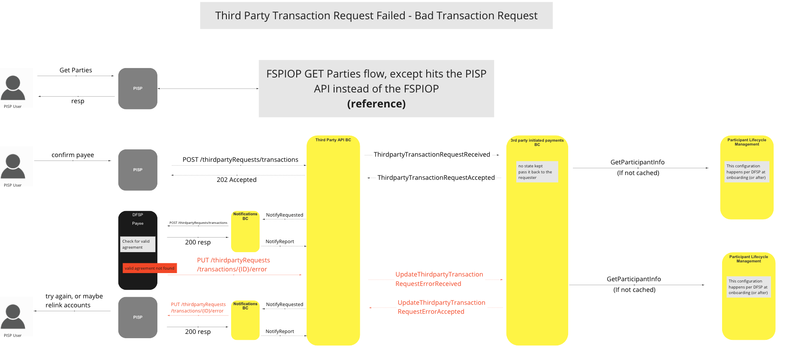
>Schéma de workflow UC : Third Party Transaction Request Failure - Invalid Transaction Request

### Third Party Transaction Request Failure - Downstream FSPIOP Failure

#### Description

Ce flux permet au Switch de gérer les cas où une demande de transaction tierce confirmée échoue côté DFSP lors du processus de devis. Le Switch est informé de la défaillance et transmet la notification au PISP User via son PISP App/Process.

#### Schéma de Flux

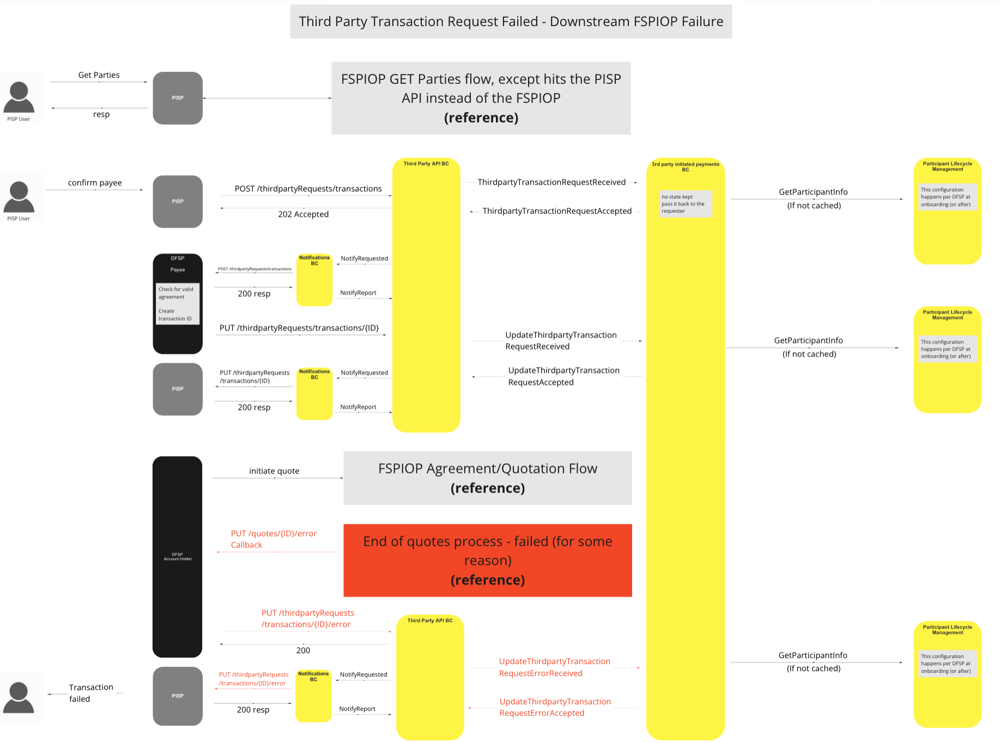
>Schéma de workflow UC : Third Party Transaction Request Failure - Downstream FSPIOP Failure

### Third Party Transaction Request Failure - Authorization Was Invalid

#### Description

Ce flux permet au Switch de gérer les cas où un parcours de transaction tierce est initié, puis autorisé par un PISP User sur demande du DFSP Account Holder, et où la réponse au challenge DFSP comporte une signature invalide. Le Switch vérifie et notifie le titulaire DFSP qui annule la transaction et informe l’utilisateur PISP via le Switch et son détenteur du profil PISP.

#### Schéma de Flux

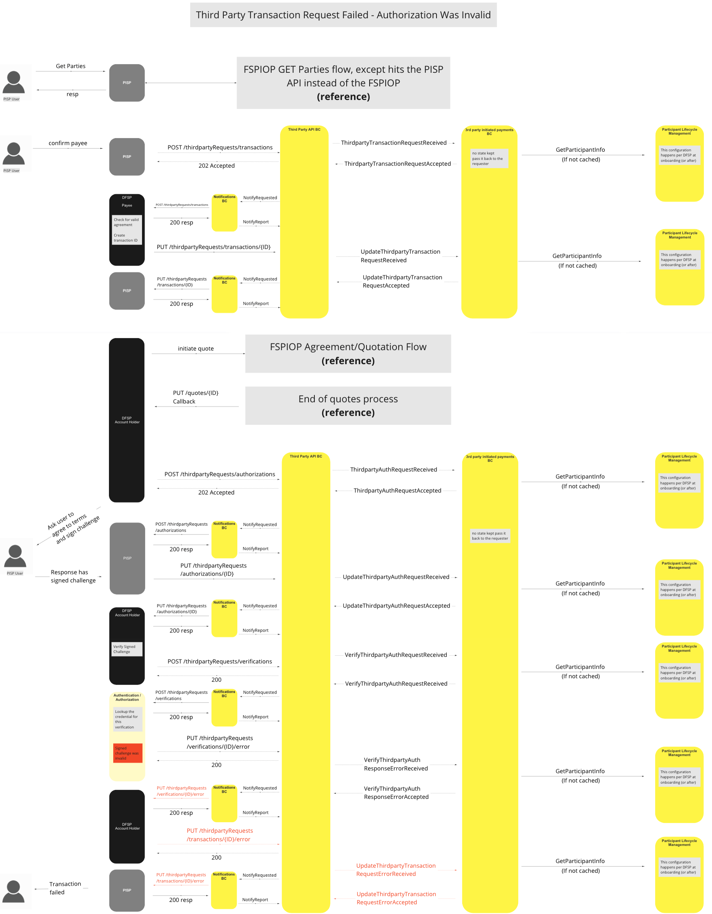
>Schéma de workflow UC : Third Party Transaction Request Failure - Authorization Was Invalid

### Third Party Transaction Request Rejected by user

#### Description

Ce flux permet au Switch de gérer les cas où un PISP User initie et confirme une transaction via son PISP, mais décline de la finaliser à réception de l’acceptation du devis et du challenge de signature du DFSP Account Holder. Après refus, le PISP prévient le DFSP via le Switch, qui annule la transaction et envoie la confirmation d’annulation au PISP initiateur.

#### Schéma de Flux

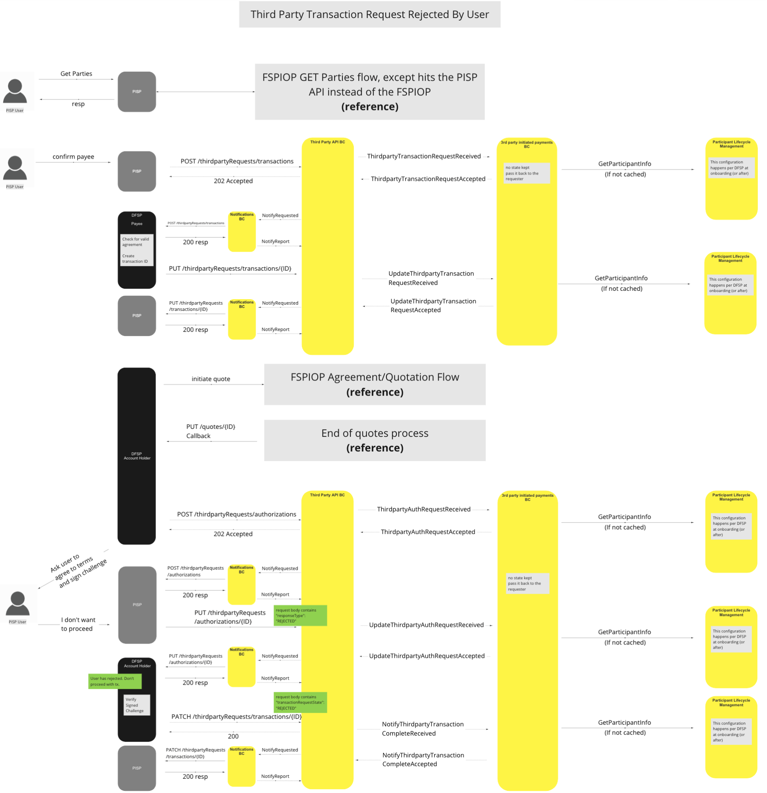
>Schéma de workflow UC : Third Party Transaction Request Rejected By User

### Third Party Transaction Request Failed - DFSP timeout

#### Description

Ce flux permet au Switch de gérer les cas où un PISP User initie et confirme une transaction via son PISP, mais ne répond pas dans le délai requis à la demande d’acceptation de devis et de challenge de signature DFSP. Passé le délai, le PISP signale le défaut au DFSP via le Switch et le DFSP annule la transaction et notifie l’utilisateur de l’échec de la demande.

#### Schéma de Flux

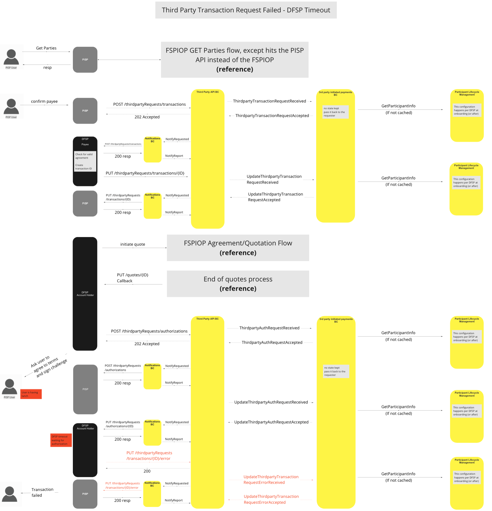
>Schéma de workflow UC : Third Party Transaction Request Failed - DFSP Timeout

<!-- Notes de bas de page en bas du document -->
<!--## Notes

[^1]: Interfaces communes : [Liste des Interfaces Communes Mojaloop](../../commonInterfaces.md)
-->