# BC Transferts

Le BC Transferts est responsable de l'orchestration des demandes de transfert. Il fonctionne en concert avec plusieurs autres BCs, notamment Settlements, Scheduling, Participant Lifecycle Management, Accounts & Balances, ainsi que le FSPIOP.

## Termes

Les termes suivants sont utilisés dans ce BC, également appelé domaine.

| Terme | Description |
|---|---|
| **Comptes** | Désigne les comptes utilisés dans toutes les activités de transfert. Ils servent à enregistrer les positions créditrices et débitrices, soit de manière temporaire dans le cas des comptes alloués spécifiquement pour les transferts, soit de façon permanente dans le cas des mises à jour finales sur les comptes des participants. |
| **Participant/Acteur** | Désigne généralement les parties DFSP Payer/Payee utilisant Mojaloop. |
| **IGS** | Méthode de règlement des transferts - Règlement Brut Immédiat (Immediate Gross Settlement). Ce processus est typiquement utilisé dans les environnements à haut volume comme le commerce de détail, et s’applique aux comptes individuels ou partagés. Dans le cas de comptes partagés, le système met à jour les soldes des Participants en modifiant la valeur proportionnelle des fonds détenus par chaque Participant sur le total disponible du compte. |
| **DNS** | Méthode de règlement des transferts - Règlement Net Différé (Deferred Net Settlement). Ce processus est fréquemment utilisé dans les environnements où un groupe de Participants réalise un transfert nécessitant un règlement global entre eux. Par exemple, lorsque des matières premières sont vendues par le Participant A au Participant B pour être transformées en produits finis, puis revendues par le Participant B au Participant A. Le switch calcule alors la valeur proportionnelle due à chaque Participant de la transaction, et effectue le règlement à la clôture de la fenêtre de règlement. |

## Vue Fonctionnelle - Transferts - Bulk

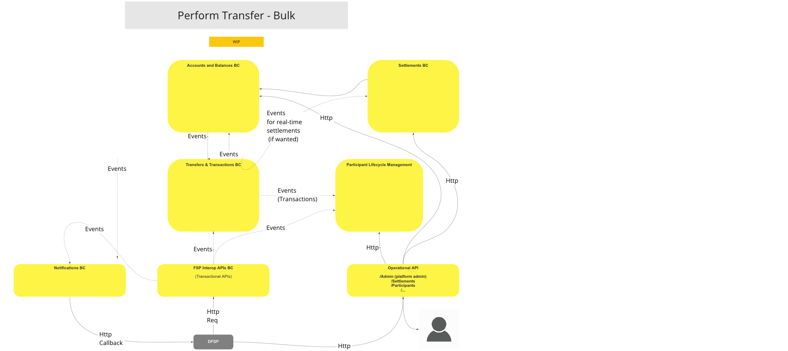
>Diagramme de flux UC : Vue Fonctionnelle - Transferts - Bulk

## Cas d’Utilisation

### Effectuer un Transfert (mode universel)

#### Description

Le flux de ce cas d'utilisation (UC) permet au BC d’effectuer un transfert en utilisant une méthode qui exclut l’intervention de l’Actor.

#### Diagramme de flux

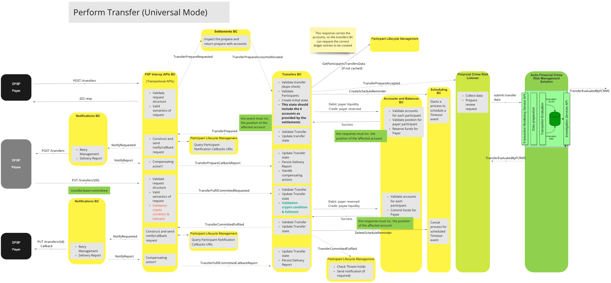
>Diagramme de flux UC : Effectuer un Transfert (Mode Universel)

### Effectuer un Transfert avec Confirmation du Payee

#### Description

Le flux de ce cas d’utilisation permet au BC d’effectuer un transfert via une méthode incluant l’intervention de l’Actor.

#### Diagramme de flux

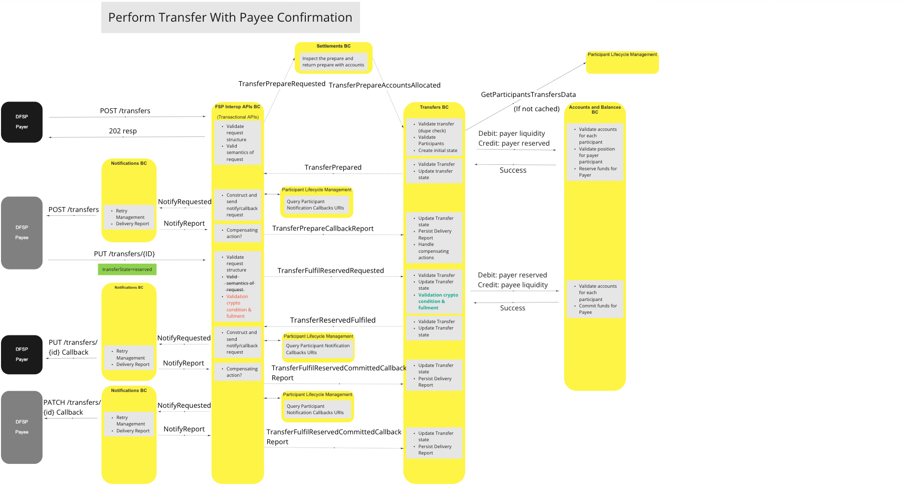
>Diagramme de flux UC : Effectuer un Transfert avec Confirmation du Payee

### Requête (GET) Transfert

#### Description

Le flux de ce cas d’utilisation permet au BC de fournir un mécanisme permettant à un Participant d’interroger l’état d’un transfert.

#### Diagramme de flux

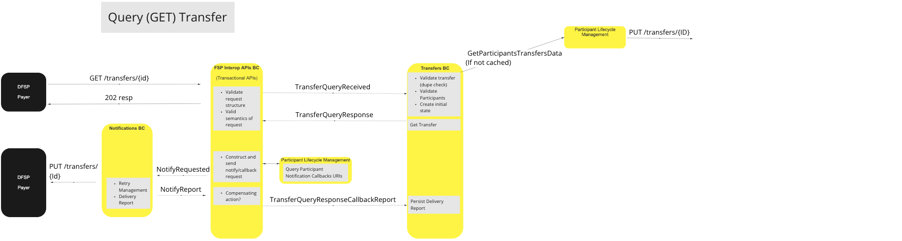
>Diagramme de flux UC : Requête (GET) Transfert

### Effectuer un Transfert – Duplicate POST (Réémission)

#### Description

Le flux de ce cas d’utilisation permet au BC de traiter une demande de transfert dupliquée.

#### Diagramme de flux

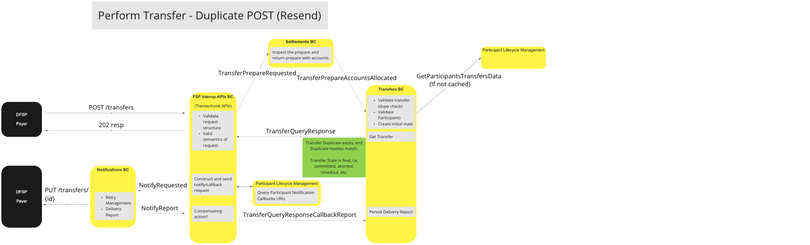
>Diagramme de flux UC : Effectuer un Transfert – Duplicate POST (Réémission)

### Effectuer un Transfert – Duplicate POST (Ignorer)

#### Description

Le flux de ce cas d’utilisation permet au BC d’ignorer une demande de transfert dupliquée.

#### Diagramme de flux

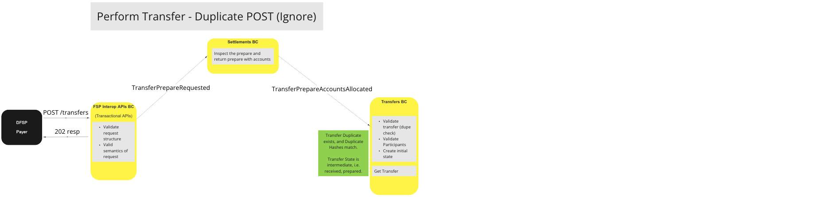
>Diagramme de flux UC : Effectuer un Transfert – Duplicate POST (Ignorer)

## Variantes des cas d’utilisation (hors scénario nominal)

### Effectuer un Transfert - PayeeFSP Rejette le Transfert

#### Description

Le flux de ce cas d’utilisation permet au BC de terminer une demande de transfert rejetée par le Payee.

#### Diagramme de flux

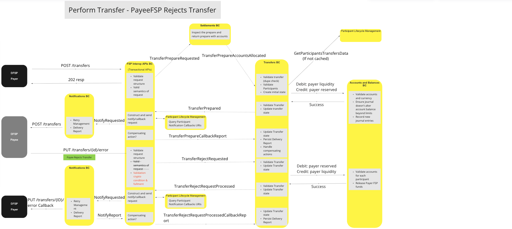
>Diagramme de flux UC : Effectuer un Transfert - PayeeFSP Rejette le Transfert

### Effectuer un Transfert - Timeout (Prepare)

#### Description

Ce flux permet au BC de terminer une demande de préparation de transfert lorsque le seuil de délai d’attente est dépassé.

#### Diagramme de flux

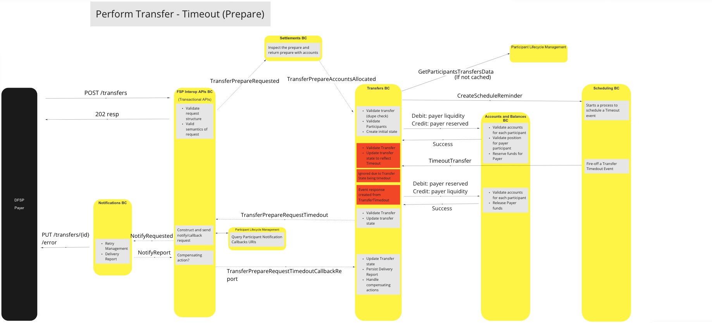
>Diagramme de flux UC : Effectuer un Transfert - Timeout (Prepare)

### Effectuer un Transfert - Timeout (Pre-Committed)

#### Description

Ce flux permet au BC de terminer une demande de transfert pré-engagée (pre-committed) dépassant le délai.

#### Diagramme de flux

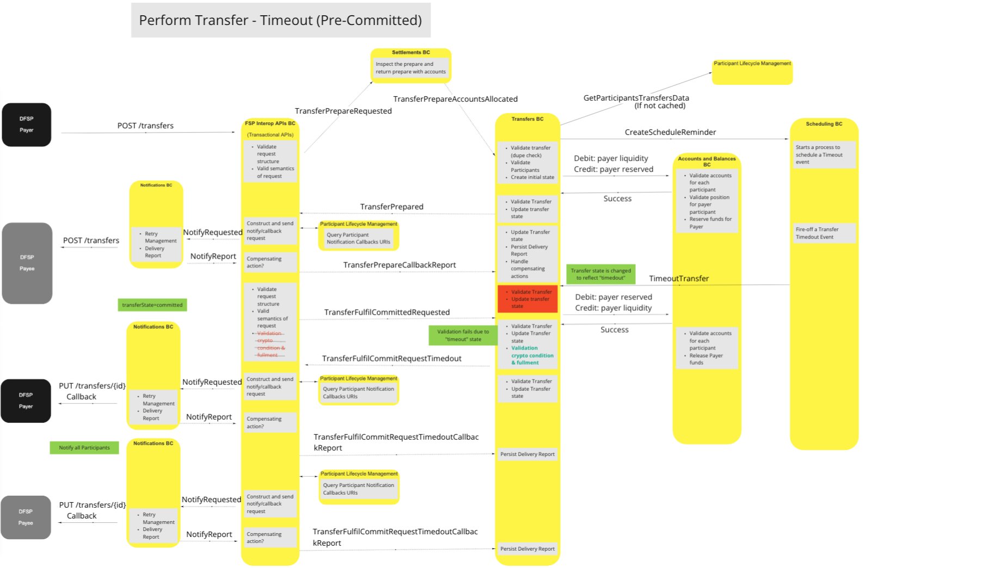
>Diagramme de flux UC : Effectuer un Transfert - Timeout (Pre-Committed)

### Effectuer un Transfert - Timeout (Post-Committed)

#### Description

Ce flux permet au BC de terminer une demande de transfert post-engagée (post-committed) dont le délai est dépassé.

#### Diagramme de flux

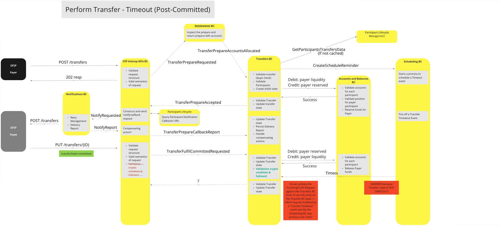
>Diagramme de flux UC : Effectuer un Transfert - Timeout (Post-Committed)

### Effectuer un Transfert - Duplicate POST (Aucune Correspondance)

#### Description

Ce flux permet au BC de terminer une demande de transfert dupliquée ne correspondant à aucune transaction existante, lorsqu’un timeout survient.

#### Diagramme de flux

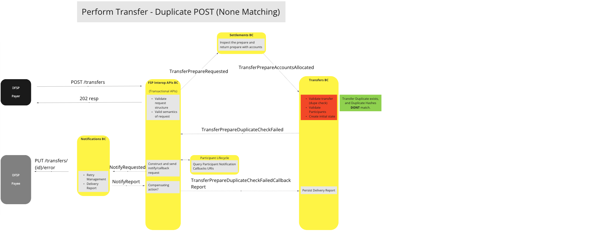
>Diagramme de flux UC : Effectuer un Transfert - Duplicate POST (Aucune Correspondance)

### Effectuer un Transfert - Liquidité Insuffisante du Payer FSP

#### Description

Ce flux permet au BC de décliner une demande de transfert échouée car le Payer ne dispose pas d’assez de liquidités pour couvrir la transaction.

#### Diagramme de flux

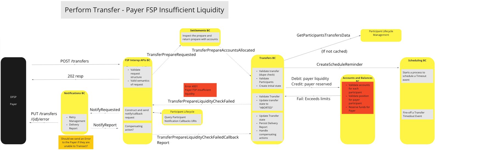
>Diagramme de flux UC : Effectuer un Transfert - Liquidité Insuffisante du Payer FSP

### Effectuer un Transfert - Échec de Validation lors de la Préparation (Payer Participant invalide)

#### Description

Ce flux permet au BC de mettre fin à une demande de préparation de transfert qui échoue lors de la validation, du fait d’un Payer Participant invalide ou inexistant.

#### Diagramme de flux

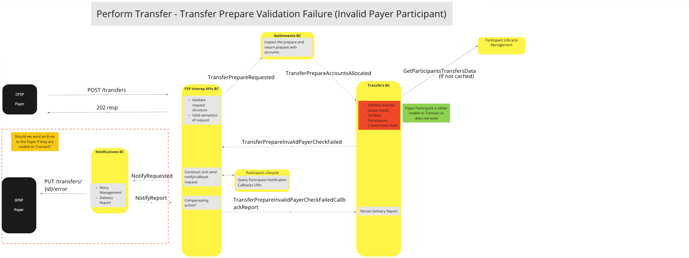
>Diagramme de flux UC : Effectuer un Transfert - Échec de Validation lors de la Préparation (Payer Participant invalide)

### Effectuer un Transfert - Échec de Validation lors de la Préparation (Payee Participant invalide)

#### Description

Ce flux permet au BC de terminer une demande de préparation qui échoue car le Payee Participant n'est pas valide ou inexistant.

#### Diagramme de flux

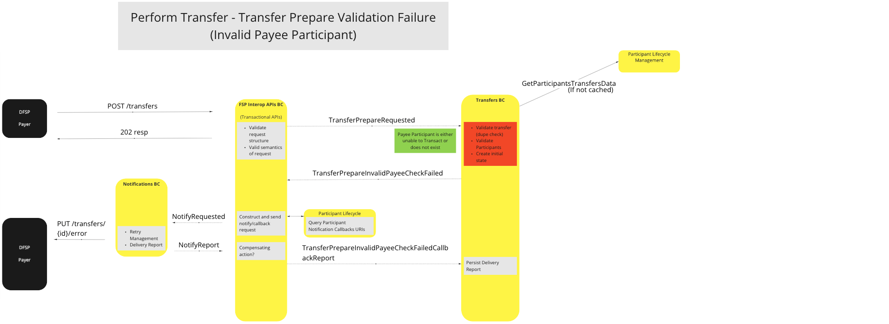
>Diagramme de flux UC : Effectuer un Transfert - Échec de Validation lors de la Préparation (Payee Participant invalide)

### Requête (GET) Transfert - Échec de Validation (Payer Participant invalide)

#### Description

Ce flux permet au BC de terminer une requête d’état de transfert lorsque la validation échoue en raison d’un Payer Participant invalide ou inexistant.

<!--#### Diagramme de flux

> Diagramme UC à définir -->

### Requête (GET) Transfert - Échec de Validation (Payee Participant invalide)

#### Description

Ce flux permet au BC de terminer une requête d’état de transfert lorsque la validation échoue à cause d’un Payee Participant invalide ou inexistant.

<!--#### Diagramme de flux

 
> Diagramme UC à définir -->

### Requête (GET) Transfert - Échec de Validation (Identifiant de Transfert Introuvable)

#### Description

Ce flux permet au BC de terminer une requête d’état de transfert lorsque la validation échoue en raison d’un identifiant de transfert introuvable.

<!--#### Diagramme de flux

 
> Diagramme UC à définir -->

## Modèle Canonique

Mojaloop utilise deux modèles canoniques pour gérer les transferts de fonds : un pour les transferts simples (hors bulk) et un pour les transferts groupés (bulk).

### Modèle Canonique Standard

* Transfert
  * transferId
  * transferType
  * quoteld (optionnel)
  * settlementModelId
  * Participants
    * Payer
      * participantId
      * Comptes
        * Debit
          * accountId
          * accountType
          * devise (currency)
        * Credit
          * accountId
          * accountType
          * devise (currency)
    * Payee
      * participantId
      * Comptes
        * Debit
          * accountId
          * accountType
          * devise (currency)
        * Credit
          * accountId
          * accountType
          * devise (currency)
  * Montant (montant à transférer)
    * value (nombre)
    * devise (code de devise ISO)
  * expiration (dateTime ISO)
  * ilpPacket
  * Extensions

### Modèle Canonique Bulk

* Transferts
  * bulkId
  * bulkQuoteId
  * Transferts[]
    * Transfert* (voir ci-dessus)

## Commentaires Finaux

* Le Payer FSP ne doit pas être autorisé à forcer unilatéralement le timeout d’un transfert (peu importe son délai d’expiration), mais doit respecter les décisions de timeout du Switch.
* La validation des conditions cryptographiques et accomplissements (fulfillments) serait gérée par le BC Transferts car il s’agit d’une composante fondamentale du « processus de transfert » (c’est-à-dire : cette fonction n’est pas spécifique au langage FSPIOP).
* Le BC Transferts appliquera le même modèle de validation que le Quoting & Party BC pour valider les Participants, pour déterminer la capacité d’un compte à effectuer une transaction, ou si un Participant est activé en mode exclusif.
* Le BC Transferts est l’unique « source de vérité » pour tous les transferts, il est donc responsable de la persistance de l’état des transferts.
* Désactiver des Participants déjà dans un état « préparé » ne doit pas empêcher le traitement des transferts en cours. Néanmoins, toute nouvelle instruction de transfert reçue par le BC Transferts via des événements TransferPrepareAccountAllocated doit être refusée.

<!-- Notes de bas de page en bas. -->
<!--## Notes -->

[^1]: Interfaces communes : [Liste des interfaces communes Mojaloop](../../commonInterfaces.md)
