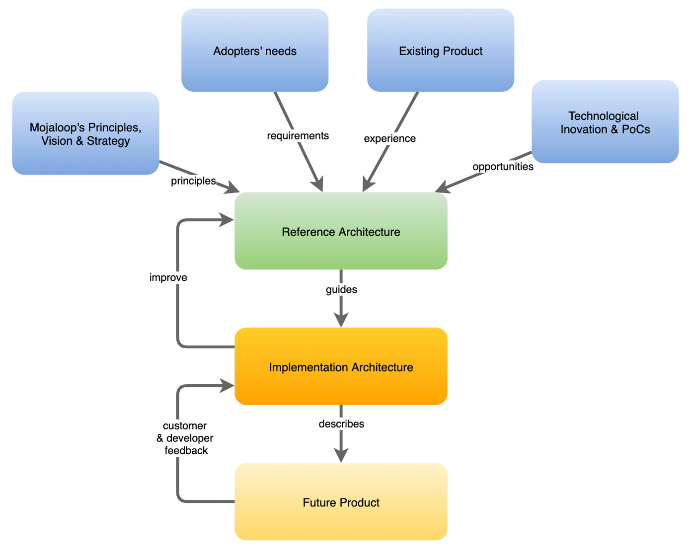

# Introduction

## Qu'est-ce qu'une Architecture de Référence ?

Dans un système logiciel, l’Architecture de Référence est un ensemble de documents de conception logicielle qui saisissent l’essence du produit et fournissent des indications pour son évolution technique.

Ce concept peut être simplifié ainsi :

_**L’Architecture de Référence représente la vision architecturale du design parfait.**_

Dans des conditions normales, ce design parfait n’est jamais réellement atteint, en partie car il n’y a ni suffisamment de temps, ni de ressources pour le mettre pleinement en œuvre, en partie car cette conception évolue et s’améliore plus vite qu’elle ne peut être réalisée.
Il est donc dans la nature d’une Architecture de Référence d’être un document vivant, continuellement mis à jour et enrichi.

## Quels sont les objectifs de l’Architecture de Référence ?

Les objectifs principaux de l’Architecture de Référence sont :

* Identifier les abstractions, interfaces et opportunités de standardisation
* Proposer des solutions et des modèles à des problèmes courants
* Aider à l’application des principes de conception technique
* Fournir des orientations pour les architectures d’implémentation
* Favoriser l’innovation et la contribution, en définissant ce qui peut être fait et comment

## Quels sont les bénéfices d’une Architecture de Référence ?

Le premier bénéfice est qu’elle constitue la fondation idéale pour une Feuille de Route Technique. En ayant la vision future à l’esprit, on peut facilement créer une feuille de route technique par étapes, garantissant que les ressources et l’attention sont concentrées sur la valeur à long terme.

Un autre avantage important concerne les orientations qu’elle donne pour la prise de décision en matière de choix technologiques et de stratégies d’implémentation.
Avec l’Architecture de Référence en tête, toute décision de développement peut être qualifiée de tactique ou de stratégique :

* Tactique – ce qui est nécessaire immédiatement et qui peut faire l’objet d’exceptions à l’Architecture de Référence en raison d’un besoin urgent à forte valeur. Ces exceptions doivent être documentées en tant que dette technique pouvant être traitée ultérieurement.
* Stratégique – ce qui a vocation à durer et devrait être mis en œuvre conformément à l’Architecture de Référence, afin de s’en rapprocher.

Enfin, et ce n’est pas moins important, elle assure l’alignement entre la vision technique et la vision produit, essentielle (voir ci-dessous concernant le processus et les modes de fonctionnement).

## Processus de création et de maintien de l’Architecture de Référence

Lors de la création de la version initiale de l’Architecture de Référence, l’équipe a suivi les étapes suivantes :

1. Cartographie de l’Espace Problème – Documenter les différents domaines et sous-domaines de problèmes, ainsi que leur classification selon leur importance.
2. Cartographie du Contexte de l’Espace Solution – Regrouper les problèmes similaires selon leur objectif et contexte.
3. Cartographie individuelle des cas d’utilisation – Discuter et documenter les cas d’utilisation en détail, en tenant compte de l’ensemble de la solution.

## Comment garder une Architecture de Référence à jour ?

Le schéma ci-dessous illustre où se situe une architecture de référence par rapport aux autres processus de la plateforme Mojaloop ; ce qu’elle doit intégrer et comprendre, non seulement la vision et les principes, mais aussi les exigences, l’expérience passée et même favoriser l’innovation technique.

> Introduction (Mojaloop 2.0 Reference Architecture): Comment garder l’Architecture de Référence à jour

## Principes guidant cette architecture

La conception de l’Architecture de Référence Mojaloop 2.0 s’appuie sur les principes du Domain-Driven Design[^1], et s’inspire également des principes de SOLID[^2] pour la programmation orientée objet, notamment le principe de responsabilité unique (SRP).

Pour expliquer comment l’architecture est interprétée par Mojaloop, nous incluons un bref aperçu de l’architecture du Domain-Driven Design.

### Vue d’ensemble de l’architecture inspirée par le DDD

L’implémentation de l’architecture inspirée du DDD pour Mojaloop inclut les concepts suivants :

* **Espace Problème** — Typiquement, l’architecture DDD reconnaît les besoins métiers comme appartenant à des domaines distincts. Par exemple, un système eCommerce est vu comme un **_Domaine_**. Mais un système eCommerce possède plusieurs composants : gestion des stocks, panier d’achat, commande, etc. Chaque composant est classé en tant que **_Sous-domaine_**, qui apporte de la valeur au domaine, ici le système eCommerce. Mojaloop utilise un seul domaine : c’est un switch.

  L’Espace Problème est l’un des deux conteneurs où sont regroupés tous les problèmes métier identifiés (améliorations/services) à résoudre. Selon la complexité du problème métier (amélioration) ou la multiplicité des problèmes à résoudre, il est possible de faire évoluer la structure initiale des sous-domaines. Chaque problème est alors assigné à son propre sous-domaine. Il convient cependant de s’assurer de la nécessité de chaque sous-domaine, et de se concentrer uniquement sur ceux qui apportent de la valeur, afin d’éviter une multiplication inutile et confuse de sous-domaines dans l’Espace Problème.

  Ce cloisonnement des améliorations/services dans des sous-domaines séparés permet à différentes équipes de travailler sur des parties gérables du système, ce qui est plus efficace et moins risqué que de construire un système monolithique. Un avantage significatif de cette méthode est que le processus de développement tout entier peut ainsi être centré sur l’amélioration continue et la création de valeur pour la plateforme, plutôt que sur l’ajout de fonctions isolées.

  Typiquement, l’Espace Problème comprend trois grands types de conteneurs qui déterminent comment ou par quoi un problème peut être résolu, auxquels un quatrième a été ajouté pour les exigences non fonctionnelles (NFRs) :

  * Cœur — solutions nécessitant un développement interne pour leur mise en œuvre.
  * Soutien (Supporting) — solutions pouvant être implémentées grâce à des produits du marché prêts à l’emploi : par exemple, connexion sécurisée.
  * Générique — solutions pouvant s’appuyer sur des produits du marché, mais nécessitant du développement supplémentaire : par exemple, reporting ou authentification.
  * Exigences Non Fonctionnelles (NFRs) — solutions nécessaires pour répondre à des besoins communs, sans apporter de valeur directe au produit.

* **Espace Solution** — Le second grand pilier de l’architecture DDD est « l’Espace Solution ». Contrairement à l’Espace Problème, il ne s’intéresse pas à quoi résoudre, mais à comment résoudre un problème (amélioration/service), et comment les différentes solutions s’articulent entre elles. L’Espace Solution inclut donc nécessairement davantage d’informations et de détails techniques sur la manière de résoudre les problèmes.

  * L’Espace Solution introduit un certain nombre d’éléments pour faciliter et harmoniser les efforts de résolution des problèmes.
  
  * Les Contextes Délimités (« Bounded Contexts ») servent à regrouper des ensembles cohérents de solutions partageant leur propre langage.

  Bien souvent, la correspondance entre les Contextes Délimités et les Sous-domaines n’est pas univoque. Les Sous-domaines appartiennent à l’Espace Problème et les Contextes Délimités à l’Espace Solution ; il se peut donc qu’un Sous-domaine soit adressé par plusieurs Contextes Délimités, ou qu’un Contexte Délimité couvre plusieurs Sous-domaines.

  En général — et c’est vrai dans l’environnement Mojaloop — les solutions sont conçues et mises en œuvre sans connaître les dépendances d’infrastructure spécifiques ou le fonctionnement interne des autres Contextes Délimités. Cette approche favorise notamment la sécurité, en s’assurant que chaque Contexte Délimité ne connaît que son propre environnement et ses interfaces. Les échanges entre Contextes Délimités s’effectuent exclusivement via des API et des messages sécurisés. Des exemples de Contextes Délimités (CD) dans Mojaloop incluent : Comptes & Soldes, Virements & Transactions, etc.

* **_Langage Ubiquitaire_** — c’est une approche encourageant l’utilisation d’un langage explicite et compris de tous, lors de la description des problèmes et solutions, de l’utilisateur final au développeur. Deux objectifs principaux au langage ubiquitaire :

  1. S’assurer que les termes uniques sont identifiés et compris dans un même sens par toutes les parties au sein de leur Contexte Délimité. Par exemple, le terme « Compte » : il peut signifier un profil de compte pour l’un, et un compte du système comptable pour un autre. Il ne s’agit pas ici de chercher un langage universel pour tout le projet ou l’organisation, ce qui serait illusoire : il s’agit de s’assurer que chaque Contexte Délimité possède son jeu de termes parfaitement définis et partagés.
  2. Faire en sorte que ces termes soient utilisés partout : de l’interface utilisateur à la documentation, dans tous les supports du projet, et même dans le code. L’usage ubiquitaire des mêmes termes garantit la compréhension commune des problèmes et solutions décrits et résolus.

* **_Préoccupations Transversales_**[^3] — Ce sont des aspects de la solution logicielle nécessitant une résolution dans plusieurs Contextes Délimités (ou fonctions/modules), tels que l’audit, la sécurité, l’authentification, ou la gestion de la configuration de la plateforme (métier et technique). Dans notre approche, ces préoccupations transversales sont séparées des Contextes Délimités. La plupart ont une nature distribuée, avec des composants centraux et des bibliothèques clientes. Elles sont représentées dans cette documentation comme l’équivalent des Contextes Délimités.

### Principes SOLID

En complément de l’architecture DDD, l’approche architecturale de Mojaloop s’inspire aussi des principes SOLID :

* Responsabilité unique et interfaces internes permettant d’implémenter des domaines additionnels, comme ISO, sans modifier l’architecture principale
* Les entités logicielles doivent être étendues mais jamais modifiées. La règle : ne jamais modifier le cœur, toujours étendre via des modules ou nœuds additionnels
* Les fonctions utilisant des références à des classes de base doivent pouvoir utiliser des objets issus des classes dérivées sans le savoir
* Plusieurs interfaces client spécifiques valent mieux qu’une seule interface fourre-tout
* Bâtir les dépendances sur les abstractions, jamais sur les implémentations concrètes

<!-- Notes en bas de page -->
### Notes

[^1]: Pour aller plus loin : [Domain-driven design sur Wikipedia, l’encyclopédie libre](https://en.wikipedia.org/wiki/Domain-driven_design)

[^2]: Pour aller plus loin : [SOLID sur Wikipedia, l’encyclopédie libre](https://en.wikipedia.org/wiki/SOLID)

[^3]: Pour aller plus loin : [Préoccupation transversale](https://en.wikipedia.org/wiki/Cross-cutting_concern#:~:text=Cross%2Dcutting%20concerns%20are%20parts,oriented%20programming%20or%20procedural%20programming.) – Éditeur : Wikipedia, l’encyclopédie libre
