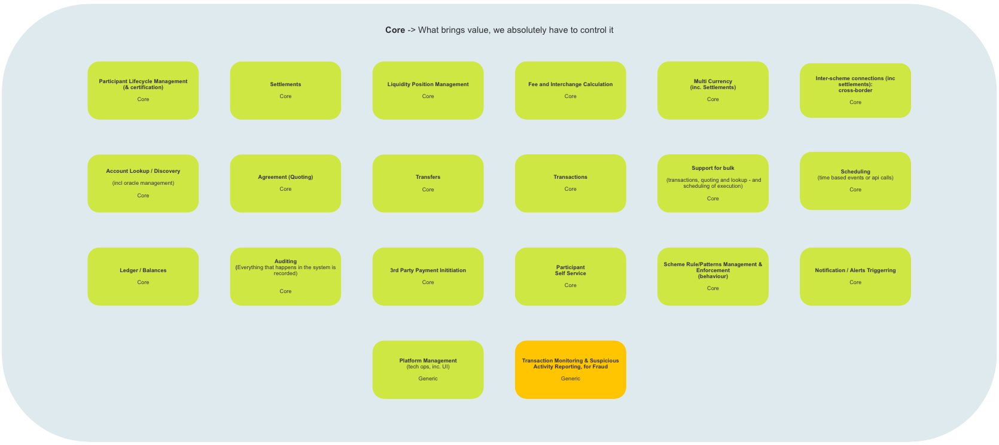
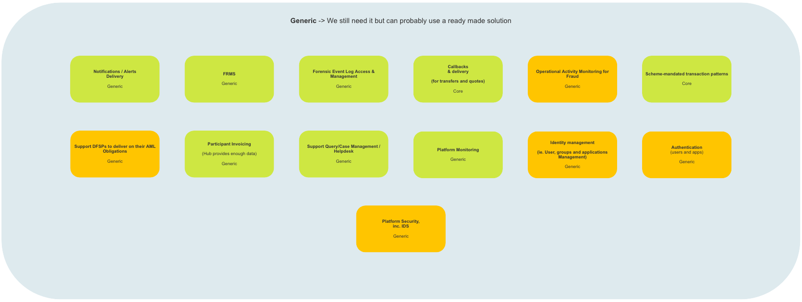
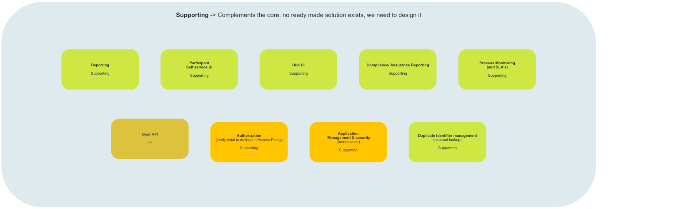
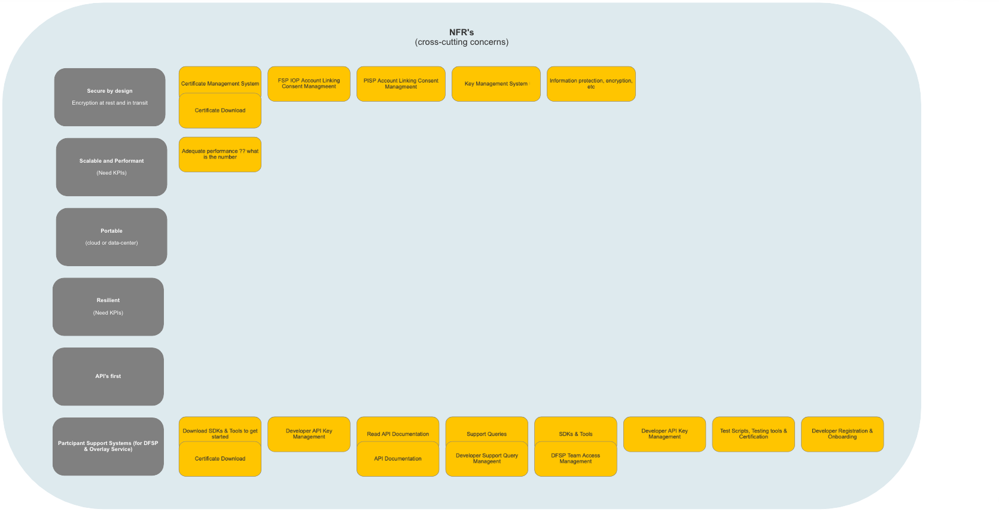
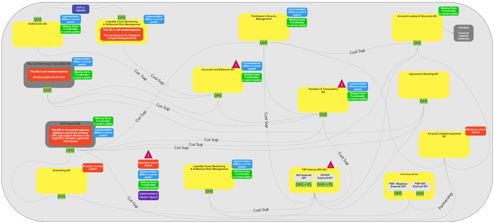

# Aperçu de l’Architecture de Référence Mojaloop

## Espace Problème (_Identification des problèmes et cartographie_)

Comme indiqué dans l’aperçu de l’architecture DDD, l’Espace Problème contient un certain nombre de conteneurs orientés solution identifiés par l’équipe d’architectes système, qui servent à catégoriser les sous-domaines où des problèmes (améliorations) ont été détectés.

### Problèmes Cœur

#### Description

Un certain nombre de problèmes Cœur (améliorations) ont été identifiés par (Business/Développeurs/Business & Développeurs). Afin de mettre en œuvre ces améliorations, des équipes de développement « internes » seront chargées de développer les solutions requises. Généralement, les sous-domaines ainsi identifiés générèrent une valeur significative pour le système Mojaloop ; il est donc essentiel de s’assurer que les services qu’ils fournissent ne soient pas compromis. Les exemples de sous-domaines Cœur incluent : la gestion du cycle de vie des participants, le règlement et la planification.

#### Carte à Haut Niveau

> Architecture de Référence (Mojaloop): Problèmes Cœur

### Problèmes Génériques

#### Description

Un certain nombre de problèmes Génériques (améliorations) ont été identifiés par (Business/Développeurs/Business & Développeurs). Afin de les mettre en œuvre, des solutions du marché seront adoptées sans nécessiter de personnalisation supplémentaire. Une intégration avec Mojaloop sera cependant nécessaire. Les exemples de sous-domaines de problèmes génériques comprennent l’authentification, le FRMS et la surveillance de la plateforme.

#### Carte à Haut Niveau

> Architecture de Référence (Mojaloop): Problèmes Génériques

### Problèmes de Support

#### Description

Un certain nombre de problèmes de Support (améliorations) ont été identifiés par (Business/Développeurs/Business & Développeurs). Pour les mettre en œuvre, des solutions du marché seront également adoptées, mais une personnalisation additionnelle sera demandée pour intégrer pleinement ces solutions au système Mojaloop et répondre aux problèmes identifiés. Exemples de sous-domaines Support : gestion des politiques d’accès, reporting et autorisation (vérification du contenu des politiques d’accès).

#### Carte à Haut Niveau

> Architecture de Référence (Mojaloop): Problèmes de Support

### Exigences Non Fonctionnelles

#### Description

Plusieurs exigences non fonctionnelles ont été identifiées par (Business/Développeurs/Business & Développeurs). Bien qu’elles n’ajoutent pas de valeur directe à Mojaloop, elles sont nécessaires pour répondre à certains problèmes (améliorations) métier. Par exemple, la sécurité n’occupe pas son propre sous-domaine : tous les sous-domaines du système devront inclure des éléments de code liés à la sécurité pour répondre à cette exigence, ou bien un service centralisé de gestion de la sécurité sera mis en place, permettant de gérer et de construire des profils de sécurité pour chaque sous-domaine, qui seront téléchargés lors de la jonction au Domaine ou à l’initialisation, et/ou poussés lors de mises à jour par le service central.

#### Carte à Haut Niveau

> Architecture de Référence (Mojaloop): Exigences Non Fonctionnelles

### Nouveaux Problèmes et Non Classifiés (hors-domaine)

#### Description

Un certain nombre de nouveaux problèmes et problèmes non classifiés (hors-domaine) ont été identifiés à la fois par les équipes métiers et techniques. Dès que le métier et les architectes du système ont identifié la solution requise, ceux-ci seront classés dans l’un des conteneurs de problème et traités selon le processus associé.

#### Carte à Haut Niveau

> Architecture de Référence (Mojaloop): Nouveaux Problèmes et Problèmes Non Classifiés

## Espace Solution (_Description haut niveau et cartographie du contexte_)

#### Description

L’Espace Solution défini par l’architecture DDD se concentre sur la manière dont les problèmes métier (améliorations) identifiés dans l’espace problème seront résolus. Par conséquent, il comprend nécessairement plus d’informations et de détails techniques que l’Espace Problème. Il inclut des éléments comme le langage ubiquitaire, les contextes délimités (« Bounded Contexts ») et les préoccupations transversales (« Cross-Cutting Concerns »).

#### Carte à Haut Niveau

> Architecture de Référence (Mojaloop): Espace Solution

### Langage Ubiquitaire

#### Description

Un défi auquel la plupart des équipes sont confrontées est de maintenir une compréhension claire des termes qui peuvent ne pas être uniques à un domaine particulier. Un exemple classique de terme non unique est « compte » : ce terme pourrait désigner un ensemble de comptes financiers, le profil d’une entité ou un identifiant de connexion.

Comme indiqué dans l’introduction, le langage ubiquitaire sert à éliminer la confusion et la mauvaise communication entre les équipes métiers et techniques qui travaillent à la résolution d’un (groupe de) problème(s) métier. Bien qu’il soit possible que chaque Domaine/Sous-domaine contienne des termes non uniques, il est essentiel, dans chaque contexte particulier — pour l’architecture DDD, c’est-à-dire un contexte limité (« Bounded Context ») — que tous les termes y soient uniques, compris de tous les participants, et appliqués correctement.

Pour plus d’informations et une description de chacun des termes uniques utilisés dans le domaine Mojaloop, veuillez consulter le [Glossaire](../glossary/README.md) annexé à ce document.

### Contextes Délimités (« Bounded Contexts »)

Les contextes délimités suivants ont été identifiés et mis en œuvre dans Mojaloop :

> Il s'agit d'une description de haut niveau de chacun des contextes délimités qui ont été identifiés et inclus dans l’Architecture de Référence Mojaloop. Une vue détaillée figure dans la section [Contexte Délimité](../boundedContexts/index.md) de ce document.

| Contexte Délimité                | Objectif                                                                                                                                                                        | Contexte Délimité                                   | Objectif                                                                                                                                                       |
| -------------------------------- | ------------------------------------------------------------------------------------------------------------------------------------------------------------------------------ | --------------------------------------------------- | --------------------------------------------------------------------------------------------------------------------------------------------------------------- |
| Règlements (Settlements)         | Exécute les règlements  Configure les modèles de règlement  Calcule les règlements                                                                                      | Gestion du Cycle de Vie du Participant              | Onboarding des participants Gestion du cycle de vie Self-service participant Interface self-service participant                                    |
| Recherche & Découverte de Compte | Noyau Oracle interne  Recherche/découverte de compte  Traitement en masse  Gestion des identifiants en double  Connexions inter-schéma (y compris règlements) | Comptes & Soldes                                   | Système d’enregistrement des activités financières et des soldes du participant DFSP                                                                            |
| Transferts & Transactions        | Traitement des transferts  Vérification de la liquidité pour chaque transfert  Transactions en masse  Multi-devises, incluant les transactions multi-hop           | Accord (Cotations)                                 | Accord/cotation (cœur)  Transactions de masse  Multi-devises, incluant multi-hop  Enforcement des règles schéma dans chaque Contexte Délimité      |
| Planification                    | Planification des événements d’API selon le temps (cœur)                                                                                                                       | Notifications & Alertes                            | État de notification - priorisation & SLA (cœur) Gestion des triggers & alertes (cœur)  Livraison notifications - priorité et SLA (générique)           |
| API Interop des FSP              | API externe ISO (masse ; API, callbacks déclenchés (transferts uniquement, manquant dans l’AS-IS actuel)                                                                      | Paiements Initiés par Tiers                        | Liaison de compte PISP Gestion du consentement Initiation de paiement par un tiers (cœur)                                                            |
| API tiers                        |                                                                                                                                                                                | API externe Mojaloop PISP API externe ISO PISP  |                                                                                                                                                                 |

### Préoccupations Transversales (« Cross cutting concerns »)

Les préoccupations transversales suivantes ont été identifiées dans Mojaloop :

| Préoccupation Transversale (BC)           | Objectif                                                                                                                                                                                                                                                                                                                                                                                                                                                            |
| ----------------------------------------- | --------------------------------------------------------------------------------------------------------------------------------------------------------------------------------------------------------------------------------------------------------------------------------------------------------------------------------------------------------------------------------------------------------------------------------------------------------------------- |
| AuthZ & AuthN et Gestion des Identités BC | Gérer tous les aspects de l'authentification utilisateur/système (AuthN) et de l'autorisation (AuthZ). Les solutions prévues s’intègreront dans les catégories Générique et de Support.                                                                                                                                                                                                                                         |
| Cryptographie BC                         | Gérer tous les services cryptographiques, notamment la gestion des clés, des certificats et des systèmes de stockage. Les solutions prévues relèvent de la catégorie Générique.                                                                                                                                                                                                                                              |
| Reporting et Audit BC                     | Gérer tous les services d’audit et de reporting, notamment les rapports de conformité et d’assurance, journalisation d’événements judiciaires et KMS, accès et gestion des logs forensiques, monitoring des process et SLA, audit système. (Chaque Contexte contiendra des capacités d’audit. Le module Reporting & Auditing centralisera les logs de tous les contextes.) Solutions réparties dans les trois catégories problème.   |
| Configuration Plateforme (Business) BC   | Gérer le processus de gestion des règles/schémas (NB : leur enforcement reste dans chaque contexte), la gestion des schémas imposés, la gestion des applications, la sécurité, la gestion des identités et des accès (incluant la gestion des utilisateurs et des équipes), l’API bizops pour la gestion des consentements de liaison et la gestion des politiques d’accès. Concerné par tous les types de problèmes.   |
| Gestion Technique de la Plateforme BC    | Gérer la surveillance et la gestion de la plateforme. Solutions prévues dans la catégorie Générique.                                                                                                                                                                                                                                                                                                                       |

<!-- Les notes de bas de page en bas de page. -->
<!--### Notes

[^?]: Note va ici - "?" indique une référence de note de bas de page-->