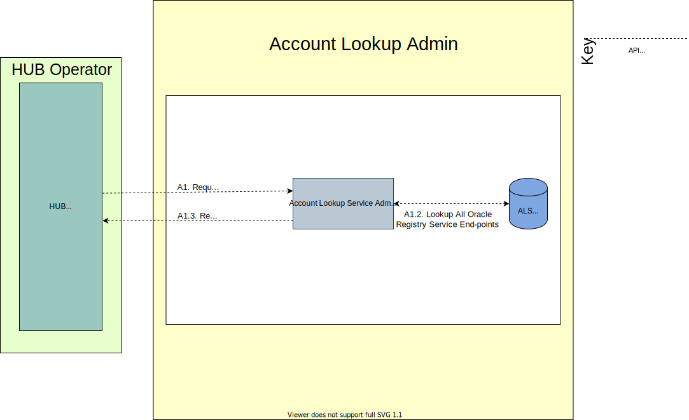
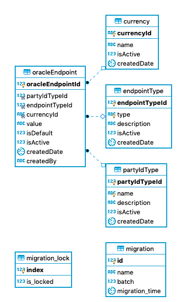

# Service de recherche de compte - Account Lookup Service

L'**Account Lookup Service** (**ALS**) ou **Service de recherche de compte** — *(voir la section `6.2.1.2`)* de la [spécification Mojaloop {{ $page.frontmatter.version }}](/api) — mets en œuvre les cas d’usage suivants :

* Recherche de participant (*Participant Look-up*)
* Recherche de entité (*Party Look-up*)
* Gestion des informations du registre des participants
    * Ajout d’informations au registre des participants
    * Suppression d’informations du registre des participants
    
Cas d’usage implémentés en sus pour l’exploitation du Hub :
* Opérations d’administration
    * Gestion des informations de routage des endpoints Oracle
    * Gestion des informations du routage des endpoints du *Switch*
  
## 1. Considérations de conception

### 1.1. Account Lookup Service (ALS)

La conception de l’ALS fournit un composant générique central faisant partie du cœur Mojaloop. Il sert à fournir le routage et l’alignement sur la spécification de l’API Mojaloop. Il prend en charge plusieurs registres de recherche (*Oracles*). Cet ALS fournira une API d'administration pour configurer le routage/la configuration de chaque Oracle, de manière similaire à l'API du Central-Service pour la configuration des points de terminaison de routage DFSP par le Notification Handler (composant ML-API-Adapter). L’ALS agit, en substance, comme un *switch* avec un stockage persistant des règles et de la configuration de routage.

#### 1.1.1. Hypothèses

* La conception de l'ALS ne prend en charge pour l'instant qu’un seul *switch*.
* La prise en charge de plusieurs *switch* utilisera le même mécanisme de résolution DNS que celui prévu pour les paiements transfrontaliers / réseaux (*Cross Border*).

#### 1.1.2. Routage

La configuration de routage repose sur les éléments suivants :

* **PartyIdType** — voir la section `7.5.6` de la spécification Mojaloop
* **Currency** — voir la section `7.5.5` de la spécification Mojaloop. Code devise selon [ISO 4217](https://www.iso.org/iso-4217-currency-codes.html) sous forme de chaîne alphabétique de trois lettres. Ce champ est optionnel ; toutefois, l'indicateur `isDefault` doit être défini à `true` si la devise n'est pas fournie.
* **isDefault** — indicateur précisant qu'un Oracle donné est le fournisseur par défaut pour un **PartyIdType**. Plusieurs Oracles peuvent être définis comme « par défaut », mais il ne peut y avoir qu'un seul Oracle par défaut par **PartyIdType**. L’Oracle par défaut pour un **PartyIdType** n’est donné que si la requête d’origine n’inclut pas de filtre sur la devise.
 

### 1.2. Oracle ALS

L’Oracle ALS, peut être mis en œuvre comme **Service** ou **Adaptateur** (sémantique selon le cas — médiation = adaptateur, service = implémentation), fournit un registre de recherche avec des fonctionnalités similaires à celles des ressources `/participants` de l'API Mojaloop. Elle s'appuie cependant de manière souple sur la spécification ML API : son interface met en œuvre un modèle synchrone, ce qui réduit les exigences de corrélation et de persistance du modèle de *callback* asynchrone implémenté directement par la spécification ML API. Cela fournira à tous les services/adaptateurs Oracle ALS une interface standardisée, médiatisée par l'ALS.  
Ce composant (ou les systèmes en back-end) assure aussi la persistance et la mise par défaut des détails des participants.

## 2. Conception de la recherche de participants

### 2.1. Vue d’ensemble de l’architecture

_Note : le cas « recherche de participant » s’applique de la même façon à un cas d'usage initié par le bénéficiaire (Payee Initiated), par exemple les `transactionRequests`. La différence est que le bénéficiaire est l’initiateur dans le schéma ci-dessus._

### 2.2. Diagrammes de séquence

#### 2.2.1. GET Participants

- [Diagramme de séquence GET Participants](als-get-participants.md)

#### 2.2.2. POST Participants

- [Diagramme de séquence POST Participants](als-post-participants.md)

#### 2.2.3. POST Participants (batch)

- [Diagramme de séquence POST Participants (batch)](als-post-participants-batch.md)

#### 2.2.4. DEL Participants

- [Diagramme de séquence DEL Participants](als-del-participants.md)

## 3. Conception de la recherche d'entités

### 3.1. Vue d’ensemble de l’architecture

### 3.2. Diagramme de séquence

#### 3.2.1. GET Parties

- [Diagramme de séquence GET Parties](als-get-parties.md)

## 4. Conception de l’administration ALS

### 4.1. Vue d’ensemble de l’architecture

### 4.2. Diagrammes de séquence

#### 4.2.1 GET Oracles

- [Diagramme de séquence GET Oracles](als-admin-get-oracles.md)

#### 4.2.2 POST Oracle

- [Diagramme de séquence POST Oracle](als-admin-post-oracles.md)

#### 4.2.3 PUT Oracle

- [Diagramme de séquence PUT Oracle](als-admin-put-oracles.md)

#### 4.2.4 DELETE Oracle

- [Diagramme de séquence DELETE Oracle](als-admin-del-oracles.md)

#### 4.2.5 DELETE cache d'endpoint

- [Diagramme de séquence DELETE cache d'endpoint](als-del-endpoint.md)

## 5. Conception de la base de données

### 5.1. Schéma de base de données ALS

#### Notes

- `partyIdType` — valeurs initialement injectées selon la section _`7.5.6`_ de la [spécification Mojaloop {{ $page.frontmatter.version }}](../../api/README.md).
- `currency` — voir la section `7.5.5` de la spécification Mojaloop ; code selon [ISO 4217](https://www.iso.org/iso-4217-currency-codes.html). Optionnel ; et doit fournir une configuration « par défaut » si aucune devise n'est fournie, OU fournir une valeur par défaut si la devise est fournie mais que seule la configuration de point de terminaison « par défaut » existe.
- `endPointType` — identifiant du type d'endpoint (ex. `URL`) offrant la flexibilité nécessaire pour la prise en charge de futurs protocoles de transport.
- `migration*` — tables de métadonnées utilisées par le moteur du framework Knex.
- Un `centralSwitchEndpoint` doit être associé à l’`OracleEndpoint` par l’API de l'admin lors de l’insertion d’un nouvel enregistrement `OracleEndpoint`. S’il n’est pas fourni dans la requête API, il doit être défini par défaut. 

* [MCD Account Lookup Service (DBeaver)](./assets/entities/AccountLookupDB-schema-DBeaver.erd)
* [Export Account Lookup Service MySQL Workbench ](./assets/entities/AccountLookup-ddl-MySQLWorkbench.sql)

## 6. Conception de l’Oracle ALS

La conception et l'implémentation de l'Oracle sont spécifiques aux exigences de chaque Oracle.

### 6.1. Spécification d’API

Voir l'**API Oracle API** dans la section [Spécifications d’API](../../api/README.md#als-oracle-api).
