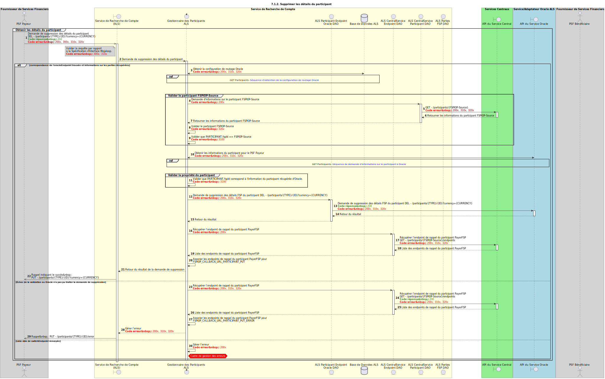

# DEL Participants

Conception de la suppression d’un participant par un DFSP.

## Notes

- Voir la section 6.2.2.4 — l’ALS doit vérifier que c’est bien le FSP actuel de la partie qui supprime l’information. C’est pris en compte dans la conception en s’assurant que la partie appartient au FSP qui demande la suppression. Les autres validations hors périmètre du *Switch* relèvent du schéma.

## Diagramme de séquence

