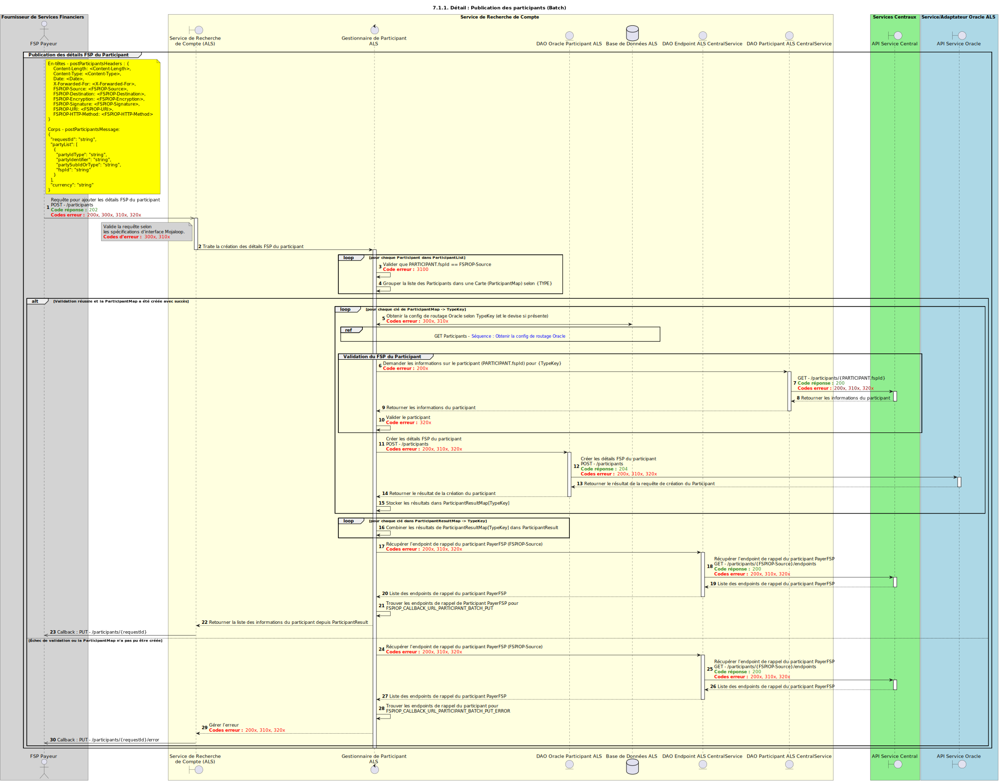

# Diagramme de séquence — POST Participants (batch)

Conception de la création de participants par un DFSP via une requête groupée.

## Notes

- L’opération ne prend en charge que les requêtes où :
    - tous les FSP des participants correspondent au `FSPIOP-Source`
    - tous les participants partagent la même devise, conformément à l’appel `POST /participants` de l’[API FSPIOP Mojaloop](/api/fspiop/v1.1/api-definition.html#post-participants)
- Un second `POST` avec le même TYPE et une devise optionnelle correspondante est traité comme une **mise à jour** : l’enregistrement existant doit être **entièrement remplacé**.

## Diagramme de séquence

