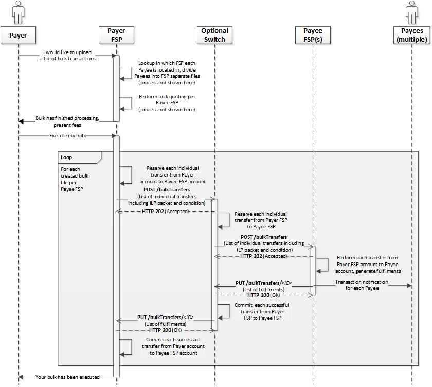

# Conception des transferts groupés (*Bulk Transfers*)

Le scénario des transferts groupés est décrit dans le document de définition d’API pour la ressource `/bulkTransfers`. Pour le détail, *(voir la section `6.10`)* selon la [spécification Mojaloop](https://github.com/mojaloop/mojaloop-specification/blob/master/API%20Definition%20v1.0.pdf).

1. [Introduction](introduction)
2. [Considérations de conception](design-considerations)
3. [Étapes de l’architecture de haut niveau](steps-involved-in-the-high-level-architecture)
4. [Notes](notes)
    1. [Points de discussion](discussion-items)
    2. [Nouvelles tables proposées](proposed-new-tables)
    3. [États des transferts groupés](bulk-transfers-states)
    4. [Notes complémentaires](additional-notes)
5. [Sujets de feuille de route](roadmap-topics)

## 1. Introduction

Le processus de transferts groupés est traité à la section 6.10 du document *API Definition* 1.0, illustré par la figure 60 dont un extrait figure ci-dessous.

Les éléments clés implicites dans la spécification en version 1.0 sont les suivants :

- La réserve de fonds est effectuée pour chaque transfert individuel du FSP payeur vers le FSP bénéficiaire
- Si un seul transfert individuel échoue pendant la phase *prepare*, l’ensemble du lot doit être rejeté.

## 2. Considérations de conception

D’après la figure 60 de la spécification, voici quelques implications importantes.

1. Le DFSP payeur effectue les recherches d’utilisateur pour chaque partie du paiement groupé séparément
2. Le DFSP payeur effectue une cotation groupée par DFSP bénéficiaire
3. Il incombe au DFSP payeur de préparer les transferts groupés selon les FSP bénéficiaires et d’envoyer une demande de transfert groupé à un seul FSP bénéficiaire
4. Il s’agit d’un processus « tout ou rien » : si un transfert individuel ne peut pas être réservé, tout le lot est rejeté, car on ne peut l’envoyer tel quel au bénéficiaire s’il contient un transfert sans réserve de fonds
5. Dans cette logique, la proposition actuelle est de donner au *Switch* le pouvoir (la spécification devra être mise à jour) d’envoyer la requête `POST /bulkTransfers` avec la liste des transferts individuels pour lesquels les fonds ont pu être réservés sur le *Switch*
6. Le *Switch* agrège alors les engagements et les échec côté FSP bénéficiaire et envoie un seul appel `PUT /bulkTransfers/{ID}` au FSP payeur avec la liste complète, y compris les transferts ayant échoué sur le *Switch* ou chez le FSP bénéficiaire
7. Exemple : 1000 transferts dans un lot ; le *Switch* réserve les fonds pour 900 d’entre eux — la requête *prepare* vers le DFSP bénéficiaire ne contient que ces 900. Si le FSP bénéficiaire renvoie un *Bulk Fulfil* avec 800 engagements et 100 abandons, le *Switch* traite chaque transfert et envoie le *callback* `PUT /bulkTransfers/{ID}` au FSP payeur pour les 1000 transferts : 800 *committed*, 200 *aborted*
8. Des impacts sur la signature, le chiffrement, la PKI et d’autres aspects de sécurité devront être traités
9. L’ordonnancement des transferts individuels relève aussi du schéma. Dans les marchés émergents, l’objectif peut être de maximiser le volume : un schéma peut réordonner par montants croissants avant traitement — décision de schéma
10. Une règle de schéma recommandée : les FSP bénéficiaires ne devraient pas pouvoir réordonner les transferts d’un lot pour éviter un biais en faveur des parties bénéficiaires
11. Les règlements impliquant des paiements publics de très gros montants via transferts groupés doivent être examinés pour permettre le traitement sans règles de liquidité trop strictes

## 3. Étapes de l’architecture de haut niveau

Étapes principales pour les transferts groupés.

1. [1.0, 1.1, 1.2] Une entrée `POST /bulkTransfers` sur le *bulk-api-adapter* est stockée dans un objet ; une notification avec référence au message est publiée sur le topic Kafka `bulk-prepare` ; une réponse **202** est renvoyée au FSP payeur
2. [1.3] Le *Bulk Prepare handler* consomme la requête et enregistre l’état RECEIVED

    a. Il valide le lot et passe à PENDING si la validation réussit

    b. Règle supplémentaire proposée : rejeter un lot si des identifiants de transfert dupliqués apparaissent dans le lot

    c. [1.4] Si la validation échoue, passage de `bulkTransferState` à PENDING_INVALID (état interne) et message vers le topic de traitement groupé
        i. Le *Bulk processing Handler* met `bulkTransferState` à REJECTED et notifie le payeur

3. [1.4] [suite de 2.a] Le *Bulk Prepare handler* décompose le lot en transferts individuels et les envoie sur le topic *prepare*

    a. Chaque transfert reçoit notamment la même date d’expiration que le transfert groupé (et les autres champs nécessaires)

4. [1.5, 1.6, 1.7] Les *Prepare handler* et *Position handler* sont adaptés pour traiter les transferts d’un lot (indicateurs `type`, `action`, `status`, etc.)

    a. La réserve de fonds est gérée par les gestionnaires concernés ; le lot est agrégé dans le *Bulk Processing Handler*

5. [1.8] Le *Position Handler* publie des messages vers le topic de traitement groupé pour chaque transfert du lot
6. [1.9] Pour chaque message consommé, le *Bulk processing Handler* vérifie s’il s’agit du dernier transfert de la phase en cours
7. [1.10, 1.11, 1.12] S’il s’agit du dernier transfert, agréger l’état de tous les transferts individuels et

    a. S’ils sont tous en état réservé → envoyer `POST /bulkTransfers` au bénéficiaire (message vers le topic *notifications*, consommé par le *notification handler*)

    b. Une fois la requête *prepare* envoyée au bénéficiaire, passer le statut à ACCEPTED

8. En cas de *Prepare* réussi — à réception du `PUT` *bulkFulfil* du FSP bénéficiaire, publication sur le topic *bulk fulfil* avec référence au message *Fulfil* stocké dans le *object store*
9. Consommation par le *bulkFulfilHandler*, passage à PROCESSING
10. Le *bulk-fulfil-handler* décompose le lot et envoie chaque transfert aux *Fulfil* et *Position Handlers* refactorisés pour valider ou abandonner selon le `PUT /bulkTransfers/{ID}` du bénéficiaire et pour engager ou libérer les fonds sur le *Switch*
11. Le *bulk-processing-handler* agrège les résultats et fixe l’état `bulkTransfer` à COMPLETED ou REJECTED

    a. Si le bénéficiaire envoie COMMITTED pour au moins un transfert individuel, proposition : état de lot COMPLETED

    b. En revanche, pour l’étape 8 ou si le bénéficiaire envoie REJECTED comme `bulkTransferState`, l’état final sur le *Switch* doit être REJECTED

12. Notifications au payeur et au bénéficiaire (proche des transferts unitaires, avec écart par rapport à la spec 1.0). Le FSP payeur reçoit la liste exhaustive des transferts individuels (identique à celle de la requête *prepare*). Le FSP bénéficiaire ne reçoit que le sous-ensemble qui lui a été adressé dans la requête *Bulk prepare* (transferts réservés sur le *Switch*).

## 4. Détails d’implémentation

### 4.1 États des transferts groupés

États d’un transfert groupé selon la spécification d’API Mojaloop :

1. RECEIVED
2. PENDING
3. ACCEPTED
4. PROCESSING
5. COMPLETED
6. REJECTED
7. État interne — PENDING_PREPARE (mappé sur PENDING)
8. État interne — PENDING_INVALID (mappé sur PENDING)
9. État interne — PENDING_FULFIL (mappé sur PROCESSING)
10. État interne — EXPIRING (mappé sur PROCESSING)
11. État interne — EXPIRED (mappé sur COMPLETED)
12. État interne — INVALID (mappé sur REJECTED)
13. Des micro-états supplémentaires peuvent être ajoutés pour usage interne sur le *Switch*

### 4.2 Nouvelles tables proposées

Tables proposées pour la conception des transferts groupés :

- bulkTransfer
- bulkTransferStateChange
- bulkTransferError
- bulkTransferDuplicateCheck
- bulkTransferFulfilment
- bulkTransferFulfilmentDuplicateCheck
- bulkTransferAssociation
- bulkTransferExtension
- bulkTransferState
- bulkProcessingState

### 4.3 Combinaisons internes type — action — statut

#### 1. Transfert groupé validé au schéma [ml-api-adapter → bulk-prepare-handler]

  1. type: bulk-prepare
  2. action: bulk-prepare
  3. Status: success
  4. Résultat : bulkTransferState=RECEIVED, bulkProcessingState=RECEIVED

#### 2. Doublon [bulk-prepare-handler → notification handler]

  1. type: notification
  2. action: bulk-prepare-duplicate
  3. Status: success
  4. Résultat : bulkTransferState=N/A, bulkProcessingState=N/A

#### 3. Échec de validation *Bulk Prepare* [bulk-prepare-handler → notification-handler]

  1. type: notification
  2. action: bulk-abort
  3. Status: error

#### 4. *Bulk Prepare* valide (décomposé en transferts individuels) [bulk-prepare-handler → prepare-handler]

  1. type: prepare
  2. action: bulk-prepare
  3. Status: success

#### 5. Doublon d’un transfert individuel du lot [prepare-handler → bulk-processing-handler]

  1. type: bulk-processing
  2. action: prepare-duplicate
  3. Status: success
  4. Action attendue : ajouter un message d’erreur indiquant un doublon
  5. Résultat : bulkTransferState=PENDING_PREPARE/ACCEPTED (selon qu’il s’agisse du dernier ou non), bulkProcessingState=RECEIVED_DUPLICATE

#### 6. Transfert *Prepare* individuel, doublon valide dans le *prepare handler* [prepare-handler → bulk-processing-handler]

  1. type: bulk-processing
  2. action: prepare-duplicate
  3. Status: error
  4. Résultat : bulkTransferState=PENDING_PREPARE/ACCEPTED (selon qu’il s’agisse du dernier ou non), bulkProcessingState=RECEIVED_DUPLICATE

#### 7. *Prepare* individuel valide, membre d’un lot [prepare-handler → position-handler]

  1. type: position
  2. action: bulk-prepare
  3. Status: success

#### 8. *Prepare* individuel du lot, validation échouée dans le *prepare handler* [prepare-handler → bulk-processing-handler]

  1. type: bulk-processing
  2. action: bulk-prepare
  3. Status: error
  4. Résultat : bulkTransferState=PENDING_PREPARE/ACCEPTED (selon qu’il s’agisse du dernier ou non), bulkProcessingState=RECEIVED_INVALID

#### 9. *Prepare* individuel valide, membre d’un lot [position-handler → bulk-processing-handler]

  1. type: bulk-processing
  2. action: bulk-prepare
  3. Status: success
  4. Résultat : bulkTransferState=PENDING_PREPARE/ACCEPTED (selon qu’il s’agisse du dernier ou non), bulkProcessingState=ACCEPTED

#### 10. *Prepare* individuel du lot, validation échouée dans le *position handler* [position-handler → bulk-processing-handler]

  1. type: bulk-processing
  2. action: bulk-prepare
  3. Status: error
  4. Résultat : bulkTransferState=PENDING_PREPARE/ACCEPTED (selon qu’il s’agisse du dernier ou non), bulkProcessingState=RECEIVED_INVALID

#### 11. *Fulfil* individuel valide (engagement), membre d’un lot [position-handler → bulk-processing-handler]

  1. type: bulk-processing
  2. action: bulk-commit
  3. Status: success
  4. Résultat : bulkTransferState=PENDING_FULFIL/COMPLETED (selon qu’il s’agisse du dernier ou non), bulkProcessingState=COMPLETED

#### 12. Message *Fulfil* de lot validé [ml-api-adapter → bulk-fulfil-handler]

  1. type: bulk-fulfil
  2. action: bulk-commit
  3. Status: success

#### 13. Transfert individuel valide du lot, *timeout* dans le *position handler* [position-handler → bulk-processing-handler]

  1. type: bulk-processing
  2. action: bulk-timeout-reserved
  3. Status: error
  4. Résultat : bulkTransferState=PENDING_FULFIL/COMPLETED (selon qu’il s’agisse du dernier ou non), bulkProcessingState=FULFIL_INVALID

#### 14. *Fulfil* individuel valide (rejet), membre d’un lot [position-handler → bulk-processing-handler]

  1. type: bulk-processing
  2. action: reject
  3. Status: success
  4. Résultat : bulkTransferState=PENDING_FULFIL/COMPLETED (selon qu’il s’agisse du dernier ou non), bulkProcessingState=REJECTED

#### 15. Doublon *Fulfil* invalide pour un transfert du lot [fulfil-handler → bulk-processing-handler]

  1. type: bulk-processing
  2. action: fulfil-duplicate
  3. Status: error
  4. Résultat : bulkTransferState=PENDING_FULFIL/COMPLETED (selon qu’il s’agisse du dernier ou non), bulkProcessingState=FULFIL_DUPLICATE

#### 16. Doublon *Fulfil* valide pour un transfert du lot [fulfil-handler → bulk-processing-handler]

  1. type: bulk-processing
  2. action: fulfil-duplicate
  3. Status: success
  4. Résultat : bulkTransferState=PENDING_FULFIL/COMPLETED (selon qu’il s’agisse du dernier ou non), bulkProcessingState=FULFIL_DUPLICATE

#### 17. Message *Fulfil* valide pour un transfert du lot [fulfil-handler → position-handler]

  1. type: position
  2. action: bulk-commit
  3. Status: success

#### 18. *Fulfil* individuel du lot, validation échouée dans le *fulfil handler* [fulfil-handler → bulk-processing-handler]

  1. type: bulk-processing
  2. action: bulk-commit
  3. Status: error
  4. Résultat : bulkTransferState=PENDING_FULFIL/COMPLETED (selon qu’il s’agisse du dernier ou non), bulkProcessingState=FULFIL_INVALID

#### 19. Demande *Fulfil* valide pour un transfert du lot [bulk-fulfil-handler → fulfil-handler]

  1. type: bulk-fulfil
  2. action: bulk-commit
  3. Status: success

#### 20. Transferts groupés : validation échouée au niveau *bulk-fulfil-handler* [bulk-fulfil-handler → notification-handler]

  1. type: notification
  2. action: bulk-abort
  3. Status: error

#### 21. Notifications de transfert groupé vers les FSP [bulk-processing-handler → notification-handler]

  1. type: notification
  2. action: bulk-prepare / bulk-commit
  3. Status: success

#### 22. Notification de *timeout* [timeout-handler → bulk-processing-handler]

  1. type: bulk-processing
  2. action: bulk-timeout-received
  3. Status: error
  4. Résultat : bulkTransferState=COMPLETED (pour le dernier), bulkProcessingState=EXPIRED

#### 23. Notification de *timeout* [timeout-handler → position-handler]

  1. type: position
  2. action: bulk-timeout-reserved
  3. Status: error

#### 24. Notification de *timeout* après ajustement de position [position-handler → bulk-processing-handler]

  1. type: bulk-processing
  2. action: bulk-timeout-reserved
  3. Status: error
  4. Résultat : bulkTransferState=COMPLETED (pour le dernier), bulkProcessingState=EXPIRED

### 4.4 Notes complémentaires

1. Documenter `GET /bulkTransfers` pour préciser les différences de réponses entre FSP payeur et FSP bénéficiaire
2. Utiliser un service dédié : *bulk-api-adapter* pour les endpoints des transferts groupés (y compris la persistance évoquée ci-dessus)

## 5. Sujets de feuille de route

1. Réévaluer le besoin de prendre en charge plusieurs FSP bénéficiaires dans un lot et les évolutions de spécification
2. Traiter par priorité les points et enseignements du PoC documentés
3. Étudier une ressource type *Bulk make* (`/bulkMake` ?) où le *Switch* accepte un lot complet et enchaîne les trois phases — recherche, cotation et transferts
4. *Throttling* des transferts individuels dans un lot ?
5. Ordre de traitement dans un lot — sur le *Switch* et chez les FSP. Recommandation : règle imposant aux FSP de respecter l’ordre du lot sans traitement préférentiel ; sur le *Switch*, rester neutre sur l’ordre, bonne pratique : tri par montants croissants
6. Règlements avec transferts groupés et paiements publics de très montants : assouplir les règles de liquidité si nécessaire
7. Implémenter `GET /bulkTransfers`
8. Notifications / journaux pour tous les cas négatifs de lot
9. Couverture complète par tests unitaires
10. Tests d’intégration du *golden path* de transfert groupé réussi
11. Tests de régression, scénarios négatifs inclus
