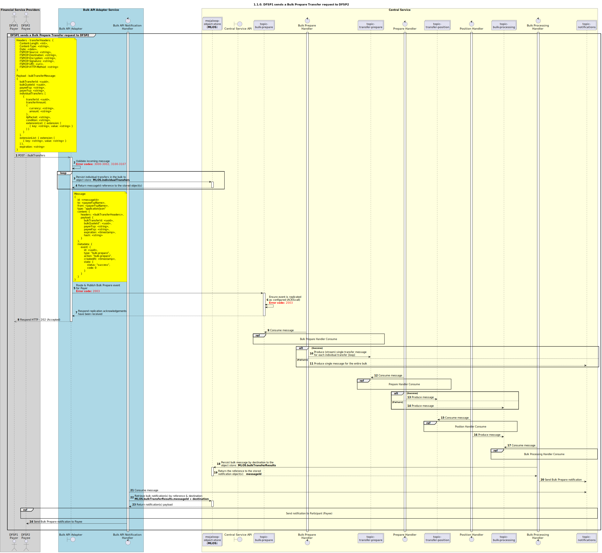

# Requête de transfert en lot — Préparation [Vue d’ensemble] [inclut les transferts individuels dans un lot]

Diagramme de séquence pour le processus de préparation d’une requête de transfert.

## Références dans le diagramme de séquence

* [Consommation par le gestionnaire de lot — Préparation (1.1.1)](1.1.1-bulk-prepare-handler-consume.md)
* [Consommation par le gestionnaire de préparation (1.2.1)](1.2.1-prepare-handler-consume-for-bulk.md)
* [Consommation par le gestionnaire de position (1.3.0)](1.3.0-position-handler-consume-overview.md)
* [Consommation par le gestionnaire de traitement de lot (1.4.1)](1.4.1-bulk-processing-handler.md)
* [Envoi de notification au participant (1.1.4.a)](1.1.4.a-send-notification-to-participant.md)

## Diagramme de séquence

