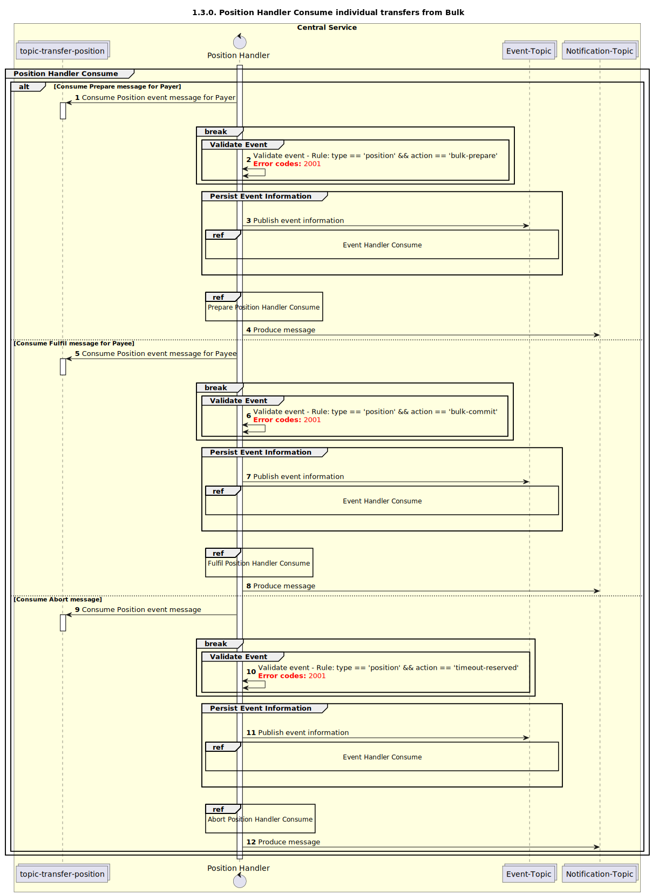

# Consommation par le gestionnaire de position [inclut les transferts individuels dans un lot]

Diagramme de séquence pour le processus de consommation par le gestionnaire de position.

## Références dans le diagramme de séquence

* [Consommation par le gestionnaire d’événements (9.1.0)](../../central-event-processor/9.1.0-event-handler-placeholder.md)
* [Consommation par le gestionnaire de position — Préparation (1.3.1)](1.3.1-prepare-position-handler-consume.md)
* [Consommation par le gestionnaire de position — Exécution (2.3.1)](2.3.1-fulfil-position-handler-consume.md)
* [Consommation par le gestionnaire de position — Abandon (2.3.2)](2.3.2-position-consume-abort.md)

## Diagramme de séquence

