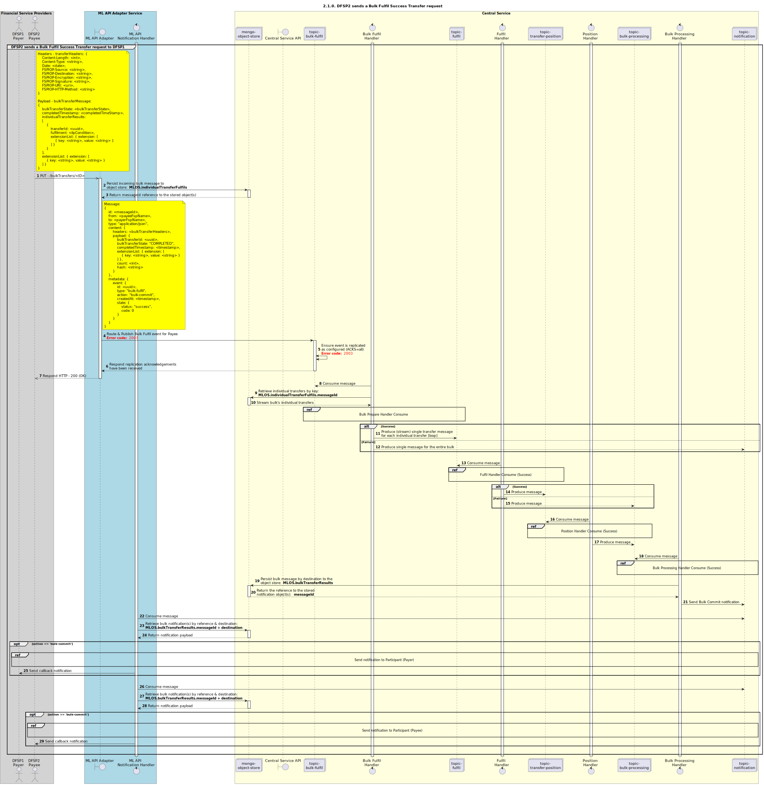

# Requête de transfert en lot — Exécution [Vue d’ensemble]

Diagramme de séquence pour la requête de transfert en lot — Exécution.

## Références dans le diagramme de séquence

* [Consommation par le gestionnaire de lot — Exécution (succès) (2.1.1)](2.1.1-bulk-fulfil-handler-consume.md)
* [Consommation par le gestionnaire d’exécution (succès) (2.2.1)](2.2.1-fulfil-commit-for-bulk.md)
* [Consommation par le gestionnaire de position (succès) (2.3.1)](2.3.1-fulfil-position-handler-consume.md)
* [Consommation par le gestionnaire de traitement de lot (1.4.1)](1.4.1-bulk-processing-handler.md)
* [Envoi de notification au participant (1.1.4.a)](1.1.4.a-send-notification-to-participant.md)

## Diagramme de séquence

