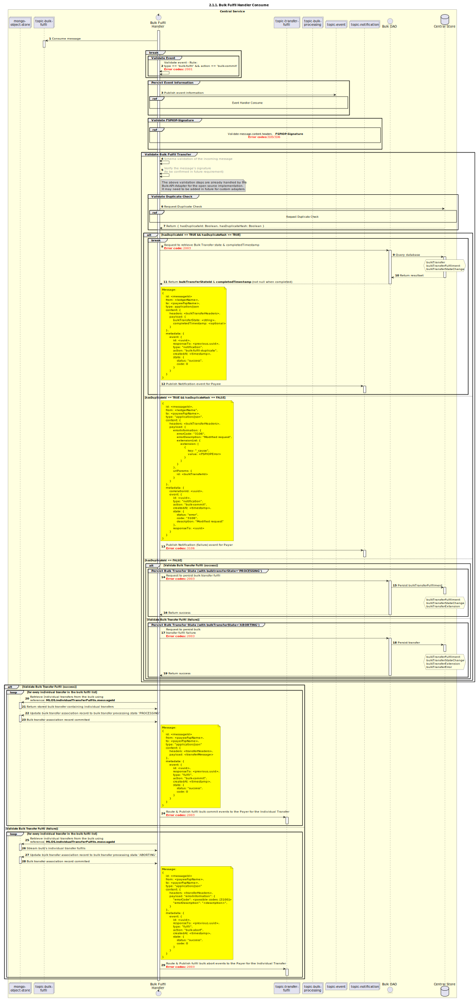

# Consommation par le gestionnaire de lot — Exécution

Diagramme de séquence pour le processus de consommation par le gestionnaire de lot — Exécution.

## Références dans le diagramme de séquence

* [Consommation par le gestionnaire d’événements (9.1.0)](../../central-event-processor/9.1.0-event-handler-placeholder.md)
* [Validation de signature (seq-signature-validation)](../../central-event-processor/signature-validation.md)
* [Envoi de notification au participant (1.1.4.a)](1.1.4.a-send-notification-to-participant.md)

## Diagramme de séquence

