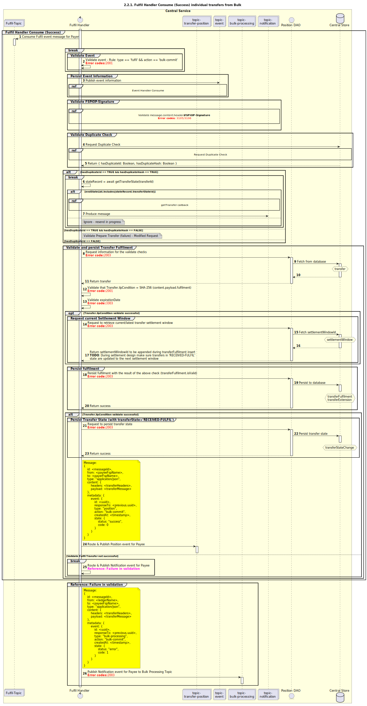

# Le bénéficiaire envoie une requête de transfert en lot — Exécution — Le lot est décomposé en transferts individuels

Diagramme de séquence pour le transfert en lot — Exécution dans le cadre de l’option de validation (commit).

## Références dans le diagramme de séquence

* [Consommation par le gestionnaire d’événements (9.1.0)](../../central-event-processor/9.1.0-event-handler-placeholder.md)

## Diagramme de séquence

