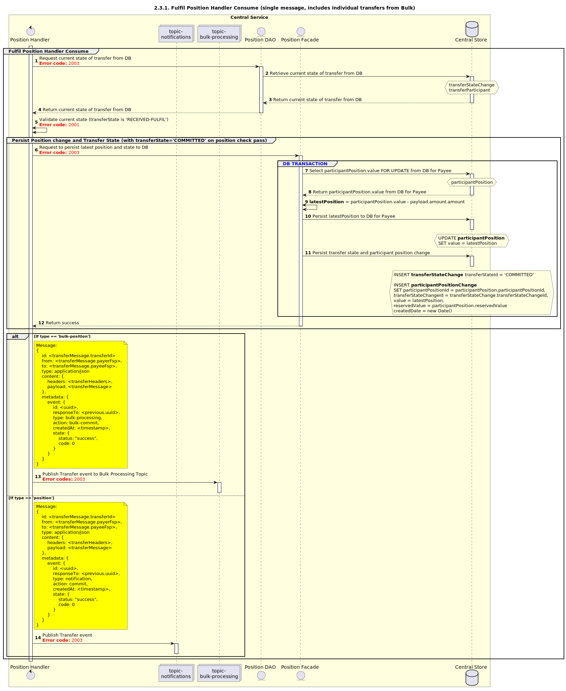

# Consommation par le gestionnaire de position — Exécution [inclut les transferts individuels dans un lot]

Diagramme de séquence pour le processus de consommation par le gestionnaire de position — Exécution.

## Références dans le diagramme de séquence

* [Consommation par le gestionnaire d’événements (9.1.0)](../../central-event-processor/9.1.0-event-handler-placeholder.md)

## Diagramme de séquence

