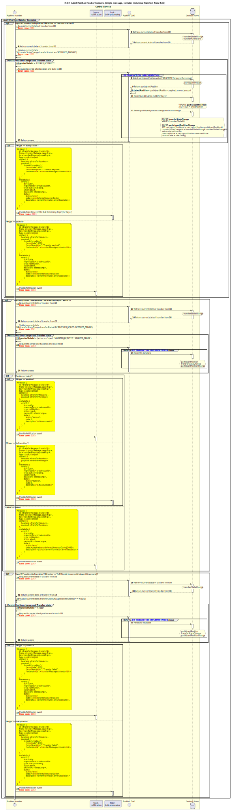

# Consommation par le gestionnaire de position — Abandon à l’exécution au niveau du transfert individuel

Diagramme de séquence pour le processus de consommation par le gestionnaire de position — Abandon.

## Diagramme de séquence

