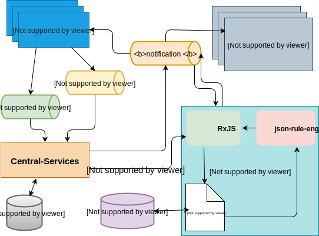

# Service Central Event Processor

Le service **Central Event Processor** (**CEP**) permet de surveiller un ensemble de règles métier ou de motifs prédéfinis et configurés.

Dans l’itération actuelle, les règles portent sur trois critères :

  1. Dépassement d’un seuil sur la limite du plafond de débit net (fixée notamment lors de l’intégration),
  2. Ajustement de la limite — plafond de débit net,
  3. Ajustement de position suite à un règlement.

Le CEP peut ensuite être couplé à un service de notification pour envoyer des alertes ou des notifications. Ici, il s’intègre à **email-notifier** pour envoyer des alertes selon ces critères.

