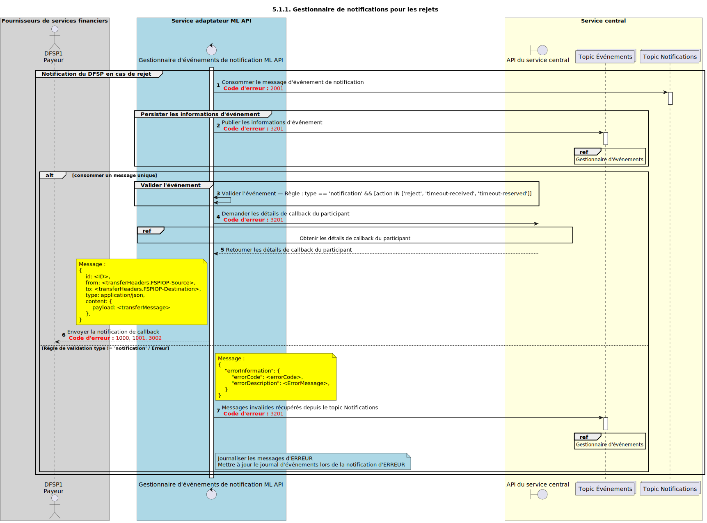

# Gestionnaire de notifications pour les rejets

Diagramme de conception de séquence pour le processus du gestionnaire de notifications en cas de rejet.

## Références dans le diagramme de séquence

* [Consommation du gestionnaire d’événements (9.1.0)](event-handler-placeholder.md)
* [Obtenir les détails de callback du participant (3.1.0)](../central-ledger/admin-operations/3.1.0-post-participant-callback-details.md)

## Diagramme de séquence

