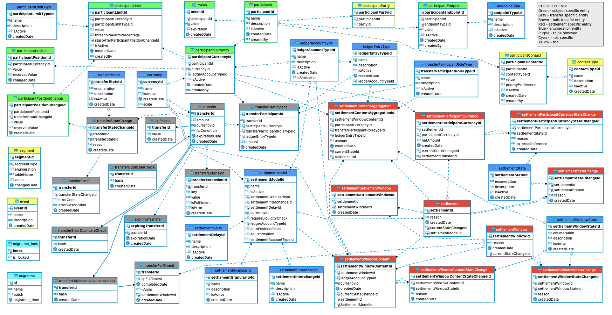

# Services du registre central (*Central Ledger*)

Le registre central est une série de services qui assurent la compensation et le règlement des transferts entre DFSP, notamment :

* L’intermédiation des messages en temps réel pour la compensation des fonds
* Le maintien des positions nettes pour un règlement net différé
* La propagation des frais au niveau du schéma de paiement et des frais hors transfert

## 1. Conception du processus du registre central

### 1.1 Vue d’ensemble de l’architecture

## 2. Architecture de bout en bout des transferts

### 2.1 Architecture de bout en bout des transferts (v1.1)

### 2.2 Architecture de bout en bout des transferts (v1.0)

## 3. Conception de la base de données

### Remarque

Les tables en *gris* sont propres au processus de transfert. Les tables en *bleu* et *vert* sont utilisées à titre de référence pendant le processus de transfert.

Résumé des tables liées au transfert :

- `transfer` — données du transfert ;
- `transferDuplicateCheck` — identification des requêtes dupliquées lors du processus de demandes de transfert ;
- `transferError` — erreurs rencontrées pendant le transfert ;
- `transferErrorDuplicateCheck` — détection des doublons pour les processus d’erreur ;
- `transferExtensions` — données d’extension du transfert ;
- `transferFulfilment` — transferts ayant terminé la phase *prepare* ;
- `transferFulfilmentDuplicateCheck` — identification des requêtes dupliquées pour les demandes d’acquittement de transfert ;
- `transferParticipant` — informations de participant liées au transfert ;
- `transferStateChange` — suivi des changements d’état de chaque transfert individuel, constituant une piste d’audit pour chaque demande de transfert spécifique ;
- `transferTimeout` — transferts ayant subi une expiration (*timeout*) ;
- `ilpPacket` — paquet ILP du transfert ;

Les autres tables du MCD ci-dessous sont soit des tables de consultation (*lookup*, en bleu), soit spécifiques au règlement (en rouge), et figurent comme dépendances directes ou indirectes pour montrer la relation entre entités « transfert » et tables associées.

La définition du schéma de base de données du **registre central** : [schéma SQL du registre central](./assets/database/central-ledger-ddl-MySQLWorkbench.sql).

## 4. Spécification d’API

Voir **Central Ledger API** dans la section [Spécifications d’API](../../api/README.md#central-ledger-api).
