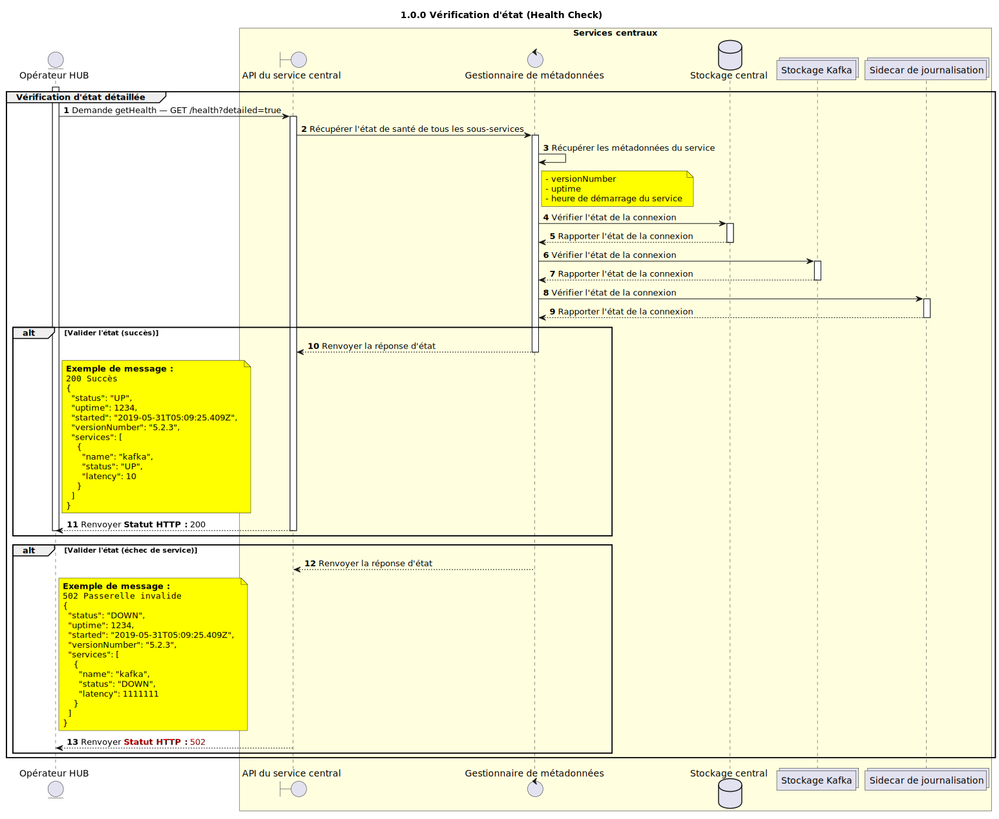

# GET — Vérification d’état (Health Check)

Discussion de conception pour la nouvelle implémentation de la vérification d’état.


## Objectifs

L’objectif de cette conception est d’implémenter une nouvelle vérification d’état pour les services du switch Mojaloop permettant un niveau de détail accru.

Elle prévoit notamment :
- Des codes HTTP explicites (inutile d’inspecter le corps de la réponse pour savoir s’il n’y a pas de problème)
- ~Rétrocompatibilité avec les vérifications d’état existantes~ — Ce n’est plus une exigence. Voir [cette discussion](https://github.com/mojaloop/project/issues/796#issuecomment-498350828).
- Des informations sur la version de l’API et la durée de fonctionnement du service
- Des informations sur les connexions aux sous-services (Kafka, sidecar de journalisation et MySQL)

## Format de la requête
`/health`

Utilise la vérification d’état nouvellement implémentée. Comme évoqué [ici](https://github.com/mojaloop/project/issues/796#issuecomment-498350828), comme il n’y aura pas de surcharge de connexion supplémentaire (par ex. requête vers une base de données) dans l’implémentation de la vérification d’état, il n’est pas nécessaire de compliquer les choses avec une version « simple » et une version « détaillée ».

Codes de réponse :
- `200` — Succès. L’API est en ligne et connectée aux services nécessaires.
- `502` — Passerelle invalide (*Bad Gateway*). L’API est en ligne mais ne peut pas se connecter à un service nécessaire (par ex. `kafka`).
- `503` — Service indisponible. Cette réponse n’est pas implémentée dans cette conception, mais sera la réponse par défaut si l’API n’est pas en ligne.

## Format de la réponse

| Nom  | Type | Description | Exemple |
| --- | --- | --- | --- |
| `status`        | `statusEnum`                       | État du service. Valeurs possibles : `OK` et `DOWN`. _Voir `statusEnum` ci-dessous_. | `"OK"`   | 
| `uptime`        | `number`                           | Durée de vie du service en secondes.  | `123456`                     |
| `started`       | `string` (date-heure au format ISO) | Date et heure de démarrage du service (UTC)                     | `"2019-05-31T05:09:25.409Z"` | 
| `versionNumber` | `string` (semver)                  | Version courante du service.                    | `"5.2.5"`                    |
| `services`      | `Array<serviceHealth>`             | Liste des services dont dépend ce service et statut de connexion | _voir ci-dessous_ |

### serviceHealth

| Nom  | Type | Description | Exemple |
| --- | --- | --- | --- |
| `name`    | `subServiceEnum`   | Nom du sous-service. _Voir `subServiceEnum` ci-dessous_.       | `"broker"` | 
| `status`  | `enum`             | État du service. Valeurs possibles : `OK` et `DOWN`    | `"OK"`     | 

### subServiceEnum

L’énumération `subServiceEnum` décrit le nom du sous-service :

Options :
- `datastore` → Base de données de ce service (typiquement MySQL).
- `broker`    → Courtier de messages de ce service (typiquement Kafka).
- `sidecar`   → Sous-service sidecar de journalisation auquel ce service est rattaché.
- `cache`     → Sous-service de mise en cache auquel ce service est rattaché.


### statusEnum

L’énumération d’état représente l’état du système ou d’un sous-service.

Elle comporte deux options :
- `OK`    → Le service ou sous-service est sain.
- `DOWN`  → Le service ou sous-service est dégradé ou indisponible.

Lorsqu’un service est `OK` : l’API est considérée comme saine, et tous les sous-services le sont également.

Si __un quelconque__ sous-service est `DOWN`, l’ensemble de la vérification d’état échoue et l’API est considérée comme `DOWN`.

## Définition de l’état des sous-services

Il ne suffit pas de « pinger » un sous-service pour savoir s’il est sain ; il faut aller plus loin. Ces critères évolueront selon le sous-service.

### `datastore`

Pour `datastore`, un état `OK` signifie :
- Une connexion active à la base de données
- La base n’est pas vide (contient plus d’une table)


### `broker`

Pour `broker`, un état `OK` signifie :
- Une connexion active au courtier Kafka
- Les rubriques (*topics*) nécessaires existent. Cela dépend du service sur lequel s’exécute la vérification d’état.

Par exemple, pour que le service `central-ledger` soit considéré comme sain, les rubriques suivantes doivent être présentes :
```
topic-admin-transfer
topic-transfer-prepare
topic-transfer-position
topic-transfer-fulfil
```

### `sidecar`

Pour `sidecar`, un état `OK` signifie :
- Une connexion active au sidecar


### `cache`

Pour `cache`, un état `OK` signifie :
- Une connexion active au cache


## Définition Swagger 

>_Remarque : ces éléments seront ajoutés aux définitions Swagger existantes des services suivants :_
> - `ml-api-adapter`
> - `central-ledger`
> - `central-settlement`
> - `central-event-processor`
> - `email-notifier`

```json
{
  /// . . . 
  "/health": {
    "get": {
      "operationId": "getHealth",
      "tags": [
        "health"
      ],
      "responses": {
        "default": {
          "schema": {
              "$ref": "#/definitions/health"
          },
          "description": "Succès"
        }
      }
    }
  },
  // . . .
  "definitions": {
    "health": {
      "type": "object",
      "properties": {
        "status": {
          "type": "string",
          "enum": [
            "OK",
            "DOWN"
          ]
        },
        "uptime": {
          "description": "Durée de vie du service en secondes.",
          "type": "number",
        },
        "started": {
          "description": "Date et heure de démarrage du service (UTC)",
          "type": "string",
          "format": "date-time"
        },
        "versionNumber": {
          "description": "Version courante du service.",
          "type": "string",
          "example": "5.2.3",
        },
        "services": {
          "description": "Liste des services dont dépend ce service et statut de connexion",
          "type": "array",
          "items": {
            "$ref": "#/definitions/serviceHealth"
          }
        },
      },
    },
    "serviceHealth": {
      "type": "object",
      "properties": {
        "name": {
          "description": "Nom du sous-service.",
          "type": "string",
          "enum": [
            "datastore",
            "broker",
            "sidecar",
            "cache"
          ]
        },
        "status": {
          "description": "Statut de connexion avec le service.",
          "type": "string",
          "enum": [
            "OK",
            "DOWN"
          ]
        }
      }
    }
  }
}
```


### Exemples de requêtes et de réponses :

__Vérification d’état héritée réussie :__

```bash
GET /health HTTP/1.1
Content-Type: application/json

200 SUCCESS
{
  "status": "OK"
}
```


__Nouvelle vérification d’état réussie :__

```
GET /health?detailed=true HTTP/1.1
Content-Type: application/json

200 SUCCESS
{
  "status": "OK",
  "uptime": 0,
  "started": "2019-05-31T05:09:25.409Z",
  "versionNumber": "5.2.3",
  "services": [
    {
      "name": "broker",
      "status": "OK",
    }
  ]
}
```

__Vérification d’état en échec, mais API en ligne :__

```
GET /health?detailed=true HTTP/1.1
Content-Type: application/json

502 BAD GATEWAY
{
  "status": "DOWN",
  "uptime": 0,
  "started": "2019-05-31T05:09:25.409Z",
  "versionNumber": "5.2.3",
  "services": [
    {
      "name": "broker",
      "status": "DOWN",
    }
  ]
}
```

__Vérification d’état en échec :__

```
GET /health?detailed=true HTTP/1.1
Content-Type: application/json

503 SERVICE UNAVAILABLE
```


## Diagramme de séquence

Diagramme de séquence pour l’endpoint GET /health (vérification d’état).


