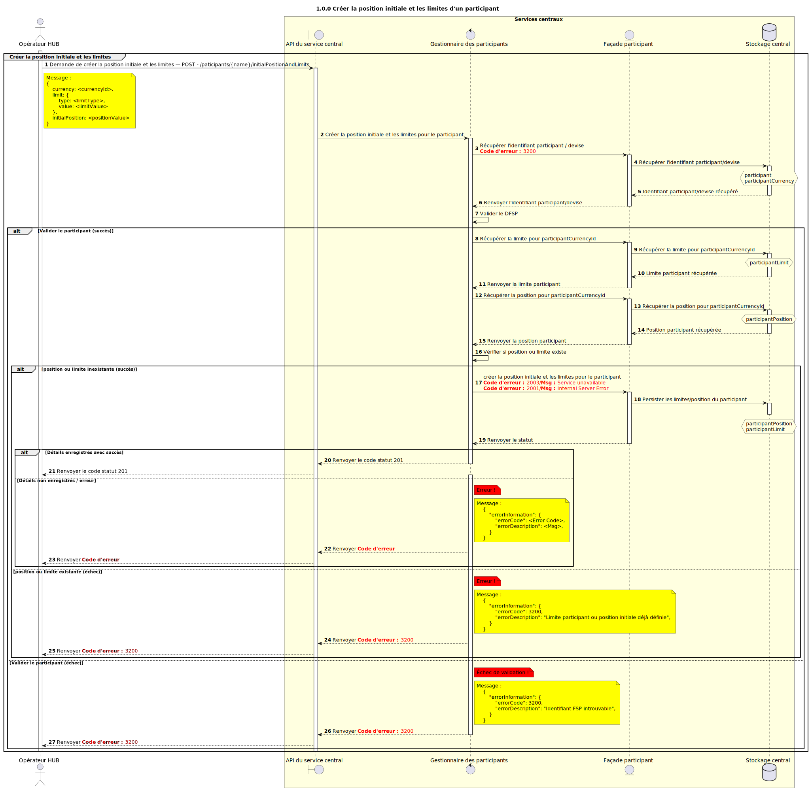

# Création de la position initiale et des limites d’un participant

Diagramme de séquence de conception pour le processus POST (création) de la position initiale et de la limite d’un participant.

## Diagramme de séquence

