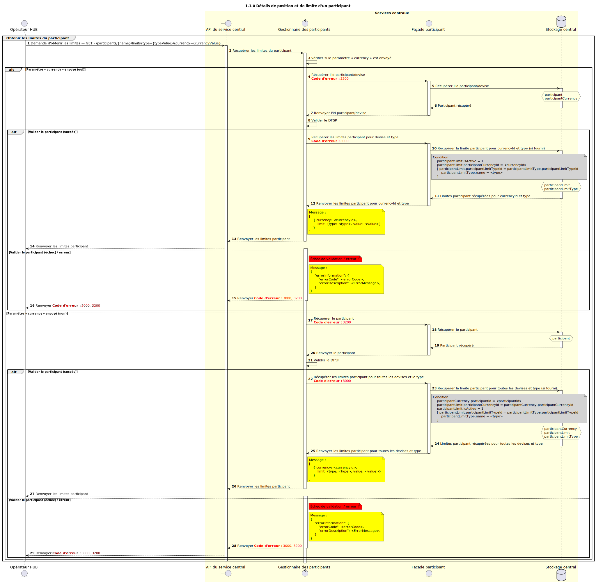

# Demander les détails de position et de limite d’un participant

Diagramme de séquence pour le processus de demande des détails de position et de limite d’un participant.

## Diagramme de séquence

