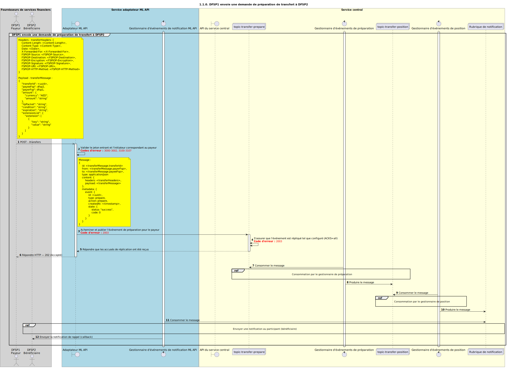

# Demande de préparation de transfert (Prepare)

Diagramme de séquence pour le processus de demande de préparation de transfert.

## Références dans le diagramme de séquence

* [Consommation par le gestionnaire Prepare (1.1.1.a)](1.1.1.a-prepare-handler-consume.md)
* **Non implémenté** [Consommation par le gestionnaire Prepare (1.1.1.b)](1.1.1.b-prepare-handler-consume.md)
* [Consommation par le gestionnaire Position (1.1.2.a)](1.1.2.a-position-handler-consume.md)
* **Non implémenté** [Consommation par le gestionnaire Position (1.1.2.b)](1.1.2.b-position-handler-consume.md)
* [Envoi d’une notification au participant (1.1.4.a)](1.1.4.a-send-notification-to-participant.md)
* **Non implémenté** [Envoi d’une notification au participant (1.1.4.b)](1.1.4.b-send-notification-to-participant.md)

## Diagramme de séquence

