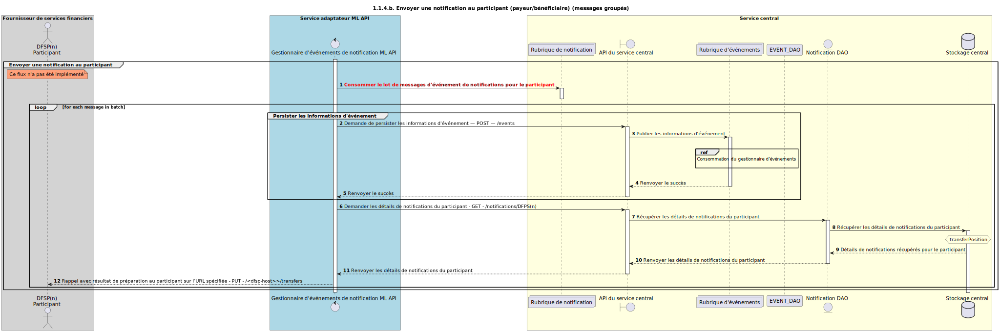

# Envoi d’une notification au participant

Diagramme de conception de séquence pour la demande d’envoi d’une notification au participant.

## Références au sein du diagramme de séquence

* [9.1.0 — Consommation par le gestionnaire d’événements](../../central-event-processor/9.1.0-event-handler-placeholder.md)

## Diagramme de séquence

