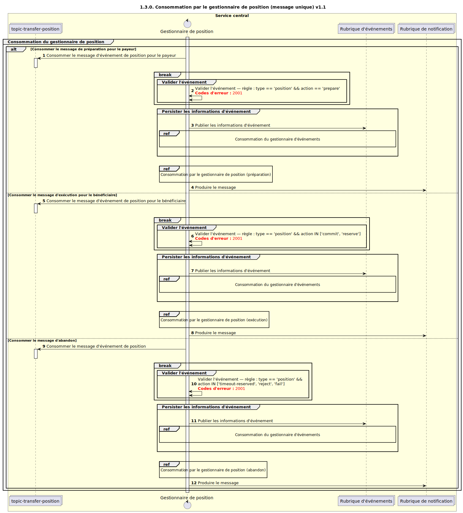

# Consommation par le gestionnaire Position (v1.1)

Diagramme de séquence pour le processus de consommation par le gestionnaire Position.

## Références dans le diagramme de séquence

* [Consommation par le gestionnaire d’événements (9.1.0)](../../central-event-processor/9.1.0-event-handler-placeholder.md)
* [Consommation par le gestionnaire de position — Prepare (1.3.1)](1.3.1-prepare-position-handler-consume.md)
* [Consommation par le gestionnaire de position — Fulfil (1.3.2)](1.3.2-fulfil-position-handler-consume-v1.1.md)
* [Consommation par le gestionnaire de position — abandon (1.3.3)](1.3.3-abort-position-handler-consume.md)

## Diagramme de séquence

