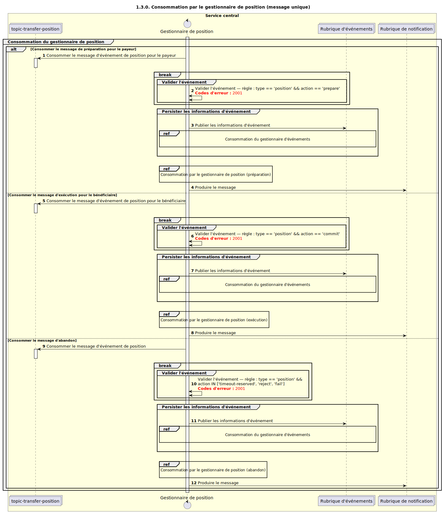

# Consommation par le gestionnaire Position

Diagramme de séquence de conception pour le processus de consommation par le gestionnaire Position.

## Références figurant dans le diagramme de séquence

* [Gestionnaire Event — Consommation (9.1.0)](../../central-event-processor/9.1.0-event-handler-placeholder.md)
* [Gestionnaire Position — Consommation Prepare (1.3.1)](1.3.1-prepare-position-handler-consume.md)
* [Gestionnaire Position — Consommation Fulfil (1.3.2)](1.3.2-fulfil-position-handler-consume.md)
* [Gestionnaire Position — Consommation Abort (1.3.3)](1.3.3-abort-position-handler-consume.md)

## Diagramme de séquence

