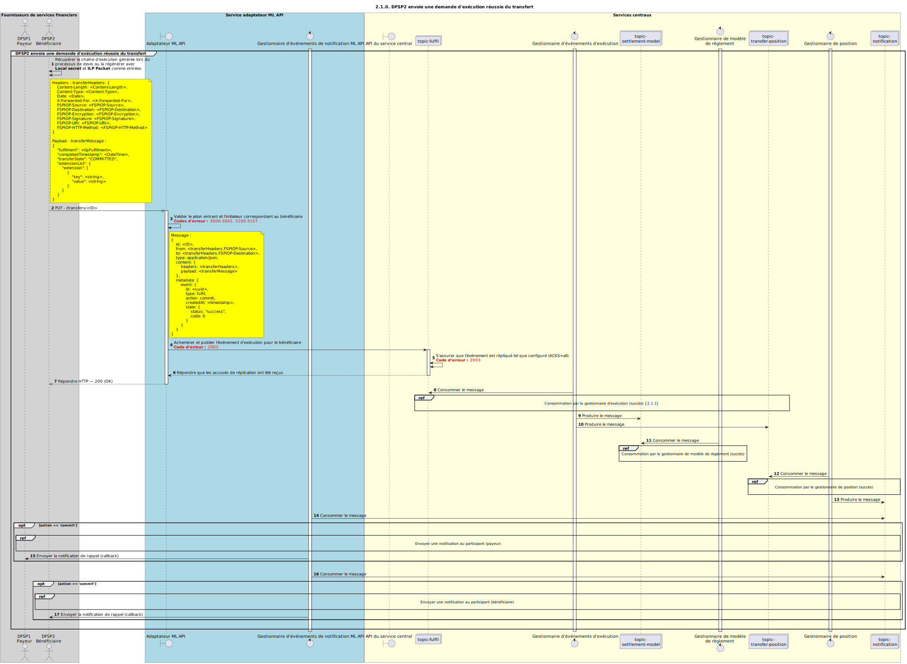

# Demande de transfert Fulfil — succès

Diagramme de séquence pour la demande de transfert Fulfil en cas de succès.

## Références dans le diagramme de séquence

* [Consommation par le gestionnaire Fulfil (succès) (2.1.1)](2.1.1-fulfil-handler-consume.md)
* [Consommation par le gestionnaire de position — Fulfil (succès) (1.3.2)](1.3.2-fulfil-position-handler-consume.md)
* [Envoi d’une notification au participant (1.1.4.a)](1.1.4.a-send-notification-to-participant.md)

## Diagramme de séquence

