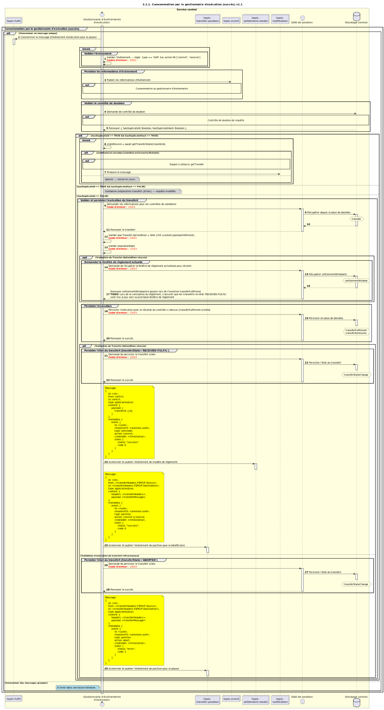

# Consommation par le gestionnaire Fulfil (succès) (v1.1)

Diagramme de séquence pour le processus de consommation par le gestionnaire Fulfil.

## Références dans le diagramme de séquence

* [Consommation par le gestionnaire d’événements (9.1.0)](../../central-event-processor/9.1.0-event-handler-placeholder.md)
* [Validation de signature (seq-signature-validation)](../../central-event-processor/signature-validation.md)
* [Envoi d’une notification au participant (1.1.4.a)](1.1.4.a-send-notification-to-participant-v1.1.md)

## Diagramme de séquence

