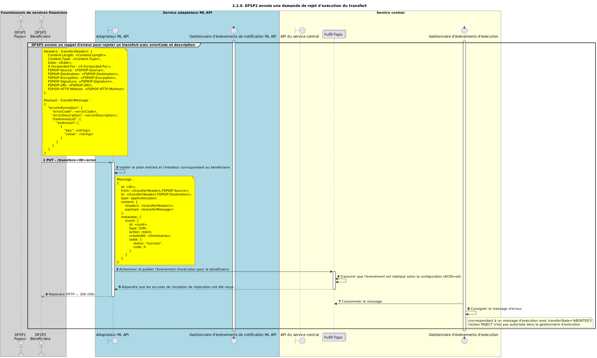

# Le bénéficiaire envoie une demande d’abandon Fulfil pour le transfert (v1.1)

Diagramme de séquence pour le processus de rejet Fulfil d’un transfert pour la version 1.1 de l’API.

## Diagramme de séquence

