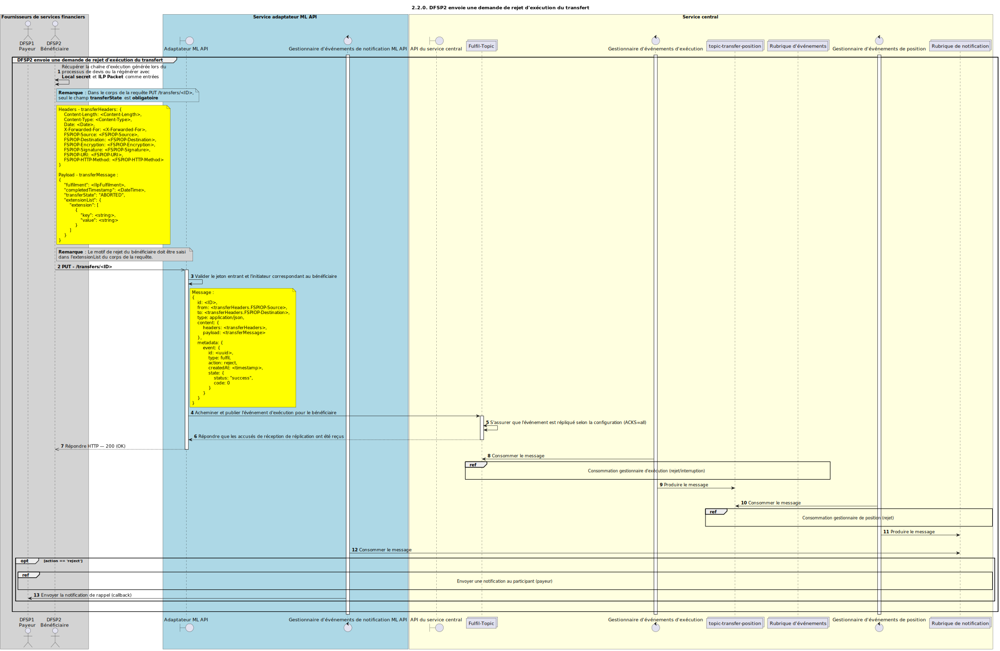

# [Obsolète] Le bénéficiaire envoie une demande de rejet Fulfil pour le transfert

Diagramme de séquence pour le processus de rejet Fulfil d’un transfert.

## Références dans le diagramme de séquence

* [Consommation par le gestionnaire Fulfil (rejet / abandon) (2.2.1)](2.2.1-fulfil-reject-handler.md)
* [Consommation par le gestionnaire de position — rejet (1.3.3)](1.3.3-abort-position-handler-consume.md)
* [Envoi d’une notification au participant (1.1.4.a)](1.1.4.a-send-notification-to-participant-v1.1.md)

## Diagramme de séquence

