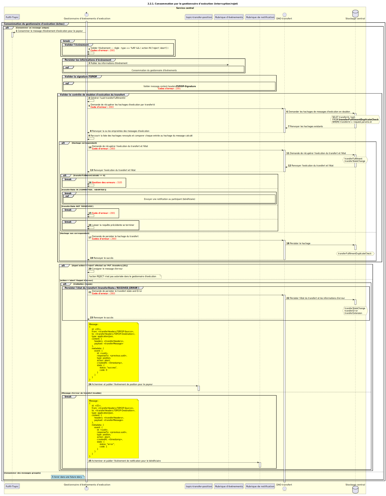

# Consommation par le gestionnaire Fulfil (rejet / abandon) (v1.1)

Diagramme de séquence pour le processus de rejet ou d’abandon par le gestionnaire Fulfil pour la version 1.1 de l’API.

## Diagramme de séquence

