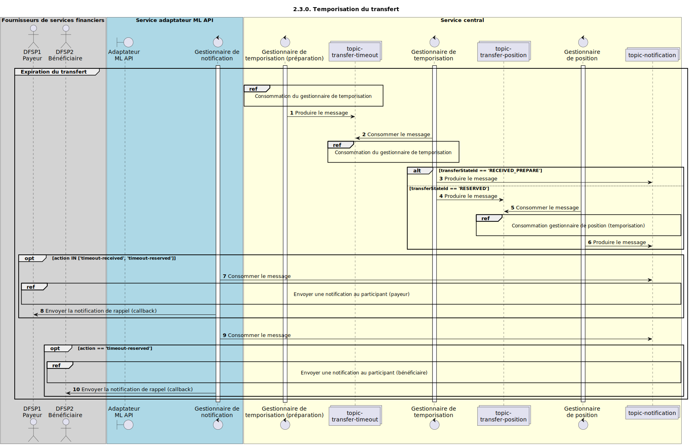

# Expiration du transfert (timeout)

Diagramme de séquence pour le processus d’expiration d’un transfert.

## Références dans le diagramme de séquence

* [Consommation par le gestionnaire d’expiration (2.3.1)](2.3.1-timeout-handler-consume.md)
* [Consommation par le gestionnaire de position — expiration (1.3.3)](1.3.3-abort-position-handler-consume.md)
* [Envoi d’une notification au participant (1.1.4.a)](1.1.4.a-send-notification-to-participant.md)

## Diagramme de séquence

