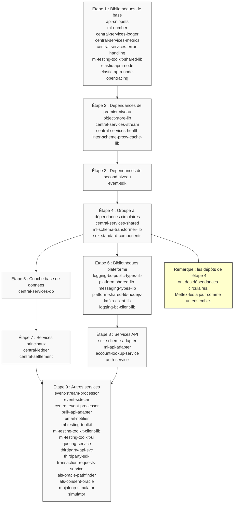

Le diagramme suivant illustre la séquence de mise à jour recommandée pour les dépôts Mojaloop, en tenant compte de leurs dépendances et relations :

Ce diagramme donne une représentation visuelle de la séquence de mise à jour et montre :

1. Le regroupement logique des dépôts
2. Les dépendances entre groupes
3. Les cas particuliers comme les dépendances circulaires
4. Les possibilités de mises à jour en parallèle
5. Les différents types de dépendances à prendre en compte
