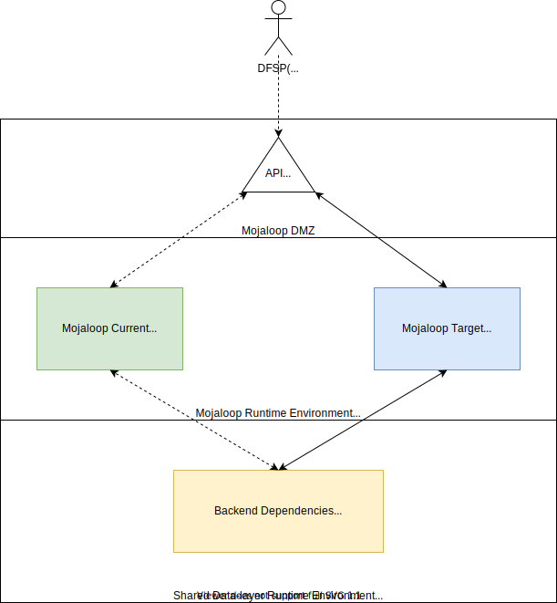
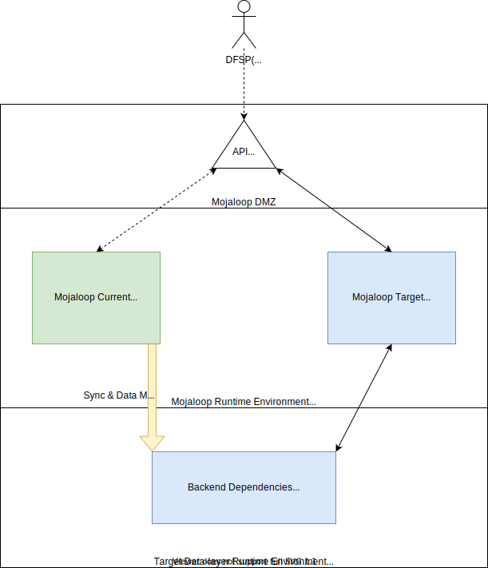

# Guide des stratégies de mise à niveau

Ce document explique comment mettre à niveau des installations Mojaloop existantes. Il part du principe que Mojaloop est déjà installé avec Helm, mais ces stratégies s’appliquent de façon générale.

## Table des matières

- [Guide des stratégies de mise à niveau](#guide-des-stratégies-de-mise-à-niveau)
  - [Table des matières](#table-des-matières)
  - [Mises à niveau Helm](#mises-à-niveau-helm)
    - [Versions sans rupture de compatibilité](#versions-sans-rupture-de-compatibilité)
    - [Versions avec rupture de compatibilité](#versions-avec-rupture-de-compatibilité)
      - [Mojaloop installé sans dépendances backend](#mojaloop-installé-sans-dépendances-backend)
        - [1. La version cible n’introduit pas de changements cassants sur le stockage de données](#1-la-version-cible-nintroduit-pas-de-changements-cassants-sur-le-stockage-de-données)
          - [Exemple de déploiement de type canary](#exemple-de-déploiement-de-type-canary)
        - [2. La version cible introduit des changements cassants sur le stockage de données](#2-la-version-cible-introduit-des-changements-cassants-sur-le-stockage-de-données)
      - [Mojaloop installé avec dépendances backend](#mojaloop-installé-avec-dépendances-backend)
        - [Exemple de déploiement blue-green](#exemple-de-déploiement-blue-green)
  - [Commandes de mise à niveau](#commandes-de-mise-à-niveau)
    - [Mise à niveau vers v17.0.0](#mise-à-niveau-vers-v1700)
      - [Tester le scénario de mise à niveau de v16.0.0 vers v17.0.0](#tester-le-scénario-de-mise-à-niveau-de-v1600-vers-v1700)

## Mises à niveau Helm

Cette section décrit les stratégies applicables à un déploiement Helm Mojaloop existant utilisant les [charts Helm Mojaloop](https://github.com/mojaloop/helm).

La portée des changements cassants décrits ci-dessous concerne le déploiement Helm de l’opérateur du switch sans impact direct (c’est-à-dire sans changement fonctionnel tel qu’une nouvelle version de la spécification API Mojaloop) sur les participants (par ex. fournisseurs de services financiers). De tels changements fonctionnels peuvent figurer dans une publication Helm, mais sortent du cadre de cette section.

Recommandations :

1. Toute mise à niveau doit être testée et validée dans un environnement préproduction (test ou QA).
2. Consultez toujours les notes de version : problèmes connus ou indications utiles pour la montée de version.
3. La commande [migrate:list](https://knexjs.org/#Migrations) permet de lister les changements de données en attente dans les dépôts suivants :
    - <https://github.com/mojaloop/central-ledger>
    - <https://github.com/mojaloop/account-lookup-service>

### Versions sans rupture de compatibilité

Les changements non cassants n’exigent aucune action supplémentaire ou particulière (sauf indication contraire dans les notes de version) hormis l’exécution d’une [mise à niveau Helm](https://helm.sh/docs/helm/helm_upgrade) standard.

Paramètres optionnels utiles lors d’une mise à niveau :

```
   -i, --install                      si aucune release de ce nom n’existe, exécuter une installation
   --reuse-values                 lors d’une mise à niveau, réutiliser les valeurs de la dernière release et fusionner les surcharges de la ligne de commande via --set et -f. Si « --reset-values » est spécifié, cette option est ignorée
   --version string               contrainte de version du chart à utiliser (étiquette précise ex. 1.1.1 ou plage valide ex. ^2.0.0). Si omis, la dernière version est utilisée
```

Exemple d’utilisation :

```bash
helm --namespace ${NAMESPACE} ${RELEASE_NAME} upgrade --install mojaloop/mojaloop --reuse-values --version ${RELEASE_VERSION}
```

Un retour en arrière est possible avec la commande [Helm rollback](https://helm.sh/docs/helm/helm_rollback/) si besoin.

### Versions avec rupture de compatibilité

Plusieurs stratégies existent selon la topologie de déploiement :

1. Mojaloop installé **sans** dépendances backend (Kafka, MySQL, MongoDB, etc.), celles-ci étant gérées séparément — **préféré** et le plus souple en cas de changements cassants.

2. Mojaloop installé **avec** dépendances backend couplées à l’installation Helm.

    > *REMARQUE : Ce mode sera déprécié à partir de Mojaloop v15.0.0 (y compris v15) ; un exemple de déploiement backend reste fourni pour les tests et la QA. Voir la section [5. BREAKING CHANGES](https://github.com/mojaloop/helm/blob/master/.changelog/release-v15.0.0.md#5-breaking-changes) des [notes de version v15.0.0](https://github.com/mojaloop/helm/blob/master/.changelog/release-v15.0.0.md).*


#### Mojaloop installé sans dépendances backend

Topologie préférée : elle offre le plus de souplesse. En séparant les dépendances backend, vous pouvez déployer la version cible de Mojaloop comme **nouveau** déploiement.

Ce nouveau déploiement peut soit réutiliser les dépendances backend existantes, soit en exiger de nouvelles selon les cas :

##### 1. La version cible n’introduit pas de changements cassants sur le stockage de données

Dans ce cas, on peut adopter une stratégie de type **canary** en pointant le nouveau déploiement vers les dépendances backend existantes. Par défaut, les schémas de données sont mis à niveau via les scripts de `migration` (voir [Central-ledger](https://github.com/mojaloop/central-ledger/tree/master/migrations), [Account-lookup-service](https://github.com/mojaloop/account-lookup-service/tree/master/migrations)). On peut aussi désactiver les migrations (ex. [central-ledger](https://github.com/mojaloop/helm/blob/master/mojaloop/values.yaml#L147), configuration analogue pour account-lookup-service) et préparer un script SQL manuel (voir [migrate:list](https://knexjs.org/#Migrations) pour la liste des changements en attente).

Le déploiement Mojaloop actuel ne devrait pas être perturbé.

Les dépendances backend étant partagées entre l’ancien et le nouveau déploiement, il est possible de router un sous-ensemble d’utilisateurs vers la cible afin de valider avec un impact limité et de permettre un retour rapide vers l’ancien déploiement.

###### Exemple de déploiement de type canary



1. Adaptez le [values.yaml du chart Mojaloop](https://github.com/mojaloop/helm/blob/master/mojaloop/values.yaml) pour la version cible :
   1. Pointez la configuration backend vers les dépendances backend déjà déployées (partagées).
   2. Si besoin, évitez que les règles Ingress écrasent la configuration du déploiement courant.
2. Déployez la version cible Mojaloop (Bleu).
   1. Surveillez les journaux des conteneurs `run-migration` pour d’éventuelles erreurs :
      - `kubectl -n ${NAMESPACE} logs -l app.kubernetes.io/name=centralledger-service -c run-migration`
      - `kubectl -n ${NAMESPACE} logs -l app.kubernetes.io/name=account-lookup-service-admin -c run-migration`
3. Exécutez des tests de cohérence sur l’environnement **Vert** actuel (impact des changements de données, possibilité de rollback ou bascule partielle pour les DFSP, etc.).
4. Exécutez des tests de cohérence sur l’environnement cible **Bleu**.
5. Basculez la passerelle API (ou les règles Ingress) du **Vert** actuel vers le **Bleu** cible.

##### 2. La version cible introduit des changements cassants sur le stockage de données

Dans ce scénario (Mojaloop installé sans dépendances backend), on peut utiliser une **mise à niveau Helm sur place** des dépendances backend.
Une fenêtre de maintenance doit être planifiée pour arrêter les transactions « en direct » sur le déploiement courant afin de garantir la cohérence des données et une bascule sûre. Cela provoque une interruption, atténuable en planifiant la fenêtre aux heures les moins chargées.

Il est **essentiel** de sauvegarder la base de données en cas de retour à la version précédente.

1. Planifier la fenêtre de maintenance.
2. Sauvegarder les bases de données.
3. Adapter le [values.yaml du chart Mojaloop](https://github.com/mojaloop/helm/blob/master/mojaloop/values.yaml) pour la version cible.
4. Désinstaller les services Mojaloop.
5. Mettre à niveau les dépendances backend avec :
```bash 
helm upgrade ${RELEASE_NAME} mojaloop/example-mojaloop-backend --namespace ${NAMESPACE} --version ${RELEASE_VERSION}
```
6. Installer les services Mojaloop :
```bash 
helm install ${RELEASE_NAME} mojaloop/mojaloop --namespace ${NAMESPACE} --version ${RELEASE_VERSION} -f {$VALUES_FILE}
```
7. Exécuter les tests de cohérence.
8. En cas de retour en arrière (la sauvegarde de la base doit avoir été faite avant la montée de version) :
   1. Utiliser `helm rollback` pour revenir à la version précédente des dépendances backend.
   2. Restaurer la base à partir de la sauvegarde (pour un état cohérent du stockage).
   3. Réinstaller la version précédente des services Mojaloop.

#### Mojaloop installé avec dépendances backend (version 15 ou antérieure)

Dans ce scénario, on peut adopter une stratégie **blue-green** : déployer de nouvelles dépendances backend et la version cible Mojaloop séparément (avec l’avantage de se rapprocher de la topologie recommandée).

Une **migration manuelle** des données des anciens magasins vers les nouveaux backends cibles sera nécessaire. Il faudra aussi maintenir les magasins ancien et nouveau synchronisés tant que des transactions en direct transitent encore par l’ancien déploiement. Planifiez une fenêtre de maintenance pour arrêter le trafic « live », garantir la cohérence et basculer en toute sécurité — avec interruption possible, à limiter en choisissant une plage horaire creuse.

##### Exemple de déploiement blue-green



1. Adaptez le [values.yaml du chart Mojaloop](https://github.com/mojaloop/helm/blob/master/mojaloop/values.yaml) pour la version cible :
   1. Pointez la configuration backend vers les nouvelles dépendances backend cibles.
   2. Si besoin, évitez que les règles Ingress écrasent la configuration du déploiement courant.
2. Déployez la version cible Mojaloop (Bleu).
3. Mettez en place un processus de migration pour synchroniser et transformer les données du backend **Vert** vers le **Bleu**.
4. Planifiez la fenêtre de bascule.
5. Réalisez la bascule pendant la fenêtre :
   1. Passer les backends **Verts** en lecture seule lorsque c’est possible.
   2. Vider les connexions restantes sur le Vert.
   3. Vérifier que la migration est entièrement synchronisée de Vert vers Bleu.
   4. Exécuter les tests de cohérence sur l’environnement cible Bleu.
   5. Basculez la passerelle API (ou les règles Ingress) du Vert actuel vers le Bleu cible.


## Commandes de mise à niveau

Ce document fournit des commandes pour mettre à niveau des installations Mojaloop existantes. Il suppose Mojaloop installé via Helm.
       
### Mise à niveau vers v17.0.0

1. Mettre à niveau les dépendances backend :
```bash
helm upgrade backend mojaloop/example-mojaloop-backend --namespace ${NAMESPACE} --version v17.0.0 -f ${VALUES_FILE}
```
2. Installer les services Mojaloop :
```bash
helm install moja mojaloop/mojaloop --namespace ${NAMESPACE} --version v17.0.0 -f ${VALUES_FILE}
```

#### Tester le scénario de mise à niveau de v16.0.0 vers v17.0.0

1. Installer les dépendances backend v16.0.0 avec persistance activée (créer les bases manuellement : les scripts initDb ne s’exécuteront pas) :
```bash
helm --namespace ${NAMESPACE} install ${RELEASE} mojaloop/example-mojaloop-backend --version 16.0.0  -f ${VALUES_FILE}
```
2. Installer les services Mojaloop v16.0.0 et lancer les tests pour peupler les bases :
```bash
helm --namespace ${NAMESPACE} install ${RELEASE} mojaloop/mojaloop --version 16.0.0  -f ${VALUES_FILE}
```
3. Désinstaller les services Mojaloop :
```bash
helm delete ${RELEASE} --namespace ${NAMESPACE}
```
4. Mettre à niveau les dépendances backend vers v17.0.0 (met à niveau les versions MySQL/Kafka/MongoDB) :
```bash
helm --namespace ${NAMESPACE} upgrade ${RELEASE} mojaloop/example-mojaloop-backend --version 17.0.0  -f ${VALUES_FILE}
```
5. Installer les services Mojaloop v17.0.0 (exécute les migrations Knex pour mettre à jour les schémas) :
```bash
helm --namespace ${NAMESPACE} install ${RELEASE} mojaloop/mojaloop --version 17.0.0  -f ${VALUES_FILE}
```
6. Lancer les tests Golden Path :
```bash
helm test ${RELEASE} --namespace=${NAMESPACE} --logs
```


