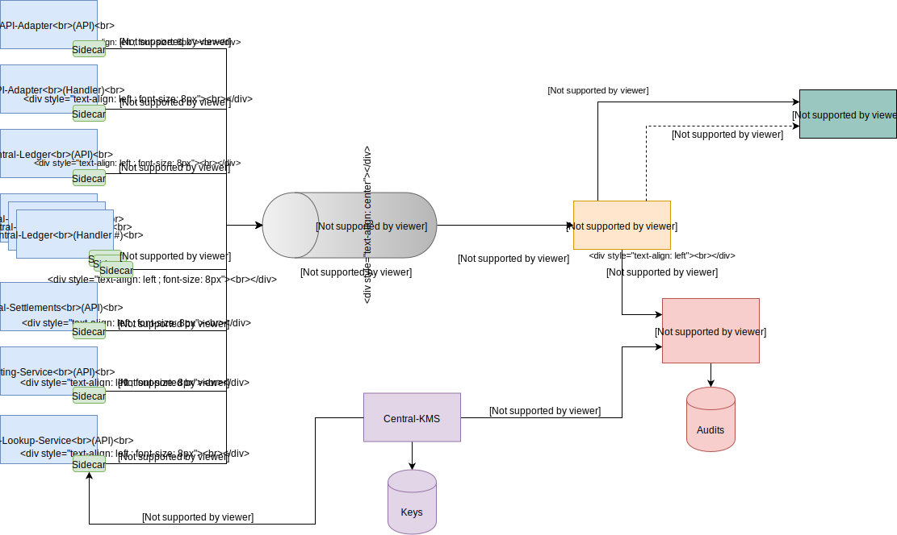
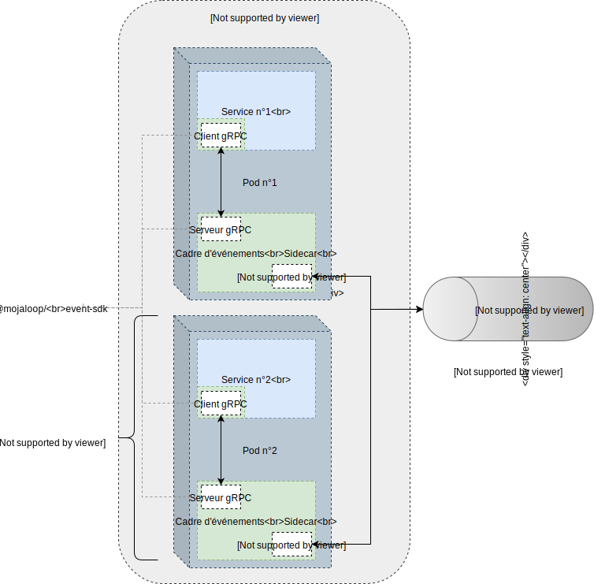

# Cadre d’événements (Event Framework)

Le **cadre d’événements** (*Event Framework*) vise à fournir une architecture unifiée et standard pour capturer tous les événements Mojaloop.

_Avertissement : solution expérimentale mise en œuvre comme preuve de concept (PoC). La conception peut évoluer selon les apprentissages et l’avancement du PoC._


## 1. Exigences

- Les événements sont produits via une bibliothèque commune standard qui publie vers un composant *sidecar* sur un protocole léger et performant (p. ex. gRPC).
- Le module *sidecar* publie sur un topic Kafka unique, consommable par plusieurs gestionnaires selon les besoins.
- Le partitionnement Kafka repose sur le type d’événement (p. ex. *log*, *audit*, *trace*, *errors*).
- Chaque composant Mojaloop dispose de son *sidecar* couplé.
- Les messages utilisent le *Trace-Id* comme clé Kafka, afin de regrouper toutes les traces d’une même transaction dans une même partition.


## 2. Architecture

### 2.1 Vue d’ensemble



### 2.2 *Pods* de microservices



### 2.3 Flux d’événements


## 3. Modèle d’enveloppe d’événement

### 3.1 Exemple JSON

```JSON
{
    "from": "noresponsepayeefsp",
    "to": "payerfsp",
    "id": "aa398930-f210-4dcd-8af0-7c769cea1660",
    "content": {
        "headers": {
            "content-type": "application/vnd.interoperability.transfers+json;version=1.0",
            "date": "2019-05-28T16:34:41.000Z",
            "fspiop-source": "noresponsepayeefsp",
            "fspiop-destination": "payerfsp"
        },
        "payload": "data:application/vnd.interoperability.transfers+json;version=1.0;base64,ewogICJmdWxmaWxtZW50IjogIlVObEo5OGhaVFlfZHN3MGNBcXc0aV9VTjN2NHV0dDdDWkZCNHlmTGJWRkEiLAogICJjb21wbGV0ZWRUaW1lc3RhbXAiOiAiMjAxOS0wNS0yOVQyMzoxODozMi44NTZaIiwKICAidHJhbnNmZXJTdGF0ZSI6ICJDT01NSVRURUQiCn0"
    },
    "type": "application/json",
    "metadata": {
        "event": {
            "id": "3920382d-f78c-4023-adf9-0d7a4a2a3a2f",
            "type": "trace",
            "action": "span",
            "createdAt": "2019-05-29T23:18:32.935Z",
            "state": {
                "status": "success",
                "code": 0,
                "description": "action réussie"
            },
            "responseTo": "1a396c07-47ab-4d68-a7a0-7a1ea36f0012"
        },
        "trace": {
            "service": "central-ledger-prepare-handler",
            "traceId": "bbd7b2c7-3978-408e-ae2e-a13012c47739",
            "parentSpanId": "4e3ce424-d611-417b-a7b3-44ba9bbc5840",
            "spanId": "efeb5c22-689b-4d04-ac5a-2aa9cd0a7e87",
            "startTimestamp": "2015-08-29T11:22:09.815479Z",
            "finishTimestamp": "2015-08-29T11:22:09.815479Z",
            "tags": {
              "transctionId": "659ee338-c8f8-4c06-8aff-944e6c5cd694",
              "transctionType": "transfer",
              "parentEventType": "bulk-prepare",
              "parentEventAction": "prepare"
            }
        }
    }
}
```

### 3.2 Définition du schéma

### 3.2.1 Définition d’objet : EventMessage

| Nom | Type | Obligatoire (O/N) | Description | Exemple |
| --- | --- | --- | --- | --- |
| id | string | O | Identifiant lié au message associé. |  |
| from | string | N | Si absent côté destination, la notification a été générée par le nœud connecté (serveur). |  |
| to | string | O | Obligatoire côté émetteur, optionnel côté destination. L’émetteur peut omettre la valeur de domaine. | |
| pp | string | N | Optionnel côté émetteur lorsqu’il représente l’identité de session. Obligatoire côté destination si l’identité de l’émetteur diffère de la propriété `from`. | |
| metadata | object `<MessageMetadata>` | N | Ne pas transporter d’informations de contenu via cette propriété — seulement le contexte de communication. Définir un nouveau type de contenu si nécessaire. | |
| type | string | O | Déclaration `MIME` du type de contenu du message. | |
| content | object \<any\> | O | Représentation du contenu. | |

##### 3.2.1.1 Définition d’objet : MessageMetadata

| Nom | Type | Obligatoire (O/N) | Description | Exemple |
| --- | --- | --- | --- | --- |
| event | object `<EventMetadata>` | O | Informations d’événement. |  |
| trace | object `<EventTraceMetaData>` | O | Informations de trace. |  |

##### 3.2.1.2 Définition d’objet : EventMetadata

| Nom | Type | Obligatoire (O/N) | Description | Exemple |
| --- | --- | --- | --- | --- |
| id | string | O | UUIDv4 généré pour l’événement. | 3920382d-f78c-4023-adf9-0d7a4a2a3a2f |
| type | enum `<EventType>` | O | Type d’événement. | [`log`, `audit`, `error` `trace`] |
| action | enum `<LogEventAction, AuditEventAction, TraceEventAction, NullEventAction>` | O | Type d’action. | [ `start`, `end` ] |
| createdAt | timestamp | O | Horodatage ISO. | 2019-05-29T23:18:32.935Z |
| responseTo | string | N | UUIDv4 de l’événement parent. | 2019-05-29T23:18:32.935Z |
| state | object `<EventStateMetadata>` | O | Objet d’état. |  |

##### 3.2.1.3 Définition d’objet : EventStateMetadata

| Nom | Type | Obligatoire (O/N) | Description | Exemple |
| --- | --- | --- | --- | --- |
| status | enum `<EventStatusType>` | O | Statut de traitement. | success |
| code | number | N | Code d’erreur selon la spécification Mojaloop. | 2000 |
| description | string | N | Libellé du statut ; souvent utilisé pour les erreurs. | Erreur serveur générique pour ne pas divulguer d’informations sensibles. |

##### 3.2.1.4 Définition d’objet : EventTraceMetaData

| Nom | Type | Obligatoire (O/N) | Description | Exemple |
| --- | --- | --- | --- | --- |
| service | string | O | Nom du service produisant la trace. | central-ledger-prepare-handler |
| traceId | 32HEXDIGLC | O | Identifiant de transaction de bout en bout. | 664314d5b207d3ba722c6c0fdcd44c61 |
| spanId | 16HEXDIGLC | O | Identifiant de jambe de traitement pour un composant ou une fonction. | 81fa25e8d66d2e88 |
| parentSpanId | 16HEXDIGLC | N | Identifiant du span parent. | e457b5a2e4d86bd1 |
| sampled | number | N | Indique si le message doit entrer dans la trace (`1`). Sinon, l’échantillonnage est laissé au consommateur. | 1 |
| flags | number | N | Inclusion dans le flux de trace (*Debug* `1` — surcharge la valeur `sampled`). | 0 |
| startTimestamp | datetime | N | ISO 8601 `yyyy-MM-dd'T'HH:mm:ss.SSSSSSz`. Si absent, horodatage courant. Début du *span*.| 2015-08-29T11:22:09.815479Z |
| finishTimestamp | datetime | N | ISO 8601 au même format. Si absent, horodatage courant. Fin du *span*. | 2015-08-29T11:22:09.815479Z |
| tags | object `<EventTraceMetaDataTags>` | O | Métadonnées associées à la trace. | success |

_Note : HEXDIGLC = chiffre / « a » … « f » (hex minuscule). Référence : [spécification W3C *trace-context*](https://www.w3.org/TR/trace-context/#field-value)._

##### 3.2.1.5 Définition d’objet : EventTraceMetaDataTags

| Nom | Type | Obligatoire (O/N) | Description | Exemple |
| --- | --- | --- | --- | --- |
| transactionId | string | N | Identifiant de transaction (transfert, cotation, etc.). | 659ee338-c8f8-4c06-8aff-944e6c5cd694 |
| transactionType | string | N | Type représenté par `transactionId` (transfert, cotation, etc.). | transfer |
| parentEventType | string | N | Type d’événement du span parent. | bulk-prepare |
| parentEventAction | string | N | Action d’événement du span parent. | prepare |
| tracestate | string | N | Présent si la variable d’environnement EventSDK `EVENT_SDK_TRACESTATE_HEADER_ENABLED` vaut `true` ou si le contexte parent contient l’en-tête ou le tag `tracestate`. Valeur conforme W3C. [Détails](#411-wc3-http-headers). | `congo=t61rcWkgMzE,rojo=00f067aa0ba902b7` | 
| `<string>` | string | N | Paire clé-valeur arbitraire pour métadonnées de trace supplémentaires. | n/a |

##### 3.2.1.6 Enum : EventStatusType

| Enum | Description |
| --- | --- |
| success | Événement traité avec succès |
| fail | Événement traité avec échec ou erreur |

##### 3.2.1.7 Enum : EventType

| Enum | Description |
| --- | --- |
| log | Entrée de journal générale. |
| audit | Événement à signer et persister dans le magasin d’audit. |
| trace | Événement avec contexte de trace pour le magasin de traçage. |

##### 3.2.1.8 Enum : LogEventAction

| Enum | Description |
| --- | --- |
| info | Entrée de journal niveau `info`. |
| debug | Entrée de journal niveau `debug`. |
| error | Entrée de journal niveau `error`. |
| verbose | Entrée de journal niveau `verbose`. |
| warning | Entrée de journal niveau `warning`. |
| performance | Entrée de journal niveau `performance`. |

##### 3.2.1.9 Enum : AuditEventAction

| Enum | Description |
| --- | --- |
| default | Action d’audit standard. |
| start | Début d’un processus. |
| finish | Fin d’un processus. |
| ingress | Activité d’entrée. |
| egress | Activité de sortie. |

##### 3.2.1.10 Enum : TraceEventAction

| Enum | Description |
| --- | --- |
| span | Action représentant un *span* de trace. |


## 4. Conception du traçage

### 4.1 Transports HTTP

En-têtes HTTP proposés pour le traçage.

Mojaloop n’a pas encore arbitré entre ces standards ni validé un support combiné.

#### 4.1.1 En-têtes W3C

Référence : https://w3c.github.io/trace-context/

| En-tête | Description | Exemple |
| --- | --- | --- |
| traceparent | Chaîne délimitée par des tirets : \<version\>-\<trace-id\>-\<parent\/span-id\>-\<trace-flags\> | 00-4bf92f3577b34da6a3ce929d0e0e4736-00f067aa0ba902b7-00 |
| tracestate | Format fabricant, délimité par des virgules : \<vendor\>=\<état encodé base64\>| congo=t61rcWkgMzE,rojo=00f067aa0ba902b7 |

Note : certains traceurs historiques envoyaient X-B3-Sampled comme `true`/`false` plutôt que `1`/`0`. Une implémentation tolérante peut les accepter.

Note : [Event-SDK](https://github.com/mojaloop/event-sdk) depuis v9.4.1 permet d’ajouter des tags clé-valeur dans `tracestate` ; depuis v9.5.2, `tracestate` est encodé en base64. Pour un comportement homogène, aligner les versions du SDK sur tous les services.

#### 4.1.2 En-têtes B3

Référence : https://github.com/apache/incubator-zipkin-b3-propagation

| En-tête | Description | Exemple |
| --- | --- | --- |
| X-B3-TraceId | 32 ou 16 caractères hex minuscules. | Ex. X-B3-TraceId: 463ac35c9f6413ad48485a3953bb6124. Requis sauf si seul l’état d’échantillonnage est propagé. |
| X-B3-SpanId | 16 caractères hex minuscules. | Ex. X-B3-SpanId: a2fb4a1d1a96d312. Requis sauf propagation de l’échantillonnage seul. |
| X-B3-ParentSpanId | Présent sur un span enfant, absent sur la racine. 16 caractères hex. | Ex. X-B3-ParentSpanId: 0020000000000001 |
| X-B3-Sampled | Acceptation `1`, refus `0`. Absent = décision différée au récepteur. | Ex. X-B3-Sampled: 1 |
| X-B3-Flags | *Debug* = `1` (implique acceptation ; ne pas envoyer aussi X-B3-Sampled). |  |

### 4.2 Transport Kafka

Voir la section *Modèle d’enveloppe d’événement* : format du message Kafka.

Le contexte de trace peut aussi être placé dans les en-têtes Kafka (v0.11+), ce qui exclut les versions antérieures.

### 4.3 Limites connues

- Le traçage des transferts reste limité à chaque jambe (*Prepare* / *Fulfil*) : la spécification API Mojaloop ne prévoit pas nativement les informations de trace. Le *Switch* peut les inclure dans les *callbacks*, mais les FSP ne sont pas tenus de répondre avec des en-têtes de trace réciproques.
