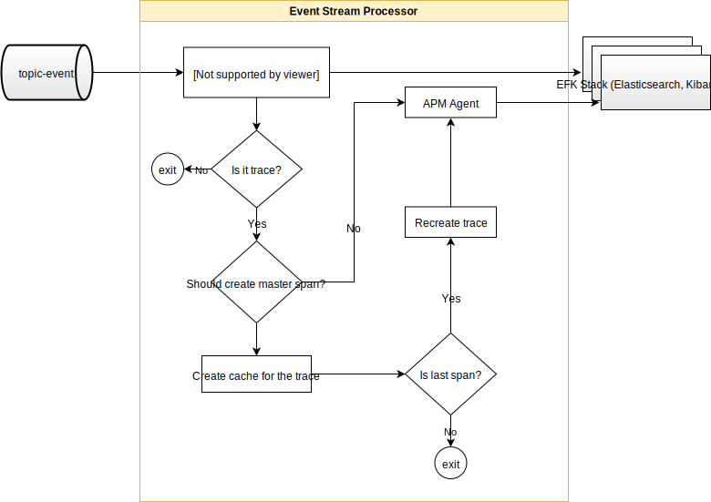
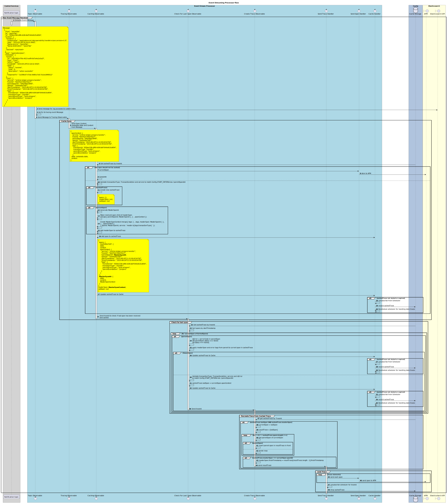

# Service Event Stream Processor

L’**Event Stream Processor** consomme les messages d’événements du topic `topic-events` en réponse aux messages publiés par le service [event-sidecar](https://github.com/mojaloop/event-sidecar). Pour plus d’informations sur l’architecture globale, consulter l’[infrastructure d’événements (Event Framework)](../event-framework/README.md).

Le service achemine les journaux (y compris les audits) et les traces vers la pile EFK avec le plugin APM activé. Selon le type de message d’événement, les messages sont acheminés vers différents index dans Elasticsearch.

## 1. Prérequis

Le service enregistre tous les événements dans une instance Elasticsearch avec le plugin APM activé. Un exemple *docker-compose* pour la stack Elastic est disponible [ici](https://github.com/mojaloop/event-stream-processor/blob/master/test/util/scripts/docker-efk/docker-compose.yml). Les journaux et audits utilisent un modèle d’index personnalisé ; les traces vont dans l’index par défaut `apm-*`.

Veuillez vous assurer d’avoir créé le modèle `mojatemplate` tel que décrit dans la documentation du service [event-stream-processor](https://github.com/mojaloop/event-stream-processor#111-create-template).

## 2. Vue d’ensemble de l’architecture

### 2.1. Vue d’ensemble du flux

### 2.2 Diagramme de séquence du traitement des traces

