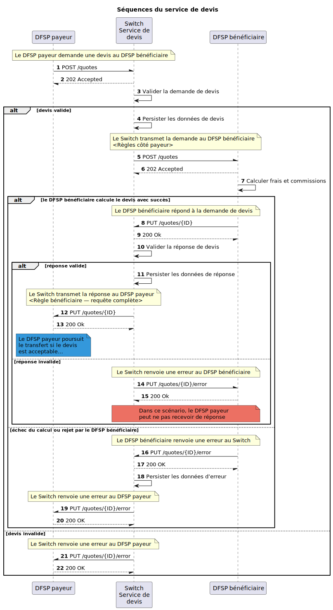

# Vue d’ensemble du service de devis

Le **Quoting Service** (**QS**) — *(voir la section `5.1`) conformément à la [spécification Mojaloop {{ $page.frontmatter.version }}](/api)* — met en œuvre la phase de devis des différents cas d’usage.

_Note : outre les devis individuelles, le service de devis prend aussi en charge les devis groupés (*bulk quotes*)._

## Diagramme de séquence

## Devis individuelles

- [GET — Devis par ID](qs-get-quotes.md)
- [POST — Devis](qs-post-quotes.md)

## Devis groupées (*bulk*)

- [GET — Devis par ID](qs-get-bulk-quotes.md)
- [POST — Devis](qs-post-bulk-quotes.md)
