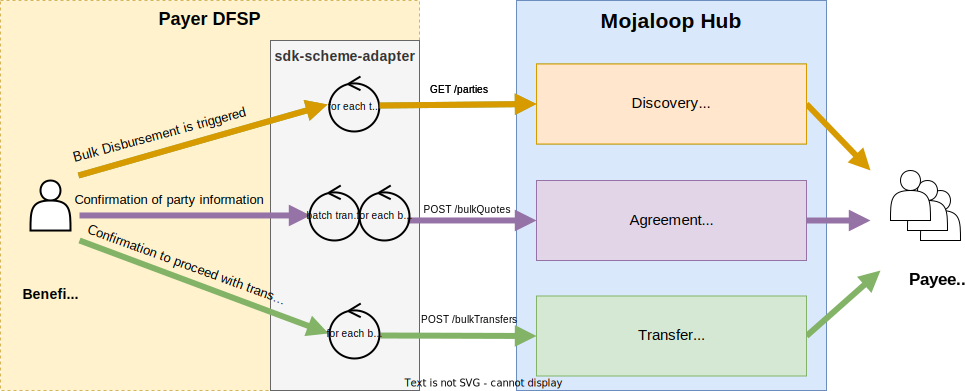
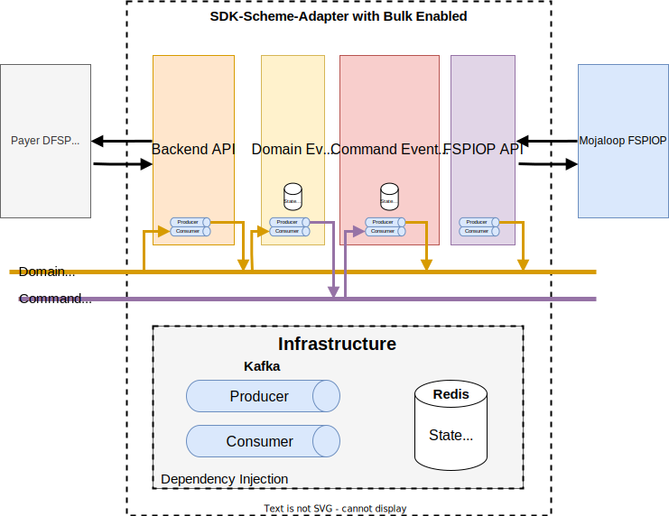
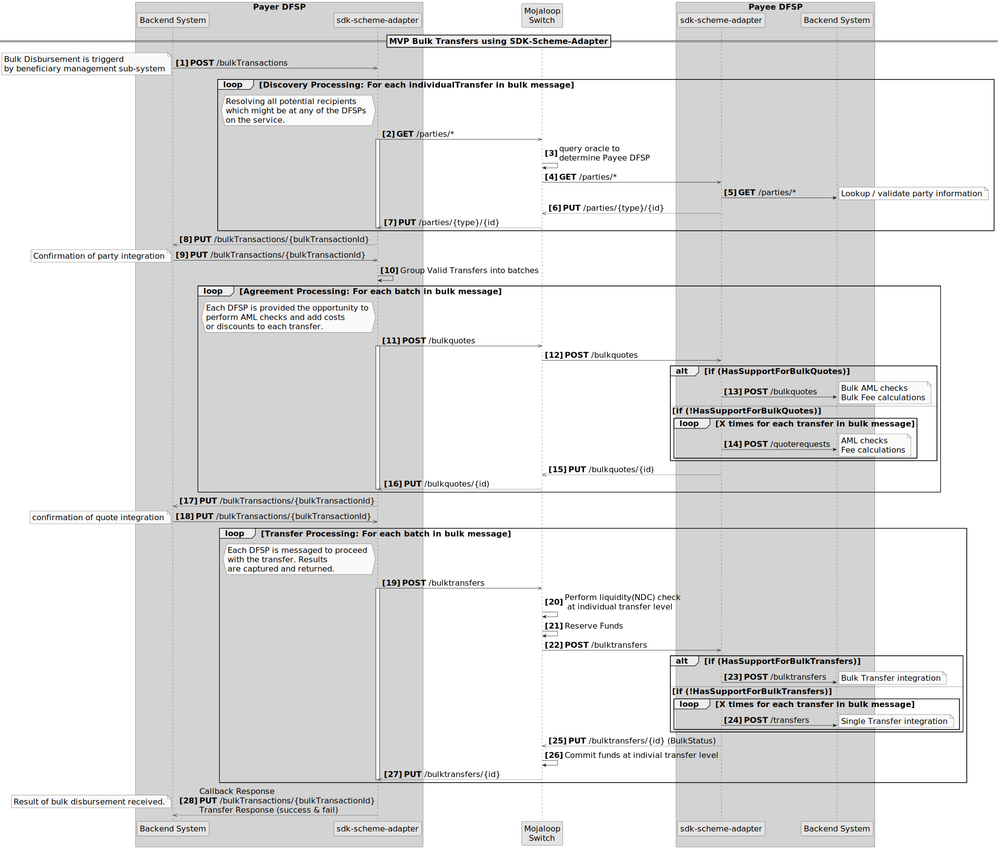

# Prise en charge des transferts groupés par le SDK — vue d’ensemble

Ce document décrit les évolutions du SDK Scheme Adapter pour le cas d’usage des transferts groupés.

## Pourquoi ? — Contourner les limites des *bulk* Mojaloop

L’implémentation des transferts groupés dans Mojaloop présente les limites suivantes, que cette évolution du SDK vise à atténuer.

1. Seuls les transferts individuels adressés au même DFSP payeur peuvent figurer dans un appel de cotations groupées ou de transferts groupés.
2. Le nombre de cotations et de transferts individuels par appel `bulkQuotes` / `bulkTransfers` est plafonné à 1000.
3. Pour activer les *bulk*, chaque DFSP bénéficiaire doit intégrer la messagerie groupée — en pratique, tous les DFSP connectés devraient mettre à jour leurs intégrations vers leurs systèmes *core banking*.
4. Il n’existe pas aujourd’hui d’appel de découverte (*discovery*) groupé.

## Exigences de l’évolution *bulk* du SDK Scheme Adapter

Les évolutions permettent notamment :

1. Des transferts sans phase de découverte préalable.
2. Aucune limite stricte sur le nombre de transferts (bornée par l’infrastructure et le réseau, au-delà du plafond ~1k de ML FSPIOP).
3. L’intégration *bulk* côté bénéficiaire devient optionnelle.
4. En option : prise en charge de scénarios tels qu’un appel unique combinant découverte, accord et transfert ; acceptation indépendante des recherches de partie ; acceptation indépendante des cotations ; plafond de frais pour l’acceptation automatique des cotations ; saut de la phase de découverte ; exécution de la seule phase de découverte ; expiration du message groupé ; identifiants de transaction *home* pour le message groupé et pour chaque transfert ; appels API synchrones et asynchrones.

## Fonctionnalités implémentées

L’implémentation actuelle ne couvre pas encore toutes les capacités prévues ; les éléments livrés sont opérationnels. D’autres fonctions peuvent être ajoutées selon les priorités produit et communauté (approche MVP agile).

| Fonctionnalité | Statut d’implémentation | Version |
|---|---|---|
| Mode asynchrone | publié | v14.1.0 RC |
| Mode synchrone | non démarré | |
| Acceptation auto des parties | non démarré | |
| Acceptation auto des cotations (avec plafond de frais) | non démarré | |
| Validation des parties uniquement | non démarré | |
| Ignorer la recherche de partie | non démarré | |
| Expiration du lot | non démarré | |
| SDK bénéficiaire — démultiplexage des cotations groupées | non démarré | |
| SDK bénéficiaire — démultiplexage des transferts groupés | non démarré | |
| Mojaloop — notification *bulk patch* | non démarré | |
| SDK bénéficiaire — démultiplexage *bulk patch* | non démarré | |

### Diagramme fonctionnel

## Diagramme d’architecture

L’architecture par *event sourcing* répartit l’implémentation en quatre composants :

1. **Backend API** : reçoit les appels API, produit les événements de domaine correspondants et, en réaction aux événements, déclenche les *callbacks* API.
2. **Domain Event Handler** : consomme les événements de domaine et produit des événements de commande.
3. **Command Event Handler** : consomme les événements de commande et produit des événements de domaine.
4. **FSPIOP API** : surveille les événements de domaine pour produire les appels FSPIOP, et les *callbacks* API pour produire à nouveau des événements de domaine.

## Diagramme de séquence — vue d’ensemble

Diagramme de séquence décrivant le rôle du SDK Scheme Adapter lors d’un appel groupé, côté DFSP payeur et DFSP bénéficiaire.

