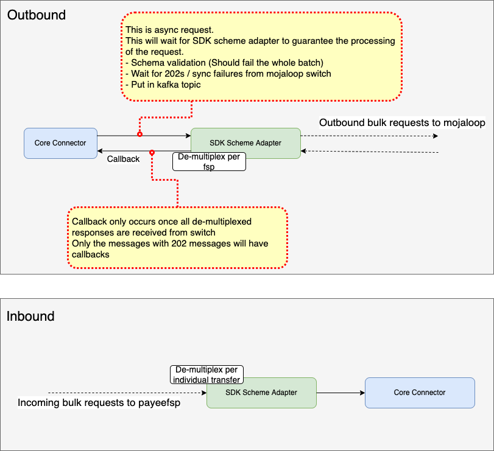
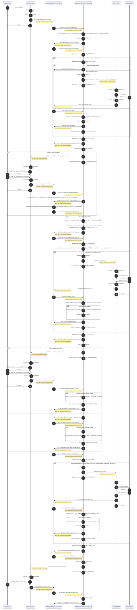
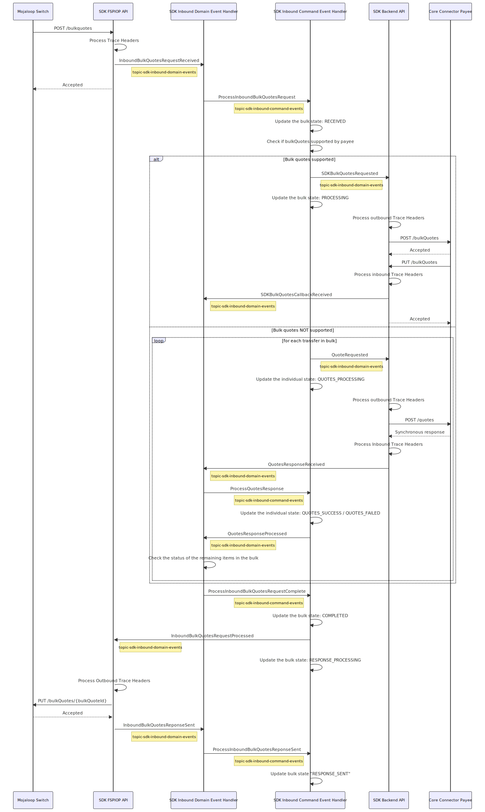
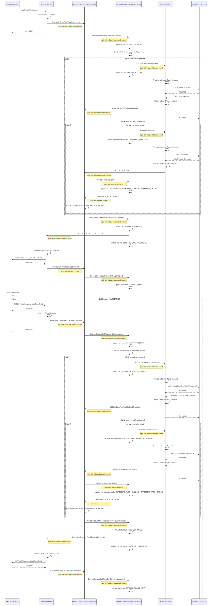

# Prise en charge des transferts groupés par le SDK — conception DDD et *event sourcing*

## Vue d’ensemble de la conception

Ce diagramme présente une vue d’ensemble de la conception du SDK.



Une réponse HTTP 202 lors de la soumission d’une requête asynchrone signifie que le SDK a **accepté** la requête, qu’elle sera traitée et qu’une réponse sera fournie. Compte tenu des délais potentiellement longs pour traiter un grand nombre de paiements groupés de façon asynchrone, une nouvelle approche de conception du SDK était nécessaire pour respecter les attentes liées à la réponse 202.

## Conception DDD et *event sourcing*

Un modèle fondé sur le *event sourcing* et le domain‑driven design a été retenu : il répond aux exigences de fiabilité et d’évolutivité tout en s’appuyant sur les bibliothèques et outils construits pour l’architecture Mojaloop vNext.

## SDK Scheme Adapter DFSP payeur (groupé sortant)

### Diagramme de séquence *event sourcing* sortant



## SDK Scheme Adapter DFSP bénéficiaire

### Diagramme de séquence *event sourcing* — cotations groupées entrantes



### Diagramme de séquence *event sourcing* — transferts groupés entrants




## Mappage des données Redis pour le transfert groupé sortant

### 1. États (global et par élément)

#### Commande :
```
HSET <key> <attribute1> <value1>
```
#### Clé :
```
outboundBulkTransaction_< bulkTransactionId >
```

#### Attributs :
- **bulkTransactionId** : identifiant de transaction groupée
- **bulkHomeTransactionID** : identifiant de transaction *home*
- **request** : {
  options: Options,
  extensionList: liste d’extensions *bulk*
}
- **individualItem_< transactionId >** : sérialisation de ({
  id: transactionId
  request: {}
  state: état individuel
  batchId: `<UUID>`
  partyRequest: {}
  quotesRequest: {}
  transfersRequest: {}
  partyResponse: {}
  quotesResponse: {}
  transfersResponse: {}
  lastError: {}
  acceptParty: bool
  acceptQuotes: bool
})
- **state** : état global
  - RECEIVED
  - DISCOVERY_PROCESSING
- **bulkBatch_< batchId >** : sérialisation de ({
  id: batchId
  state: état individuel
  - AGREEMENT_PROCESSING
  - TRANSFER_PROCESSING
  bulkQuoteId: `<UUID>`
  bulkTransferId: `<UUID>` (peut être batchId)
})
- **partyLookupTotalCount** : nombre total de demandes de recherche de partie
- **partyLookupSuccessCount** : nombre de recherches de partie réussies
- **partyLookupFailedCount** : nombre de recherches de partie en échec
- **bulkQuotesTotalCount** : nombre total de demandes de cotations groupées
- **bulkQuotesSuccessCount** : nombre de demandes de cotation réussies
- **bulkQuotesFailedCount** : nombre de demandes de cotation en échec
- **bulkTransfersTotalCount** : nombre total de demandes de transferts groupés
- **bulkTransfersSuccessCount** : nombre de demandes de transfert réussies
- **bulkTransfersFailedCount** : nombre de demandes de transfert en échec

::: tip Remarques
- Les messages Kafka doivent contenir le *bulkID*.
- Pour mettre à jour l’état global, utiliser la commande `HSET bulkTransaction_< bulkTransactionId > state < stateValue >`
:::

### 2. Mappage des *callbacks* individuels avec les éléments du lot

#### Commande :
```
HSET outboundBulkCorrelationMap <attribute1> <value1>
```

#### Attributs :
- partyLookup_`<id_type>`_`<id_value>`(_`<subid_type>`) : "{ bulkTransactionId: `<bulkTransactionId>`, transactionId: `<transactionId>` }"
- bulkQuotes_`<bulkQuoteId>` : "{ bulkTransactionId: `<bulkTransactionId>`, batchId: `<batchId>` }"
- bulkTransfers_`<bulkTransferId>` : "{ bulkTransactionId: `<bulkTransactionId>`, batchId: `<batchId>`, bulkQuoteId: `<bulkQuoteId>` }"
- bulkHomeTransactionId_`<bulkHomeTransactionId>` : "{ bulkTransactionId: `<bulkTransactionId>` }"

::: tip Remarques
- On peut utiliser la commande `HKEYS` pour récupérer tous les identifiants de transferts individuels d’un lot et itérer
:::

## Format des messages Redis pour le transfert groupé entrant

### 1. Cotations groupées

#### Commande :
```
HSET <key> <attribute1> <value1>
```
#### Clé :
```
inboundBulkQuotes_< bulkQuotesId >
```

#### Attributs :
- **bulkQuotesId** : identifiant des cotations groupées
- **individualItem_< quotesId >** : sérialisation de ({
  id: quotesId
  request: {}
  state: état individuel
  quotesRequest: {}
  quotesResponse: {}
  lastError: {}
})
- **state** : état global
  - RECEIVED
  - PROCESSING
- **bulkQuotesTotalCount** : nombre total de demandes de cotations groupées
- **bulkQuotesSuccessCount** : nombre de demandes de cotation réussies
- **bulkQuotesFailedCount** : nombre de demandes de cotation en échec

::: tip Remarques
- Les messages Kafka doivent contenir le *bulkQuotesId*.
- Pour mettre à jour l’état global, utiliser la commande `HSET bulkQuotes_< bulkQuotesId > state < stateValue >`
:::

### 2. Transferts groupés

#### Commande :
```
HSET <key> <attribute1> <value1>
```
#### Clé :
```
inboundBulkTransfer_< bulkTransferId >
```

#### Attributs :
- **bulkTransferId** : identifiant du transfert groupé
- **individualItem_< transferId >** : sérialisation de ({
  id: transferId
  request: {}
  state: état individuel
  transfersRequest: {}
  transfersResponse: {}
  lastError: {}
})
- **state** : état global
  - RECEIVED
  - PROCESSING
- **bulkTransferTotalCount** : nombre total de demandes de transferts groupés
- **bulkTransferSuccessCount** : nombre de demandes de transfert réussies
- **bulkTransferFailedCount** : nombre de demandes de transfert en échec

::: tip Remarques
- Les messages Kafka doivent contenir le *bulkTransferId*.
- Pour mettre à jour l’état global, utiliser la commande `HSET bulkTransfer_< bulkTransferId > state < stateValue >`
:::

### 3. Mappage des *callbacks* individuels avec les éléments du lot

#### Commande :
```
HSET inboundBulkCorrelationMap <attribute1> <value1>
```

#### Attributs :
- quotes_`<quoteId>` : "{ bulkQuoteId: `<bulkQuoteId>` }"
- transfers_`<transferId>` : "{ bulkTransferId: `<bulkTransferId>`, bulkQuoteId: `<bulkQuoteId>` }"

::: tip Remarques
- On peut utiliser la commande `HKEYS` pour récupérer tous les identifiants de transferts individuels d’un lot et itérer
:::
