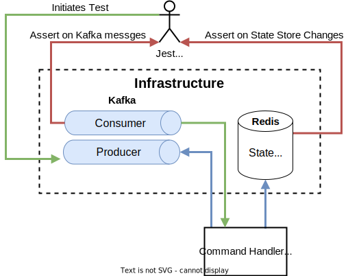
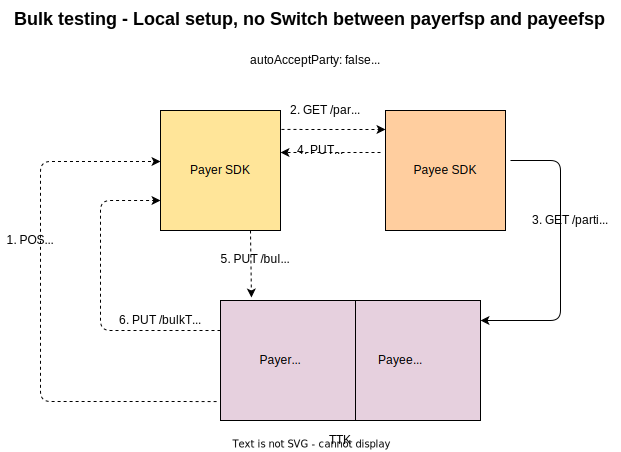

# Prise en charge des transferts groupés par le SDK — tests

## Stratégie de test

La qualité de la solution livrée dépend de la qualité des tests et de la stratégie de test adoptée. La nature distribuée de cette solution fondée sur l’*event sourcing* a influé sur la stratégie retenue. Plusieurs types de tests ont été créés, se renforçant mutuellement et visant à détecter les défauts le plus tôt possible.

Le gestionnaire d’événements de commande et le gestionnaire d’événements de domaine disposent tous deux de tests unitaires et de tests d’intégration ciblés comme socle. Les composants API FSPIOP et API *backend* n’ont que des tests unitaires.

Une forte insistance a été mise sur les tests fonctionnels, qui vérifient les quatre composants ensemble, sur des scénarios nominaux et d’échec.

### Tests d’intégration ciblés

Ces tests sont écrits avec Jest et vérifient par exemple le magasin d’état mis à jour et les événements produits à partir d’un événement de commande généré.

**Banc d’essai d’intégration du gestionnaire de commandes**

### Banc d’essai des tests fonctionnels

Le test fonctionnel s’appuie sur le TTK (*Testing Toolkit*), qui simule les *backends* DFSP payeur et bénéficiaire.

:::tip Remarque
Ce banc d’essai couvre à la fois le SDK payeur et le SDK bénéficiaire.
:::

:::tip Remarque
Ces tests peuvent être exécutés sur le dépôt *monorepo* extrait en local ; ils sont lancés dans le pipeline CI et inclus dans Helm comme tests Helm pour valider le déploiement.
:::

## Matrice des tests d’intégration DFSP payeur

|Cas de test|C1|C2|C3|C4|C5|C6|C7|C8|C9|C10|C11|C12|
|---|---|---|---|---|---|---|---|---|---|---|---|---|
|INT D-1||||x|||||||||
|INT D-2||x|||||||||||
|INT D-3||x|||||||||||
|INT D-4|x||||||||||||
|INT D-5|||x||||||||||
|INT D-6|||x||||||||||
|INT A-1||||||x|||||||
|INT A-2|||||x||||||||
|INT T-1|||||||||||x||
|INT T-2||||||||||x|||
|INT T-3|||||||||x||||
|INT T-4|||||||||||x||
|INT T-5|||||||x||||||
|INT T-6||||||||||||x|

## Matrice des tests fonctionnels DFSP payeur

|Cas de test|B1|B2|B3|B4|B5|F1|F2|F3|F4|F5|F6|F7|F8|F9|D1|D2|D3|D4|D5|D6|D7|D8|D9|D10|D11|D12|D13|D14|D15|D16|D17|D18|D19|D20|C1|C2|C3|C4|C5|C6|C7|C8|C9|C10|C11|C12|
|---|---|---|---|---|---|---|---|---|---|---|---|---|---|---|---|---|---|---|---|---|---|---|---|---|---|---|---|---|---|---|---|---|---|---|---|---|---|---|---|---|---|---|---|---|---|---|
|FUNC 1|x|x|x|x|x|x|x||x|x||x|x||x|x|x|x|x|x|x|x|x|x|x|x|x|||x|x|x|x|x|x|x|x|x|x|x|x||x|x|x|x
|FUNC 2|x|x||||x||x|||||||x|x|x|x|x||||||||||||||||x|x|x|||||||||
|FUNC 3|x|x||||x||x|||||||x|x|x|x|x||||||||||||||||x|x|x|||||||||
|FUNC 4|x|x||||x||x|||||||x|x|x|x|x||||||||||||||||x|x|x|||||||||
|FUNC 5|x|x||||x||x|||||||x|x|x|x|x||||||||||||||||x|x|x|||||||||
|FUNC 6|x|x||||x||x|||||||x|x|x|x|x||||||||||||||||x|x|x|||||||||
|TC-BQ1|x|x|x|||x|x||x||x||||x|x|x|x|x|x|x|x|x|x|||||||||||x|x|x|x|x|x|||||x|x
|TC-BQ2|x|x|x|||x|x||x|x|||||x|x|x|x|x|x|x|x|x|x|||||||||||x|x|x|x|x|x|||||x|x
|TC-BQ3|x|x|x|||x|x||x|x|||||x|x|x|x|x|x|x|x|x|x|x||||||||||x|x|x|x|x|x||||||
|TC-BQ4|x|x|x|||x|x||x|x|||||x|x|x|x|x|x|x|x|x|x|x||||||||||x|x|x|x|x|x||||||
|TC-BQ5|x|x|x|||x|x||x|x|||||x|x|x|x|x|x|x|x|x|x|x||||||||||x|x|x|x|x|x||||||
|TC-BQ6|x|x|x|||x|x||x|x|||||x|x|x|x|x|x|x|x|x|x|x||||||||||x|x|x|x|x|x||||||
|TC-BQ7|x|x|x|||x|x||x|x|||||x|x|x|x|x|x|x|x|x|x|x||||||||||x|x|x|x|x|x||||||
|TC-BQ8|x|x|x|||x|x||x|x|||||x|x|x|x|x|x|x|x|x|x|x||||||||||x|x|x|x|x|x||||||
|TC-BQ9|x|x|x|||x|x||x|x|x||||x|x|x|x|x|x|x|x|x|x|x||||||||||x|x|x|x|x|x||||||
|TC-BQ10|x|x|x|||x|x||x||x||||x|x|x|x|x|x|x|x|x|x|||||||||||x|x|x|x|x|x|||||x|x|
|TC-BQ11|x|x|x|||x|x||x|x|||||x|x|x|x|x|x|x|x|x|x|x||||||||||x|x|x|x|x|x|||||||
|TC-BQ13|x|x|x|||x|x||x|x|||||x|x|x|x|x|x|x|x|x|x|x||||||||||x|x|x|x|x|x|||||||
|TC-BT1|x|x|x|x|x|x|x||x|x||x||x|x|x|x|x|x|x|x|x|x|x|x|x|x|||x|x||||x|x|x|x|x|x|x||x|x|x|x|
|TC-BT2|x|x|x|x|x|x|x||x|x||x||x|x|x|x|x|x|x|x|x|x|x|x|x|x|||x|x||||x|x|x|x|x|x|x||x|x|x|x|
|TC-BT3|x|x|x|x|x|x|x||x|x|x|x||x|x|x|x|x|x|x|x|x|x|x|x|x|x|||x|x||||x|x|x|x|x|x|x||x|x|x|x|
|TC-BT4|x|x|x|x|x|x|x||x|x|x|x||x|x|x|x|x|x|x|x|x|x|x|x|x|x|||x|x||||x|x|x|x|x|x|x||x|x|x|x|
|TC-BT5|x|x|x|x|x|x|x||x|x||x||x|x|x|x|x|x|x|x|x|x|x|x|x|x|||x|x||||x|x|x|x|x|x|x||x|x|x|x|
|TC-BT6|x|x|x|x|x|x|x||x|x||x||x|x|x|x|x|x|x|x|x|x|x|x|x|x|||x|x||||x|x|x|x|x|x|x||x|x|x|x|
|TC-BT7|x|x|x|x|x|x|x||x|x||x||x|x|x|x|x|x|x|x|x|x|x|x|x|x|||x|x||||x|x|x|x|x|x|x||x|x|x|x|
|TC-BT8|x|x|x|x|x|x|x||x|x||x||x|x|x|x|x|x|x|x|x|x|x|x|x|x|||x|x||||x|x|x|x|x|x|x||x|x|x|x|

## Référence des fonctionnalités DFSP payeur

|#|Fonctionnalité sortante|Détail|
|---|---|---|
|B1|API *backend*|POST /bulkTransactions SDKBulkRequest|
|B2|API *backend*|Événement SDKOutboundBulkAcceptPartyInfoRequested|
|B3|API *backend*|PUT /bulkTransactions/{bulkTransactionId} Acceptation de partie|
|B4|API *backend*|PUT /bulkTransactions/{bulkTransactionId} Acceptation de cotation|
|B5|API *backend*|PUT /bulkTransactions/{bulkTransactionId} Résultats|
|F1|API FSPIOP|GET /parties|
|F2|API FSPIOP|PUT /parties/{Type}/{ID}|
|F3|API FSPIOP|PUT /parties/{Type}/{ID}/error|
|F4|API FSPIOP|POST /bulkQuotes|
|F5|API FSPIOP|PUT /bulkQuotes/{ID}|
|F6|API FSPIOP|PUT /bulkQuotes/{ID}/error|
|F7|API FSPIOP|POST /bulkTransfers|
|F8|API FSPIOP|PUT /bulkTransfers/{ID}|
|F9|API FSPIOP|PUT /bulkTransfers/{ID}/error|
|D1|Gestionnaire d’événements de domaine|SDKOutboundBulkRequestReceived|
|D2|Gestionnaire d’événements de domaine|SDKOutboundBulkPartyInfoRequested|
|D3|Gestionnaire d’événements de domaine|PartyInfoCallbackReceived|
|D4|Gestionnaire d’événements de domaine|PartyInfoCallbackProcessed|
|D5|Gestionnaire d’événements de domaine|SDKOutboundBulkPartyInfoRequestProcessed|
|D6|Gestionnaire d’événements de domaine|SDKOutboundBulkAcceptPartyInfoReceived|
|D7|Gestionnaire d’événements de domaine|SDKOutboundBulkAutoAcceptPartyInfoRequested|
|D8|Gestionnaire d’événements de domaine|SDKOutboundBulkAcceptPartyInfoProcessed|
|D9|Gestionnaire d’événements de domaine|BulkQuotesCallbackReceived|
|D10|Gestionnaire d’événements de domaine|BulkQuotesCallbackProcessed|
|D11|Gestionnaire d’événements de domaine|SDKOutboundBulkQuotesRequestProcessed|
|D12|Gestionnaire d’événements de domaine|SDKOutboundBulkAcceptQuoteReceived|
|D13|Gestionnaire d’événements de domaine|SDKOutboundBulkAcceptQuoteProcessed|
|D14|Gestionnaire d’événements de domaine|SDKOutboundBulkAutoAcceptQuoteRequested|
|D15|Gestionnaire d’événements de domaine|SDKOutboundBulkAutoAcceptQuoteProcessed|
|D16|Gestionnaire d’événements de domaine|BulkTransfersCallbackReceived|
|D17|Gestionnaire d’événements de domaine|BulkTransfersCallbackProcessed|
|D18|Gestionnaire d’événements de domaine|SDKOutboundBulkTransfersRequestProcessed|
|D19|Gestionnaire d’événements de domaine|SDKOutboundBulkResponseSent|
|D20|Gestionnaire d’événements de domaine|SDKOutboundBulkResponseSentProcessed|
|C1|Gestionnaire d’événements de commande|ProcessSDKOutboundBulkRequest|
|C2|Gestionnaire d’événements de commande|ProcessSDKOutboundBulkPartyInfoRequest|
|C3|Gestionnaire d’événements de commande|ProcessPartyInfoCallback|
|C4|Gestionnaire d’événements de commande|ProcessSDKOutboundBulkAcceptPartyInfo|
|C5|Gestionnaire d’événements de commande|ProcessSDKOutboundBulkQuotesRequest|
|C6|Gestionnaire d’événements de commande|ProcessBulkQuotesCallback|
|C7|Gestionnaire d’événements de commande|ProcessSDKOutboundBulkAcceptQuote|
|C8|Gestionnaire d’événements de commande|ProcessSDKOutboundBulkAutoAcceptQuote|
|C9|Gestionnaire d’événements de commande|ProcessSDKOutboundBulkTransfersRequest|
|C10|Gestionnaire d’événements de commande|ProcessBulkTransfersCallback|
|C11|Gestionnaire d’événements de commande|PrepareSDKOutboundBulkResponse|
|C12|Gestionnaire d’événements de commande|ProcessSDKOutboundBulkResponseSent|

## Référence des cas de test

|Groupe|N° cas de test|Type de test|Statut|Détail|
|--- |--- |--- |--- |--- |
|**Découverte** — tests d’intégration du gestionnaire de commandes|||||
|(process_bulk_accept_party_info.test.ts)|INT D-1|Intégration|Réussi|Étant donné la réception de l’événement de commande entrant ProcessSDKOutboundBulkAcceptPartyInfo, la logique doit parcourir chaque transfert individuel de la requête groupée, mettre à jour l’état de chaque transfert en DISCOVERY_ACCEPTED ou DISCOVERY_REJECTED selon la valeur de l’événement entrant, mettre l’état global à DISCOVERY_ACCEPTANCE_COMPLETED et publier l’événement sortant SDKOutboundBulkAcceptPartyInfoProcessed.|
|(process_bulk_party_info_request.test.ts)|INT D-2|Intégration|Réussi|Étant donné qu’aucune information de partie n’existe encore pour les transferts individuels et que la recherche de partie n’est pas ignorée, à la réception de ProcessSDKOutboundBulkPartyInfoRequest, l’état global doit passer à DISCOVERY_PROCESSING, un événement Kafka PartyInfoRequested doit être publié pour chaque transfert individuel, et l’état de chaque transfert doit passer à DISCOVERY_PROCESSING.|
|(process_bulk_party_info_request.test.ts)|INT D-3|Intégration|Réussi|Étant donné que les informations de partie existent pour les transferts individuels et que la recherche de partie n’est pas ignorée, à la réception de ProcessSDKOutboundBulkPartyInfoRequest, l’état global doit passer à DISCOVERY_PROCESSING, aucun événement sortant PartyInfoRequested ne doit être publié pour chaque transfert individuel, et l’état de chaque transfert doit passer à RECEIVED.|
|(process_bulk_request.test.ts)|INT D-4|Intégration|Réussi|À la réception de ProcessSDKOutboundBulkRequest, l’événement sortant SDKOutboundBulkPartyInfoRequested doit être publié et l’état global doit passer à RECEIVED.|
|(process_party_info_callback.test.ts)|INT D-5|Intégration|Réussi|Étant donné que les informations de partie reçues n’existent pas et que la recherche de partie a réussi, à la réception de ProcessPartyInfoCallback, l’état des recherches réussies doit passer à DISCOVERY_SUCCESS, les données Redis de chaque transfert concerné doivent être mises à jour avec les informations reçues, l’événement PartyInfoCallbackProcessed doit être publié ; si toutes les recherches ne sont pas terminées, ProcessSDKOutboundBulkPartyInfoRequestProcessed ne doit pas être publié, et SDKOutboundBulkAutoAcceptPartyInfoRequested ne doit pas non plus l’être.|
|(process_party_info_callback.test.ts)|INT D-6|Intégration|Réussi|Étant donné que les informations de partie reçues n’existent pas et que la recherche de partie a réussi, à la réception de ProcessPartyInfoCallback, l’état des recherches réussies doit passer à DISCOVERY_SUCCESS, les données Redis doivent être mises à jour, PartyInfoCallbackProcessed doit être publié ; si toutes les recherches sont terminées, SDKOutboundBulkPartyInfoRequestProcessed doit être publié ; si l’acceptation automatique de partie est fausse, SDKOutboundBulkAcceptPartyInfoRequested doit être publié.|
|**Accord** — tests d’intégration du gestionnaire de commandes|||||
|(process_bulk_quotes_callback.test.ts)|INT A-1|Intégration|Réussi|Étant donné une BulkTransaction avec les options { synchronous: false, onlyValidateParty: true, skipPartyLookup: false, autoAcceptParty: false, autoAcceptQuote: false }, un *callback* de lot de cotations réussi et un mélange de réponses réussies et échouées par cotation individuelle, à la réception de ProcessBulkQuotesCallback, la logique doit mettre l’état du lot à AGREEMENT_COMPLETED ou AGREEMENT_FAILED, chaque transfert du lot à AGREEMENT_SUCCESS ou AGREEMENT_FAILED selon le cas, mettre à jour les données de cotation dans Redis, l’état global de la BulkTransaction à AGREEMENT_ACCEPTANCE_PENDING, et publier les événements de domaine BulkQuotesCallbackProcessed et SDKOutboundBulkQuotesRequestProcessed.|
|(process_bulk_quotes_callback.test.ts)|INT A-2|Intégration|Réussi|À la réception de ProcessSDKOutboundBulkQuotesRequest, la logique doit mettre l’état global à AGREEMENT_PROCESSING, créer des lots par FSP en état DISCOVERY_ACCEPTED selon maxEntryConfigPerBatch, publier BulkQuotesRequested pour chaque lot et mettre l’état de chaque lot à AGREEMENT_PROCESSING.|
|**Transferts** — tests d’intégration du gestionnaire de commandes|||||
|(prepare_sdk_outbound_bulk_response.test.ts)|INT T-1|Intégration|Réussi|Étant donné une BulkTransaction avec les options { synchronous: false, onlyValidateParty: true, skipPartyLookup: false, autoAcceptParty: false, autoAcceptQuote: false }, à la réception de PrepareSDKOutboundBulkResponseCmdEvt, SDKOutboundBulkResponsePreparedDmEvt doit être publié pour chaque lot de transferts et l’état global de la transaction groupée doit passer à RESPONSE_PROCESSING.|
|(process_bulk_transfers_callback.test.ts )|INT T-2|Intégration|Réussi|Étant donné une BulkTransaction avec les mêmes options, à la réception de ProcessBulkTransfersCallbackCmdEvt, l’état du lot de transferts doit passer à TRANSFERS_COMPLETED, les cotations en échec restent AGREEMENT_FAILED, la logique doit parcourir les transferts et mettre à jour TRANSFER_SUCCESS ou TRANSFER_FAILED, publier BulkTransferProcessedDmEvt pour chaque lot ainsi que BulkQuotesCallbackProcessed, SDKOutboundBulkQuotesRequestProcessed, SDKOutboundBulkAutoAcceptQuoteProcessedDmEvt, BulkTransfersRequestedDmEvt, BulkTransfersCallbackProcessed et SDKOutboundBulkTransfersRequestProcessed.|
|(process_bulk_transfers_request.test.ts)|INT T-3|Intégration|Réussi|Étant donné une BulkTransaction avec les mêmes options, un *callback* de cotations réussi et un mélange de réponses par cotation, à la réception de ProcessSDKOutboundBulkTransfersRequestCmdEvt, l’état global doit passer à TRANSFERS_PROCESSING, l’état de chaque lot à TRANSFERS_PROCESSING ou TRANSFERS_FAILED, chaque transfert à AGREEMENT_ACCEPTED ou AGREEMENT_REJECTED selon acceptQuotes TRUE/FALSE, sans modifier les transferts déjà en AGREEMENT_FAILED, mettre à jour Redis et publier BulkQuotesCallbackProcessed, SDKOutboundBulkQuotesRequestProcessed, SDKOutboundBulkAutoAcceptQuoteProcessedDmEvt et BulkTransfersRequestedDmEvt.|
|(process_prepare_bulk_response.test.ts)|INT T-4|Intégration|Réussi|À la réception de PrepareSDKOutboundBulkResponseCmdEvt, SDKOutboundBulkResponsePreparedDmEvnt doit être publié.|
|(process_sdk_outbound_bulk_accept_quote.test.ts)|INT T-5|Intégration|Réussi|Étant donné une BulkTransaction avec les mêmes options et un *callback* de cotations avec succès et échecs mixtes, à la réception de ProcessSDKOutboundBulkAcceptQuote, l’état global doit passer à AGREEMENT_ACCEPTANCE_COMPLETED, l’état de chaque lot à AGREEMENT_COMPLETED ou AGREEMENT_FAILED, les transferts à AGREEMENT_ACCEPTED ou AGREEMENT_REJECTED selon acceptQuotes, mettre à jour Redis et publier BulkQuotesCallbackProcessed, SDKOutboundBulkQuotesRequestProcessed, SDKOutboundBulkAutoAcceptQuoteProcessedDmEvt et BulkTransfersRequestedDmEvt.|
|(process_sdk_outbound_bulk_response_sent.test.ts)#|INT T-6|Intégration|Réussi|Étant donné une BulkTransaction avec les mêmes options, à la réception de ProcessSDKOutboundBulkResponseSentCmdEvt, SDKOutboundBulkResponseSentProcessedDmEvt doit être publié pour chaque lot et l’état global doit passer à RESPONSE_SENT.|
|**Chemin nominal :** (bulk-happy-path.json)|||||
|- 1 transfert avec acceptParty et acceptQuote à true|||||
||TC-BHP1|Fonctionnel|Réussi|4 transferts vers 2 DFSP, avec acceptParty et acceptQuote à true|
||TC-BHP2|Validation|Réussi|Transaction groupée avec une erreur de format|
|**Erreurs parties :** (bulk-parties-error-cases.json)|||||
|- 1 transfert dans la requête|||||
||TC-BP1|Fonctionnel|Réussi|Le récepteur renvoie une erreur dans la réponse *parties*|
||TC-BP2|Fonctionnel|Réussi|Délai dépassé côté récepteur|
||TC-BP3|Fonctionnel|Réussi|skipPartyLookup est false et les informations du récepteur sont déjà présentes dans la requête.|
|- 2 transferts dans la requête|||||
||TC-BP4|Fonctionnel|Réussi|Le récepteur renvoie une erreur pour l’un des transferts|
||TC-BP5|Fonctionnel|Réussi|Le récepteur dépasse le délai pour l’un des transferts|
||TC-BP6|Fonctionnel|Réussi|Aucune réponse du récepteur pour les deux transferts|
|**Erreurs cotations :** (bulk-quotes-error-cases.json)|||||
|- 2 transferts avec le même FSP bénéficiaire |||||
|- acceptParty pour tous les transferts|||||
||TC-BQ1|Fonctionnel|Réussi|Le FSP récepteur fait échouer tout le lot|
||TC-BQ2|Fonctionnel|Réussi|Le FSP récepteur dépasse le délai sur tout le lot|
||TC-BQ3|Fonctionnel|Réussi|Le FSP récepteur n’envoie qu’une réponse et ignore l’autre|
||TC-BQ4|Fonctionnel|Hors périmètre MVP|Le FSP récepteur envoie une réponse de succès et une d’échec (non implémenté — issue 3015)|
|- acceptParty variable|||||
||TC-BQ5|Fonctionnel|Réussi|Un true, un false|
||TC-BQ6|Fonctionnel|Hors périmètre MVP|Acceptation de partie false pour toutes les réponses — alors seuls les détails de partie, pas de cotation, état final COMPLETED (non implémenté — issue 3015)|
||TC-BQ7|Fonctionnel|Hors périmètre MVP|True envoyé pour une seule cotation dans PUT /bulkTxn acceptParty, la seconde ignorée (non implémenté — issue 3015)|
||TC-BQ8|Fonctionnel|Hors périmètre MVP|False envoyé pour une seule cotation dans PUT /bulkTxn acceptParty, la seconde ignorée (non implémenté — issue 3015)|
|- 2 transferts avec des FSP bénéficiaires différents — acceptParty pour tous|||||
||TC-BQ9|Fonctionnel|Réussi|Un lot renvoie une erreur|
||TC-BQ10|Fonctionnel|Réussi|Les deux lots renvoient une erreur|
||TC-BQ11|Fonctionnel|Réussi|Un lot dépasse le délai|
|- 3 transferts : 2 partagent un FSP bénéficiaire, le 3e un autre|||||
||TC-BQ12|Fonctionnel|Hors périmètre MVP|Le lot à 2 transferts n’envoie qu’une réponse de transfert et l’autre lot envoie le succès (non implémenté — issue 3015)|
||TC-BQ13|Fonctionnel|Hors périmètre MVP|Erreur sur le commutateur pour devise non prise en charge — (issue —|
|**Erreurs transferts :** (bulk-transfer-errors.json)|||||
|- Un bulkTransfer avec 2 transferts |||||
|- acceptQuote pour tous les transferts|||||
||TC-BT1|Fonctionnel|Réussi|Le récepteur fait échouer tout le lot|
||TC-BT2|Fonctionnel|Réussi|Le récepteur dépasse le délai sur tout le lot|
||TC-BT3|Fonctionnel|Hors périmètre MVP|Le FSP récepteur n’envoie qu’une réponse et ignore l’autre (non implémenté — issue 3015)|
||TC-BT4|Fonctionnel|Défauts intermittents|Le FSP récepteur envoie une réponse de succès et une d’échec — (issue : 3019)|
|- acceptQuote variable|||||
||TC-BT5|Fonctionnel|Hors périmètre MVP|Un true et un false — TC2 — bug 2958|
||TC-BT6|Fonctionnel|Hors périmètre MVP|Acceptation de cotation — tous à false (non implémenté — issue 3015)|
||TC-BT7|Fonctionnel|Hors périmètre MVP|True envoyé pour un seul transfert dans PUT /bulkTxn acceptParty, le second ignoré (non implémenté — issue 3015)|
||TC-BT8|Fonctionnel|Hors périmètre MVP|False envoyé pour un seul transfert dans PUT /bulkTxn acceptParty, le second ignoré (non implémenté — issue 3015)|

