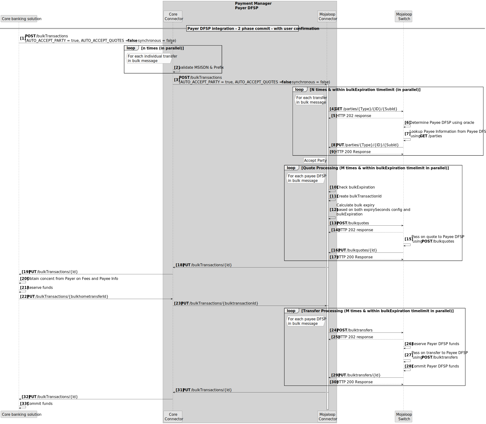
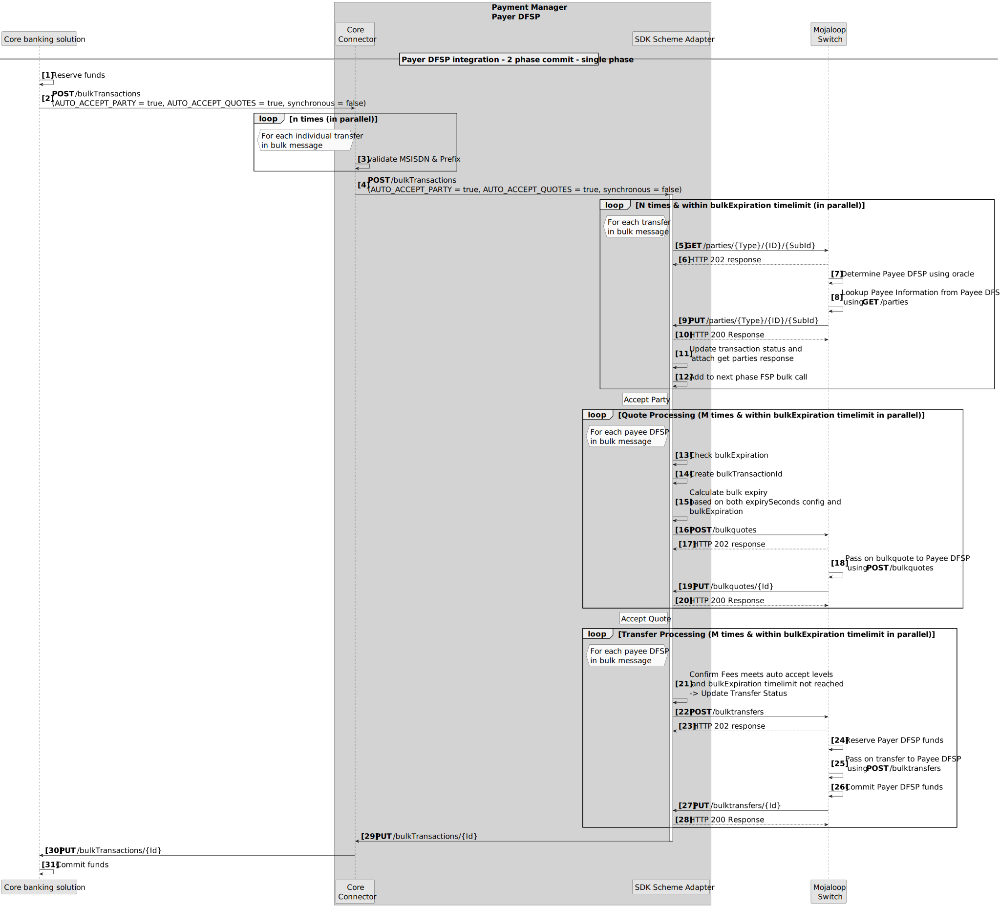
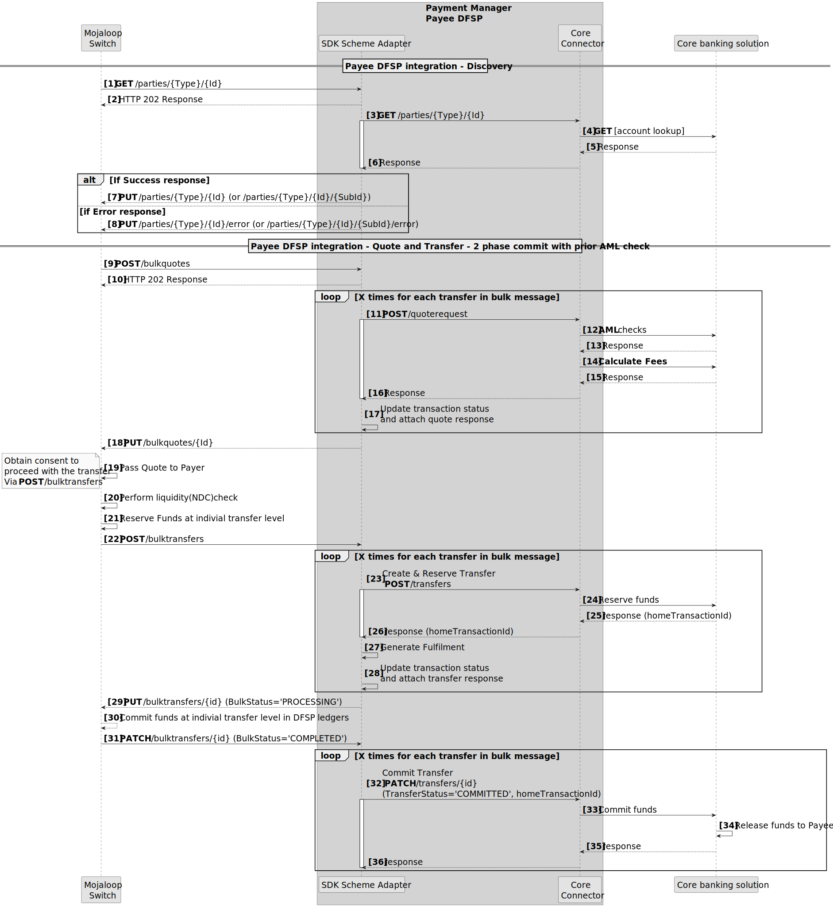
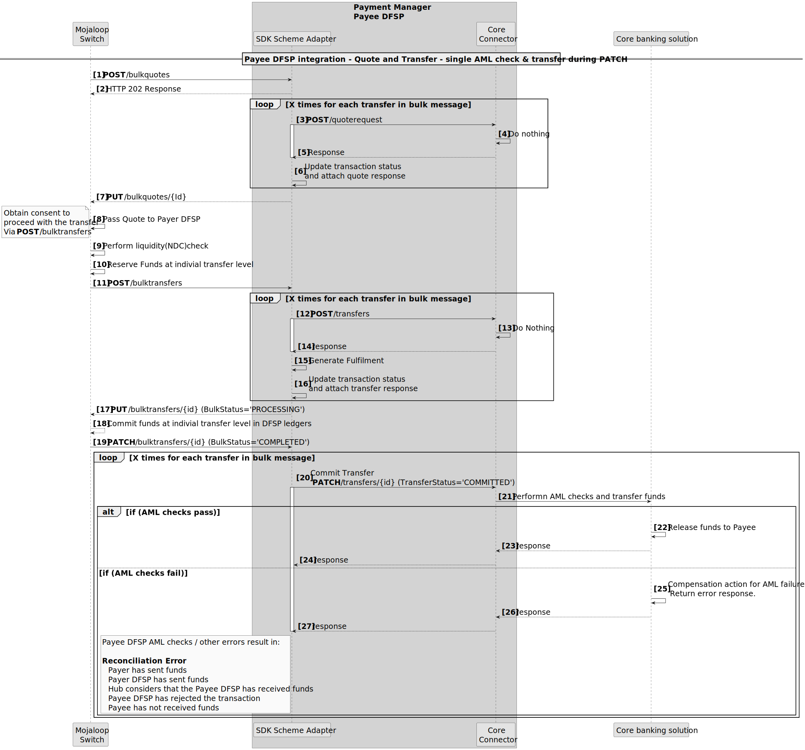

# Intégration des systèmes *core banking* via les transferts groupés

Il existe trois modèles pour construire l’intégration du DFSP payeur dans le cadre des transferts groupés.

1. Intégration de transfert en **trois phases**. Ce modèle s’aligne sur les trois phases de transaction Mojaloop : découverte, accord et transfert.
1. **Intégration double API**. Ce modèle est détaillé dans le diagramme de séquence ci‑dessous. Il regroupe les phases Découverte et Accord en une première phase ; les résultats sont présentés au payeur pour confirmation ; la phase Transfert s’exécute ensuite en seconde phase.

1. **Intégration API unique**. Ce modèle est détaillé dans le diagramme de séquence ci‑dessous. Les trois phases sont regroupées en un seul appel de transfert synchrone.

::: tip Commit en deux phases
Tous les modèles d’intégration DFSP payeur prennent en charge un commit en deux phases (phase de réservation puis phase d’engagement).
:::

## Exigences côté DFSP bénéficiaire

Les évolutions du SDK Scheme Adapter garantiront que les DFSP ayant déjà intégré Mojaloop n’auront pas à modifier leur intégration pour recevoir des transferts groupés : le SDK Scheme Adapter recevra les messages de transfert groupé et les convertira en messages de transfert individuels. Si un DFSP bénéficiaire souhaite tirer parti du message de transfert groupé, une intégration dédiée aux messages de transfert groupé peut être mise en œuvre lorsque cela s’avère pertinent pour le DFSP bénéficiaire concerné.

## Modèle de flux idéal côté bénéficiaire (groupé)

Ici, les contrôles LBC/FT sont effectués et les frais calculés en phase d’accord, et la phase de transfert comporte une phase de réservation puis une phase d’engagement.

## API éditeur limitée à un seul appel

Si le système *core banking* ne propose qu’un **seul** appel API pour toutes les vérifications et phases du transfert, c’est le modèle le plus couramment supporté.

### Appel du transfert sur la notification PATCH

Toute défaillance **après** la notification PATCH (étape **19**) peut entraîner une erreur de réconciliation. On peut y remédier en prévoyant des mécanismes de compensation (par exemple initier un transfert de remboursement en cas d’erreur après l’étape 19).
