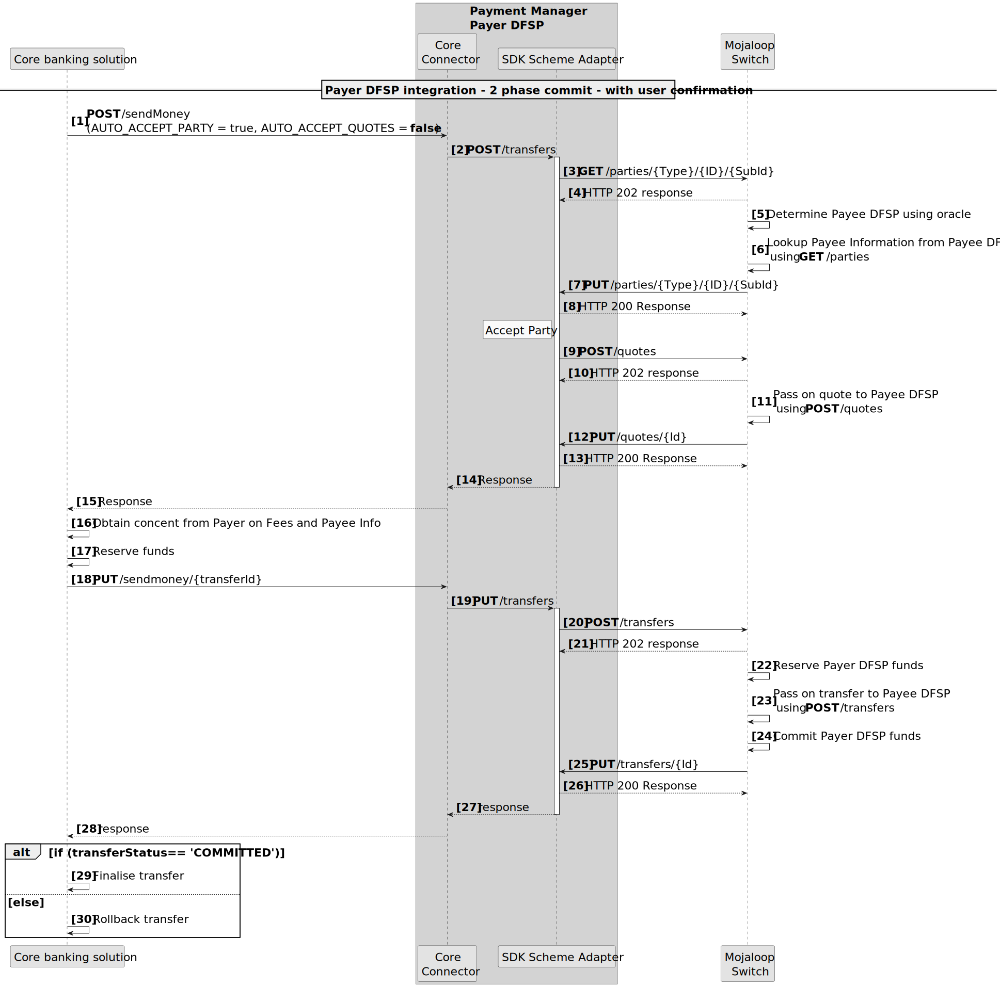
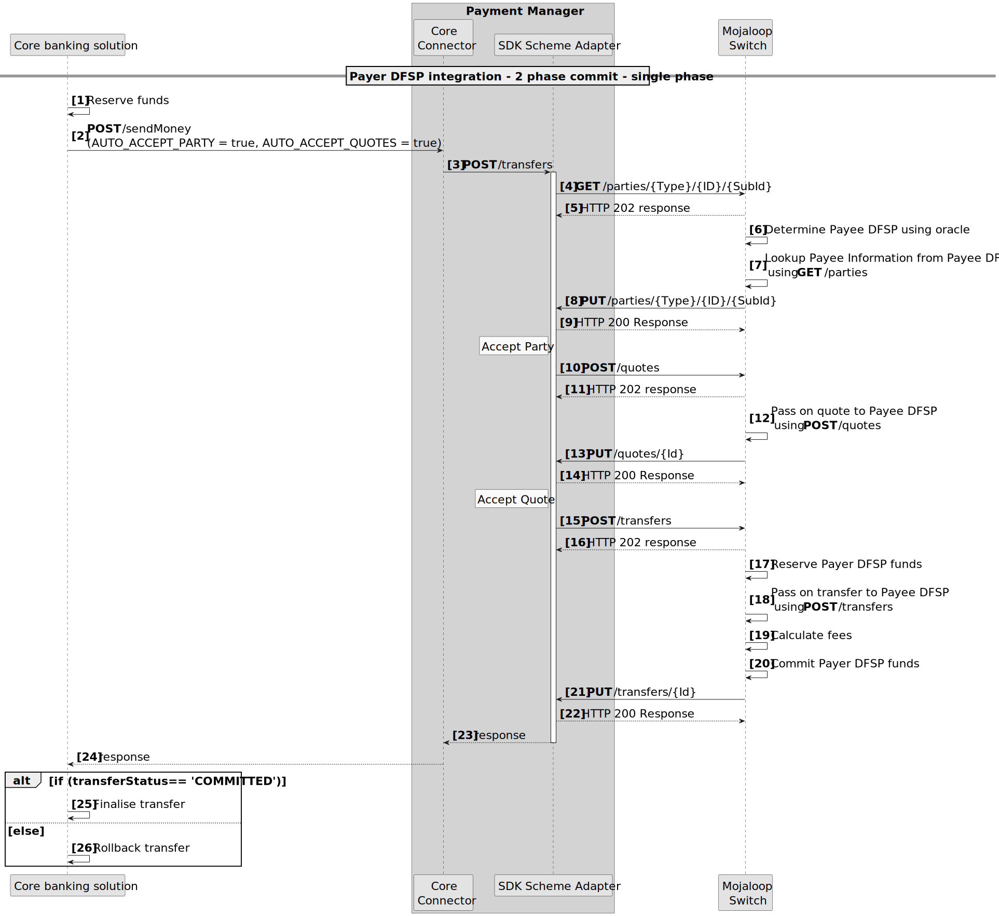
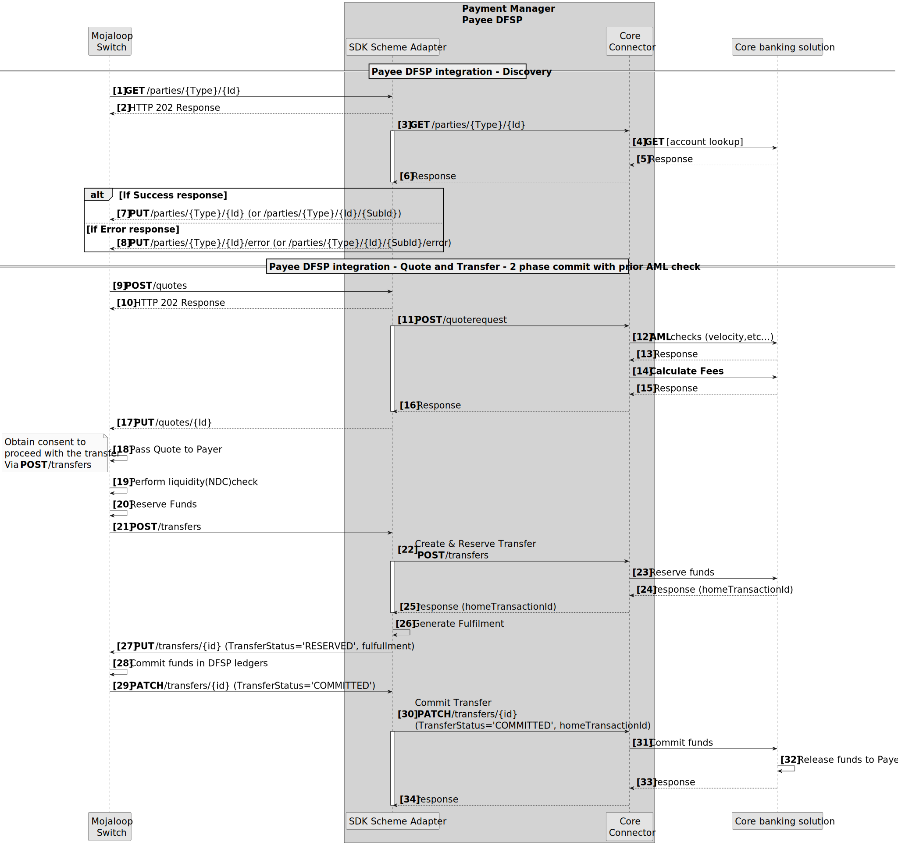
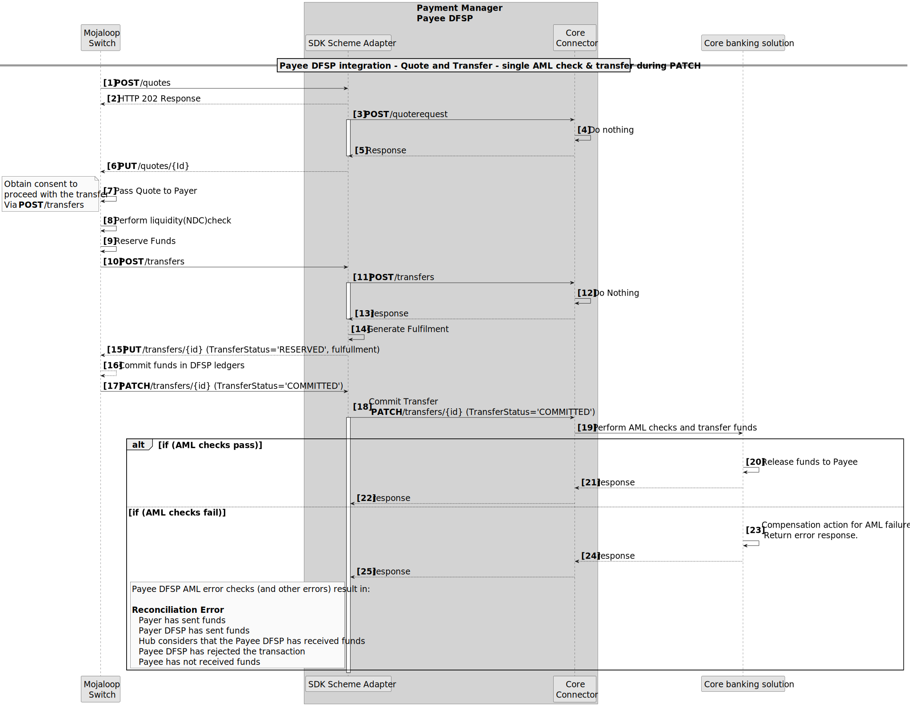
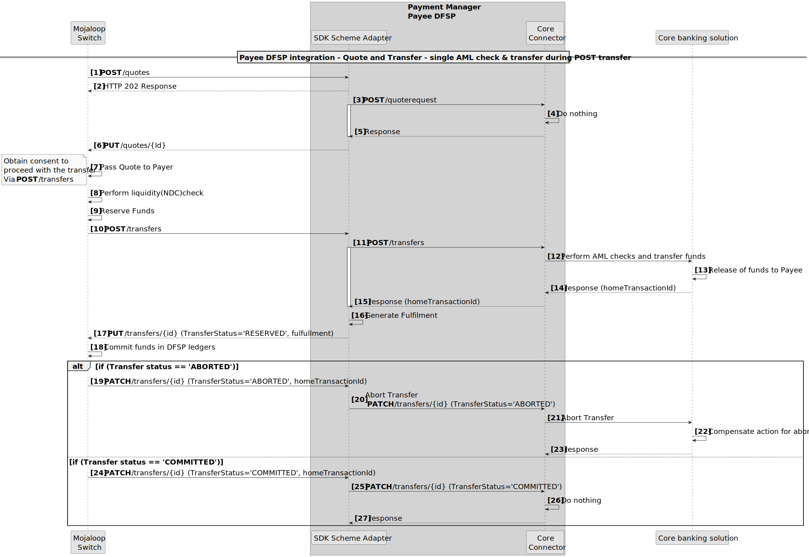

# Intégration des systèmes *core banking* à Mojaloop — modèles

L’intégration d’un système *core banking* dans un flux de transaction temps réel de type *push* peut poser des difficultés, en grande partie selon les API d’intégration fournies par l’éditeur. Ce document décrit à quoi devrait ressembler une intégration idéale, certaines limitations typiques des API éditeurs, les modèles de flux utilisés pour pallier ces limitations, et les risques associés.

## Modèles d’intégration côté DFSP payeur

Trois modèles peuvent être utilisés pour construire l’intégration du DFSP payeur :

1. Intégration de transfert en **trois phases**. Aligné sur les trois phases de transaction Mojaloop : découverte, accord et transfert.
1. **Intégration double API**. Ce modèle est détaillé dans le diagramme de séquence ci‑dessous. Il regroupe les phases Découverte et Accord en une première phase ; les résultats sont présentés au payeur pour confirmation ; la phase Transfert s’exécite ensuite en seconde phase.

1. **Intégration API unique**. Ce modèle est détaillé dans le diagramme de séquence ci‑dessous. Les trois phases sont regroupées en un seul appel de transfert synchrone.

::: tip Validation en deux temps
Tous les modèles d’intégration DFSP payeur prennent en charge une validation en deux temps (phase de réservation puis phase d’engagement).
:::

## Modèle idéal d’intégration côté DFSP bénéficiaire

Idéalement, les API de l’éditeur permettent :

1. D’effectuer les contrôles LBC/FT **avant** et **indépendamment** du transfert.
1. De calculer les frais d’un transfert **avant** et **indépendamment** du transfert.
1. D’exécuter le transfert en **deux phases** : une phase de réservation, puis une phase d’engagement.

Lorsque ces capacités existent dans l’API éditeur, une intégration « idéale » peut réduire les écarts de réconciliation lors d’erreurs inattendues et limiter le risque pour le DFSP.

### Modèle de flux idéal côté bénéficiaire

Ici, les contrôles LBC/FT et les frais sont traités en phase d’accord, et la phase de transfert comporte une réservation puis un engagement.

::: warning Limitation fréquente
Une limitation courante des API éditeurs est de regrouper toutes ces opérations en un **seul** appel, en une **seule** phase, pour effectuer le transfert.
:::

## API éditeur limitée à un seul appel

Si le système *core banking* ne propose qu’un **seul** appel API pour toutes les vérifications et phases du transfert, deux modèles méritent d’être envisagés.

1. Appeler le transfert sur la notification PATCH

Toute défaillance **après** la notification PATCH (étape **17**) peut entraîner une erreur de réconciliation. On peut y remédier en prévoyant des mécanismes de compensation (par exemple initier un transfert de remboursement en cas d’erreur après l’étape 17).

1. Appeler le transfert pendant la phase de transfert

Ce modèle est en général déconseillé, car l’annulation d’un transfert est souvent impossible. Il devient pertinent lorsque le transfert porte sur un compte interne (par exemple remboursement de prêt).
