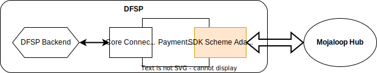
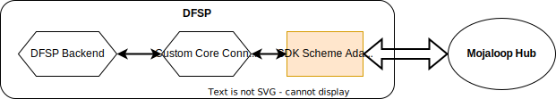
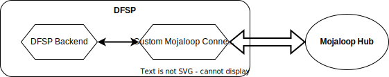

# SDK Scheme Adapter

Un *scheme adapter* est un service qui fait l’interface entre un *switch* conforme à l’API Mojaloop et une plateforme backend DFSP qui n’implémente pas nativement l’API Mojaloop.

L’API entre le *scheme adapter* et le backend DFSP est du HTTP synchrone, tandis que l’interface entre le *scheme adapter* et le *switch* est l’API Mojaloop native. Exception : les intégrations *bulk*, configurables en synchrone ou asynchrone.

Le **SDK-Scheme-Adapter** est maintenu par la communauté Mojaloop et sert de référence pour les bonnes pratiques de connexion d’un DFSP à l’API Mojaloop. Il est le plus souvent déployé directement dans la solution. Ci-dessous, les principaux modes d’adoption.

## Modèles d’adoption du SDK

Selon les règles du système, les DFSP interagissent avec le Hub Mojaloop central selon quatre modes courants. Ce qui suit résume le rôle du SDK-Scheme-Adapter dans chaque mode et les avantages pour les DFSP.

### 1. DFSP utilisant une solution tierce (ex. Payment Manager) intégrant le SDK Scheme Adapter

Plusieurs solutions tierces proposent support, outillage et intégrations vers les backends en s’appuyant sur le SDK-Scheme-Adapter pour une intégration synchrone (selon les pratiques recommandées Mojaloop) vers l’API Mojaloop.

*Payment Manager*, outil *open source*, en est un exemple. D’autres informations sont disponibles [ici](https://rtplex.io/). *Payment Manager* peut être déployé en SaaS ou en auto-hébergement.

- Le SDK Scheme Adapter est intégré directement à l’implémentation personnalisée.
- Maintenu par la communauté, il offre une trajectoire de montée de version vers les nouvelles versions de l’API Mojaloop.
- Solution normalisée pour une intégration rapide
- *Core Connector* co-développé avec des intégrateurs ou éditeurs bancaires
- L’UX *Payment Manager* couvre aussi les opérations métier et l’accueil sécurité avec automatisation de la maintenance

:::tip Composants open source
Ils sont sous licence Apache v2.0, choisie pour limiter les conflits avec les politiques d’entreprise. Sans contrainte « copy-left », les adoptants peuvent personnaliser des éléments (comme les *core connectors*) sans obligation de publication vers la communauté.  
:::

### 2. DFSP avec son propre Core Connector et le SDK Scheme Adapter

Le DFSP développe un *Core Connector* sur mesure entre son backend et le SDK Scheme Adapter Mojaloop, en s’appuyant sur les guides open source.

- SDK Scheme Adapter intégré directement à l’implémentation personnalisée.
- Trajectoire de montée de version grâce à la maintenance communautaire.
- Développement selon les guides *Core Connector* open source
- Support de la communauté Mojaloop
- Exploitation par les équipes techniques du DFSP

### 3. Solution de connexion Mojaloop entièrement développée par le DFSP

Aucune connexion standard imposée : le DFSP élabore sa propre connexion au Hub Mojaloop.

- Basé sur la documentation de conception open source
- Support de la communauté Mojaloop
- Exploitation par les équipes techniques du DFSP
- Le SDK Scheme Adapter peut servir uniquement de référence
- Cette implémentation dialogue directement avec les API asynchrones Mojaloop

