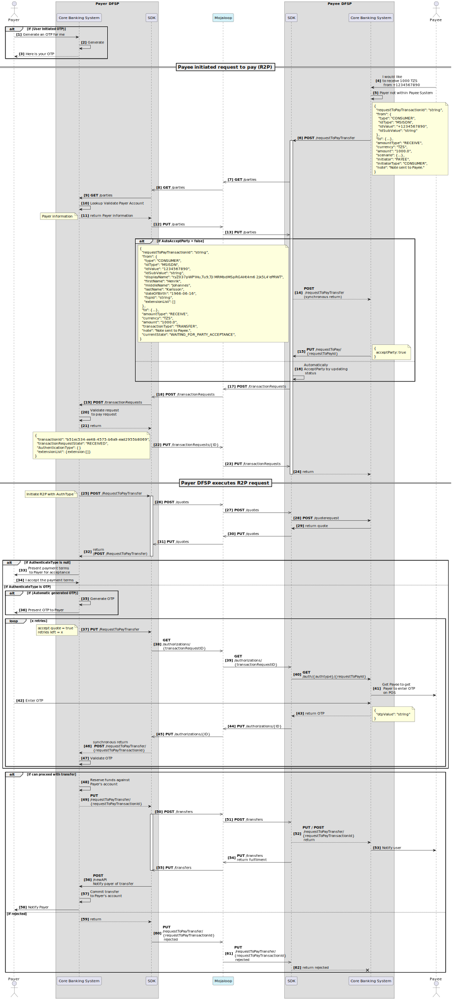

# Demande de paiement (R2P) — prise en charge du cas d’usage

Cette documentation décrit comment le SDK Scheme Adapter prend en charge le cas d’usage *request to pay* (demande de paiement). Ce cas d’usage est à la base de tous les transferts initiés par le bénéficiaire. La prise en charge exige que chaque DFSP sur un commutateur Mojaloop traite automatiquement un transfert dès qu’une demande de transfert est reçue et validée. L’intégration de ce cas dans le SDK Scheme Adapter est importante car elle réduit l’effort de développement de chaque DFSP lorsqu’un schéma impose le support par les participants. Ce cas d’usage est particulièrement intéressant d’un point de vue test, car il permet des tests à distance en tant que DFSP payeur et DFSP bénéficiaire.

> Points importants :
>
> 1. Toutes les fonctionnalités n’ont pas été entièrement testées et mises en conformité avec la spécification FSPIOP ; consulter l’épique suivante pour l’avancement : [#3344 — Améliorer le SDK Scheme Adapter pour le cas Request to Pay](https://github.com/mojaloop/project/issues/3344) ;
> 2. Il n’existe actuellement pas de tests de bout en bout couvrant l’ensemble des fonctionnalités, y compris l’authentification au moyen d’un OTP. Voir la [publication de la collection de cas de test du Testing Toolkit](https://github.com/mojaloop/testing-toolkit-test-cases/releases) pour ce qui est testé aujourd’hui : [testing-toolkit-test-cases@v15.0.1](https://github.com/mojaloop/testing-toolkit-test-cases/releases/tag/v15.0.1) ; et
> 3. Tous les cas d’échec n’ont peut‑être pas été entièrement implémentés. Se reporter à nouveau à l’épique [#3344](https://github.com/mojaloop/project/issues/3344).
>

## Diagramme de séquence

1. Le DFSP bénéficiaire démarre le cas R2P par un appel API **POST** `/RequestToPay`.
2. Le DFSP bénéficiaire peut, en option, valider le payeur.
3. Le DFSP payeur exécute la demande R2P par un appel **POST** `/requestToPayTransfer`. Si le type d’authentification n’est pas fourni dans cet appel, le flux suppose que le payeur confirmera le transfert et ses modalités via un **PUT** `/requestToPayTransfer` ; sinon, le flux d’authentification approprié est exécuté.

Le diagramme suivant résume ce flux.

## Diagramme de séquence détaillé

Ci‑dessous, un diagramme de séquence plus détaillé pour le cas demande de paiement et les appels API du SDK Scheme Adapter.

