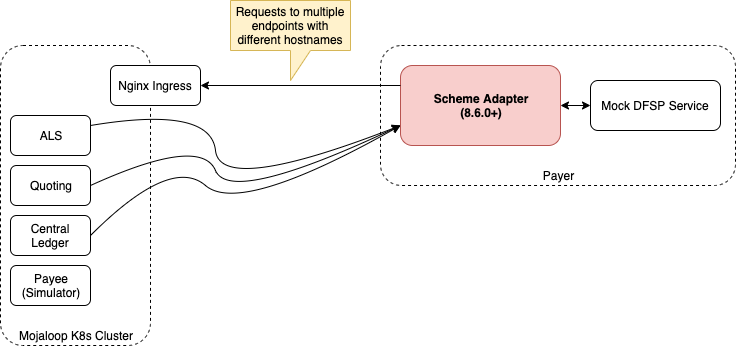

# Vue d’ensemble des scénarios d’usage testés du SDK

Un *scheme adapter* est un service qui fait l’interface entre un *switch* conforme à l’API Mojaloop et une plateforme backend DFSP qui n’implémente pas nativement l’API Mojaloop.

L’API entre le *scheme adapter* et le backend DFSP est du HTTP synchrone ; l’interface entre le *scheme adapter* et le *switch* est l’API Mojaloop native.

Ce document présente différentes configurations qu’un DFSP peut tester avec le *scheme adapter*.

# Scénarios

Scénarios testés et documentés :

* [[Scheme Adapter + Mock DFSP Backend] → [Scheme Adapter + Mojaloop Simulator]](./scheme-adapter-to-scheme-adapter/README.md)
* [[Scheme Adapter + Mock DFSP Backend] → [Cluster K8s local]](./scheme-adapter-and-local-k8s/README.md)
* [[Scheme Adapter + Mojaloop Simulator] → [Switch Mojaloop public compatible WSO2]](./scheme-adapter-and-wso2-api-gateway/README.md)

## [Scheme Adapter + Mock DFSP Backend] → [Scheme Adapter + Mojaloop Simulator]

Le *scheme adapter* peut être utilisé en combinaison avec les backends simulés déjà implémentés : *Mock DFSP Backend* et *Mojaloop Simulator*. Dépôts :

https://github.com/mojaloop/sdk-mock-dfsp-backend.git

https://github.com/mojaloop/mojaloop-simulator.git

L’idée est d’associer le *scheme adapter* et le backend simulé DFSP d’un côté, et le simulateur Mojaloop de l’autre — par exemple payeur et bénéficiaire. En suivant cet exemple, vous pouvez envoyer et recevoir des fonds d’un DFSP à l’autre.

Voir la [documentation détaillée](./scheme-adapter-to-scheme-adapter/README.md).

## [Scheme Adapter + Mock DFSP Backend] → [Cluster K8s local]

Si l’on souhaite intercaler un *switch* entre les DFSP, on peut simuler cet environnement avec un cluster Kubernetes local. Suivre le guide de déploiement : https://mojaloop.io/documentation/deployment-guide/

Voir la [documentation](./scheme-adapter-and-local-k8s/README.md).

## [Scheme Adapter + Mojaloop Simulator] → [Switch Mojaloop public compatible WSO2]

Avec accès à l’API Mojaloop WSO2, les tests décrits ici utilisent l’authentification par jeton et le chiffrement SSL du *scheme adapter* (contrairement aux deux scénarios précédents).

Voir la [documentation](./scheme-adapter-and-wso2-api-gateway/README.md).

