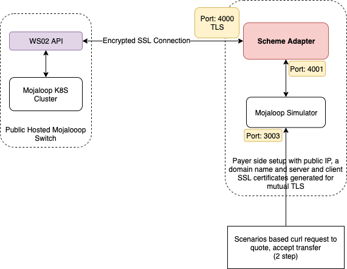

# SDK Scheme Adapter et passerelle API WSO2

Guide pour tester le *scheme adapter* contre une passerelle WSO2 publique avec TLS et authentification par jeton *bearer*.




## Prérequis

* Accès à l’API de production WSO2 avec jeton généré
* `sdk-scheme-adapter`
* `mojaloop-simulator`

## Générer le jeton d’accès et les URL WSO2

* Se connecter au *store* WSO2, menu *Applications* : créer une application et des clés d’accès si nécessaire.
* Menu *APIs* : s’abonner aux deux API ci-dessous (application et *tier* depuis la page de chaque API).
  * **Central Ledger Admin API** — création de FSP et configuration des endpoints (demander à l’équipe infra les URL HTTPS correctes sur le Hub).
  * **FSPIOP API** — recherche de compte, cotations et transferts.
* Tester des requêtes dans l’onglet *API Console* avec le jeton généré.
* Noter les URL des deux API et le jeton d’accès.


## Côté infrastructure

Points généralement gérés par l’équipe infrastructure (les contacter pour le détail) :

* Machine avec IP publique fixe et nom de domaine pointant vers cette IP pour recevoir les réponses.
* Certificats client/serveur (portail MCM, outil de *keychain*) pour la communication en *mutual* TLS.
* Publication des endpoints vers votre adresse HTTPS dans WSO2 / HAProxy.
* Mise en place de l’authentification JWS.
* **Déploiement AWS** (exemple)
  * Créer une instance EC2 (**t2.micro**, **Ubuntu 18.04**), connexion SSH avec la clé fournie par la console.
  * Installer Docker et Docker Compose sur l’instance.
  * Ouvrir le port TCP **4000** dans le groupe de sécurité ; associer une *Elastic IP* pour une adresse statique.
  * Associer un nom DNS (Route 53 ou autre) à cette IP — nécessaire car Let’s Encrypt ne délivre pas de certificats pour une IP seule.


## Configurer le Scheme Adapter avec Mojaloop Simulator

Cloner le simulateur :
```
git clone https://github.com/mojaloop/mojaloop-simulator.git
```
* Remplacer les certificats et clés dans `src/secrets` par ceux générés précédemment.

* Adapter `src/docker-compose.yml`, par exemple :

    ```
    version: '3'
    services:
      redis:
        image: "redis:5.0.4-alpine"
        container_name: redis
      backend:
        image: "mojaloop/mojaloop-simulator-backend"
        env_file: ./sim-backend.env
        container_name: ml_simulator
        ports:
          - "3000:3000"
          - "3001:3001"
          - "3003:3003"
        depends_on:
          - scheme-adapter
    
      scheme-adapter:
        image: "mojaloop/sdk-scheme-adapter:latest"
        env_file: ./scheme-adapter.env
        container_name: sa_sim2
        volumes:
          - ./secrets:/src/secrets
        ports:
          - "3500:3000"
          - "4000:4000"
        depends_on:
          - redis
    ```

* `src/sim-backend.env` :

    ```
    OUTBOUND_ENDPOINT=http://src_scheme-adapter_1:4001
    DFSP_ID=extpayerfsp
    ```

* `src/scheme-adapter.env` :

  ```
  MUTUAL_TLS_ENABLED=true
  CACHE_HOST=redis
  DFSP_ID=extpayerfsp
  BACKEND_ENDPOINT=ml_simulator:3000
  PEER_ENDPOINT=<URL API WSO2>
  AUTO_ACCEPT_QUOTES=true
  ```

Démarrer :
```
cd src/
docker-compose up -d
```

L’API de test du simulateur est sur le port **3003**.

## Provisionner le DFSP `extpayerfsp` avec les bons endpoints

Créer un FSP (nom libre, ex. `extpayerfsp`).

Utiliser la section d’intégration FSP de la collection Postman `OSS-New-Deployment-FSP-Setup` — dépôt https://github.com/mojaloop/postman.

* Dupliquer l’environnement `Mojaloop-Local` et ajuster :
  * `payerfsp` → `extpayerfsp`
  * `HOST_ML_API_ADAPTER`, `HOST_ML_API`, `HOST_SWITCH_TRANSFERS`, `HOST_ACCOUNT_LOOKUP_SERVICE`, `HOST_QUOTING_SERVICE` → l'endpoint FSPIOP WSO2
  * `HOST_CENTRAL_LEDGER` → API d’administration des services centraux WSO2
  * `HOST_CENTRAL_SETTLEMENT` → règlement central WSO2 (optionnel pour ces tests)
  * `HOST_SIMULATOR` et `HOST_SIMULATOR_K8S_CLUSTER` → `https://<votre_domaine>:4000`
* Dans *FSP Onboarding*, remplacer les URL `payerfsp` par `extpayerfsp`.
* Pour tout le dossier *Payer FSP Onboarding* : authentification *Bearer Token* avec le jeton WSO2 ; URL en HTTPS fournies par l’infra.
* Exécuter le dossier *Payer FSP Onboarding* avec le nouvel environnement.

Un passage à 100 % valide la création du FSP et la configuration des endpoints.

## Provisionner `payeefsp` et enregistrer un participant (simulateur MSISDN)

Le simulateur côté *switch* inclut généralement `payeefsp` ; enregistrer un participant (numéro) au choix.

Référence Postman : `p2p_happy_path SEND QUOTE / Register Participant {{pathfinderMSISDN}} against MSISDN Simulator for PayeeFSP` dans la collection `Golden_Path`.

La requête envoie un `POST` sur `<HOST_ACCOUNT_LOOKUP_SERVICE>/participants/MSISDN/<nouveau_numero>` avec le corps et les en-têtes requis, par exemple :
```
{
    "fspId": "payeefsp",
    "currency": "USD"
}
```

## Envoyer des fonds

### En une étape

Activer `AUTO_ACCEPT_QUOTES` et `AUTO_ACCEPT_PARTY` dans `scheme_adapter.env`.

```
curl -X POST \
  "http://localhost:3003/scenarios" \
  -H 'Content-Type: application/json' \
  -d '[
    {
        "name": "scenario1",
        "operation": "postTransfers",
        "body": {
            "from": {
                "displayName": "From some person name",
                "idType": "MSISDN",
                "idValue": "44123456789"
            },
            "to": {
                "idType": "MSISDN",
                "idValue": "919848123456"
            },
            "amountType": "SEND",
            "currency": "USD",
            "amount": "100",
            "transactionType": "TRANSFER",
            "note": "testpayment",
            "homeTransactionId": "123ABC"
        }
    }
]'

```

### En deux étapes

Demander d’abord une cotation, puis accepter après vérification des frais et de la partie :

```
curl -X POST \
  "http://localhost:3003/scenarios" \
  -H 'Content-Type: application/json' \
  -d '[
    {
        "name": "scenario1",
        "operation": "postTransfers",
        "body": {
            "from": {
                "displayName": "From some person name",
                "idType": "MSISDN",
                "idValue": "44123456789"
            },
            "to": {
                "idType": "MSISDN",
                "idValue": "9848123456"
            },
            "amountType": "SEND",
            "currency": "USD",
            "amount": "100",
            "transactionType": "TRANSFER",
            "note": "testpayment",
            "homeTransactionId": "123ABC"
        }
    },
    {
        "name": "scenario2",
        "operation": "putTransfers",
        "params": {
            "transferId": "{{scenario1.result.transferId}}"
        },
        "body": {
            "acceptQuote": true
        }
    }
]'

```
