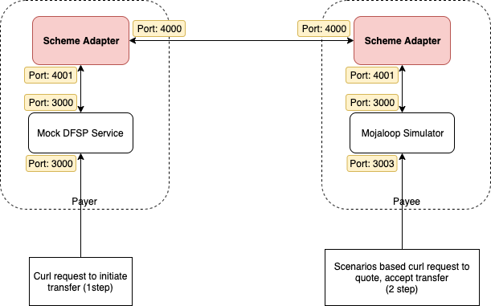

# Test Scheme Adapter vers Scheme Adapter

Documentation pour les DFSP qui souhaitent tester un transfert d’un *scheme adapter* vers un autre, en s’appuyant sur le *mock backend* et les services du simulateur Mojaloop.



## Prérequis

* Mojaloop Simulator
* Service *DFSP mock backend*
* Le *scheme adapter* est déjà inclus dans les deux *docker-compose* ci-dessous

## Configuration et démarrage des services

L’idée est d’exécuter en parallèle les deux *docker-compose*. Pour éviter les conflits, éditez chaque `docker-compose.yml` et fixez explicitement les noms de conteneurs.

### Service Mojaloop Simulator

Cloner le dépôt du simulateur Mojaloop :
```
git clone https://github.com/mojaloop/mojaloop-simulator.git
```
* Modifier `src/docker-compose.yml` et ajouter les `container_name` pour tous les services — voir l’exemple :

```
version: '3'
services:
  redis1:
    image: "redis:5.0.4-alpine"
    container_name: redis1
  sim:
    image: "mojaloop-simulator-backend"
    build: ../
    env_file: ./sim-backend.env
    container_name: ml_sim1
    ports:
      - "13000:3000"
      - "3001:3001"
      - "3003:3003"
    depends_on:
      - scheme-adapter
  scheme-adapter:
    image: "mojaloop/sdk-scheme-adapter:latest"
    env_file: ./scheme-adapter.env
    container_name: sa_sim1
    ports:
      - "13500:3000"
      - "14000:4000"
    depends_on:
      - redis1
```

* Modifier `src/sim-backend.env` et pointer vers le bon nom de conteneur du *scheme adapter* :

```
OUTBOUND_ENDPOINT=http://sa_sim1:4001
```

* Modifier `src/scheme-adapter.env` avec les noms du second *scheme adapter* et du simulateur, par exemple :

```
DFSP_ID=payeefsp
CACHE_HOST=redis1
PEER_ENDPOINT=sa_sim2:4000
BACKEND_ENDPOINT=ml_sim1:3000
AUTO_ACCEPT_PARTY=true
AUTO_ACCEPT_QUOTES=true
VALIDATE_INBOUND_JWS=false
VALIDATE_INBOUND_PUT_PARTIES_JWS=false
JWS_SIGN=true
JWS_SIGN_PUT_PARTIES=true

```

Puis lancer :
```
cd src/
docker-compose up -d
```

L’API de test du simulateur est alors disponible sur le port **3003**.

Ajouter une partie au simulateur (adapter les champs si besoin) :
```
curl -X POST "http://localhost:3003/repository/parties" -H "accept: */*" -H "Content-Type: application/json" -d "{\"displayName\":\"Test Payee1\",\"firstName\":\"Test\",\"middleName\":\"\",\"lastName\":\"Payee1\",\"dateOfBirth\":\"1970-01-01\",\"idType\":\"MSISDN\",\"idValue\":\"9876543210\"}"
```

Vérifier les parties :
```
curl -X GET "http://localhost:3003/repository/parties" -H "accept: */*"
```

Ensuite, configurer la seconde instance (*scheme adapter* + *mock DFSP*).

### Service DFSP Mock Backend

Le *mock backend* est une implémentation minimale d’exemple ; seules des fonctions de base sont prises en charge.

Cloner :
```
git clone https://github.com/mojaloop/sdk-mock-dfsp-backend.git
```

Éditer `src/docker-compose.yml`, `src/backend.env` et `src/scheme-adapter.env` et définir les noms de conteneurs — voir :

docker-compose.yml
```
version: '3'
services:
  redis2:
    image: "redis:5.0.4-alpine"
    container_name: redis2
  backend:
    image: "mojaloop/sdk-mock-dfsp-backend"
    env_file: ./backend.env
    container_name: dfsp_mock_backend2
    ports:
      - "23000:3000"
    depends_on:
      - scheme-adapter2

  scheme-adapter2:
    image: "mojaloop/sdk-scheme-adapter:latest"
    env_file: ./scheme-adapter.env
    container_name: sa_sim2
    depends_on:
      - redis2
```
scheme-adapter.env
```
DFSP_ID=payerfsp
CACHE_HOST=redis2
PEER_ENDPOINT=sa_sim1:4000
BACKEND_ENDPOINT=dfsp_mock_backend2:3000
AUTO_ACCEPT_PARTY=true
AUTO_ACCEPT_QUOTES=true
VALIDATE_INBOUND_JWS=false
VALIDATE_INBOUND_PUT_PARTIES_JWS=false
JWS_SIGN=true
JWS_SIGN_PUT_PARTIES=true

```

backend.env
```
OUTBOUND_ENDPOINT=http://sa_sim2:4001
```

Démarrer :
```
cd src/
docker-compose up -d
```

## Essayer un envoi de fonds

Envoyer des fonds depuis `payerfsp` (*Mock DFSP*) vers un MSISDN présent chez `payeefsp` (simulateur Mojaloop), via le *scheme adapter*.

Exemple d’appel vers le *Mock DFSP* :
```
curl -X POST \
  http://localhost:23000/send \
  -H 'Content-Type: application/json' \
  -d '{
    "from": {
        "displayName": "John Doe",
        "idType": "MSISDN",
        "idValue": "123456789"
    },
    "to": {
        "idType": "MSISDN",
        "idValue": "9876543210"
    },
    "amountType": "SEND",
    "currency": "USD",
    "amount": "100",
    "transactionType": "TRANSFER",
    "note": "test payment",
    "homeTransactionId": "123ABC"
}'
```

La réponse doit indiquer un `currentState` à **COMPLETED**.
