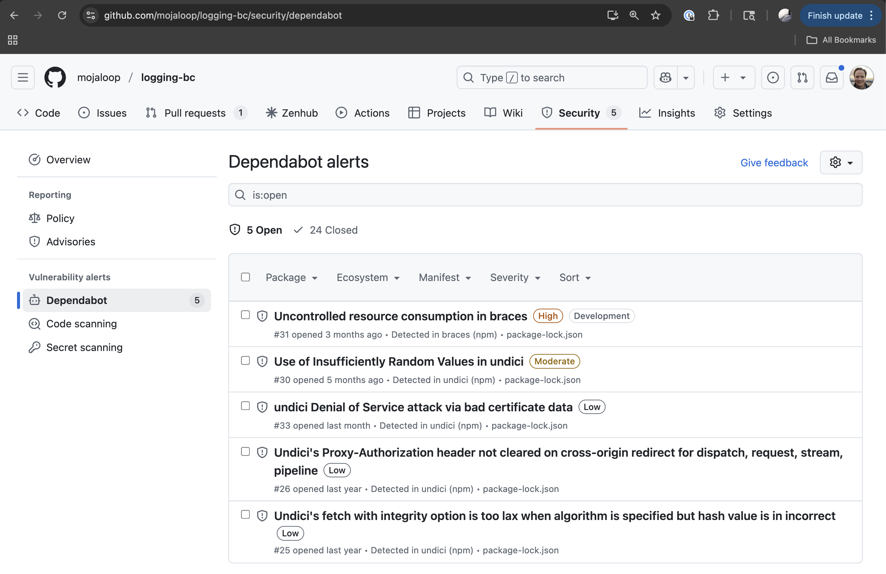
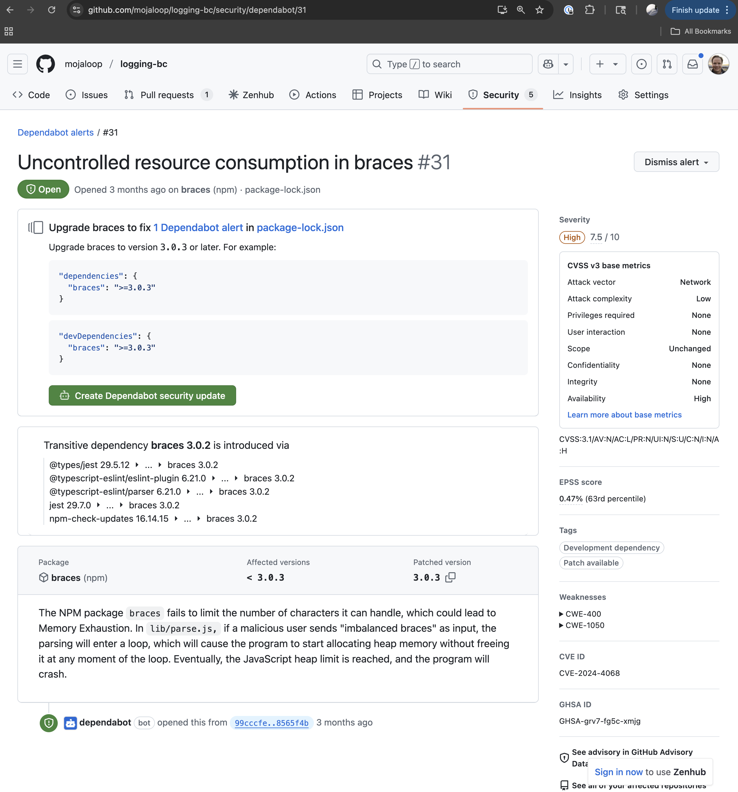
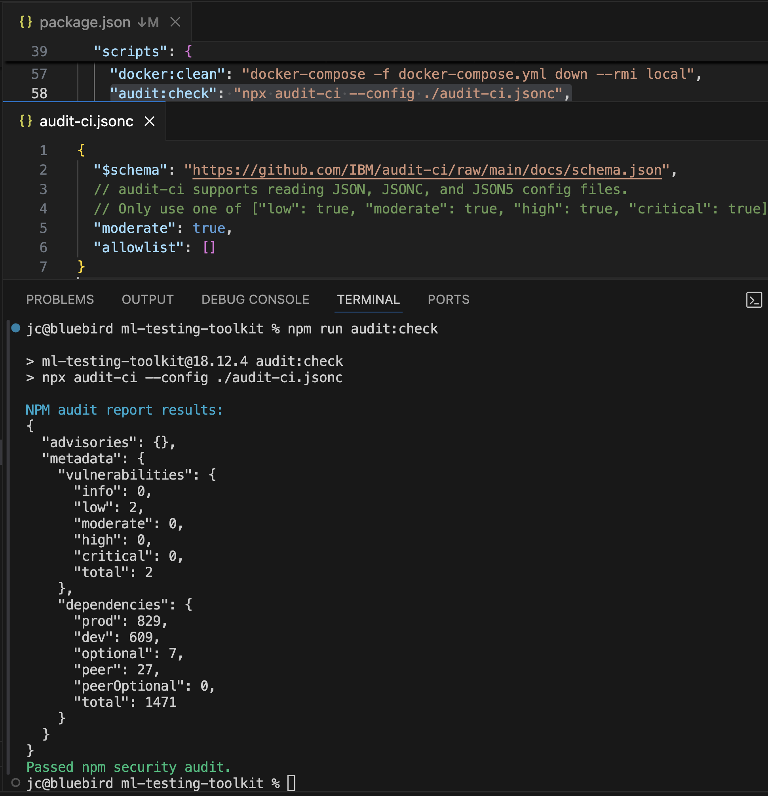
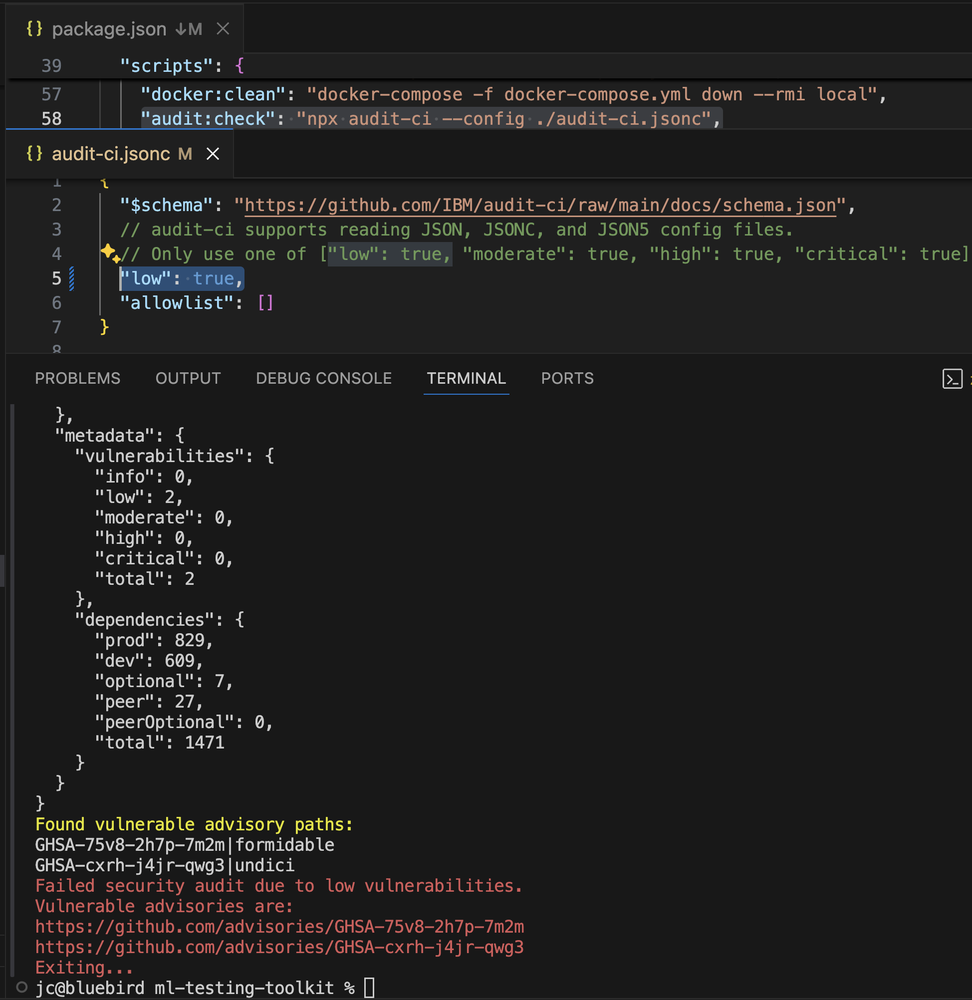
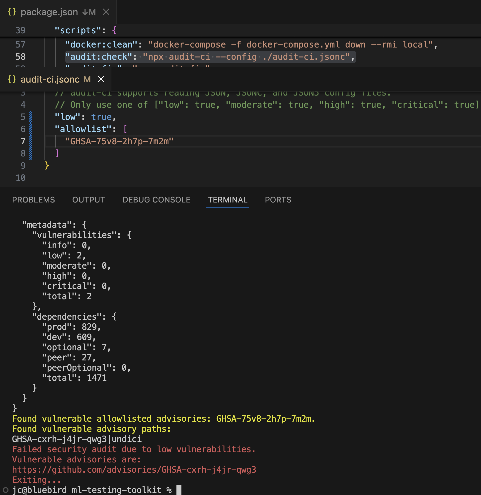
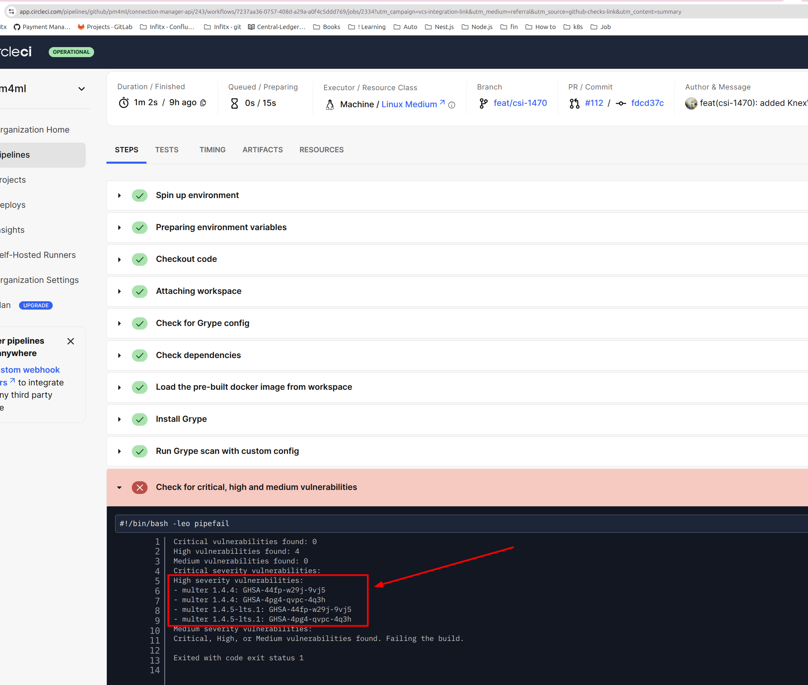
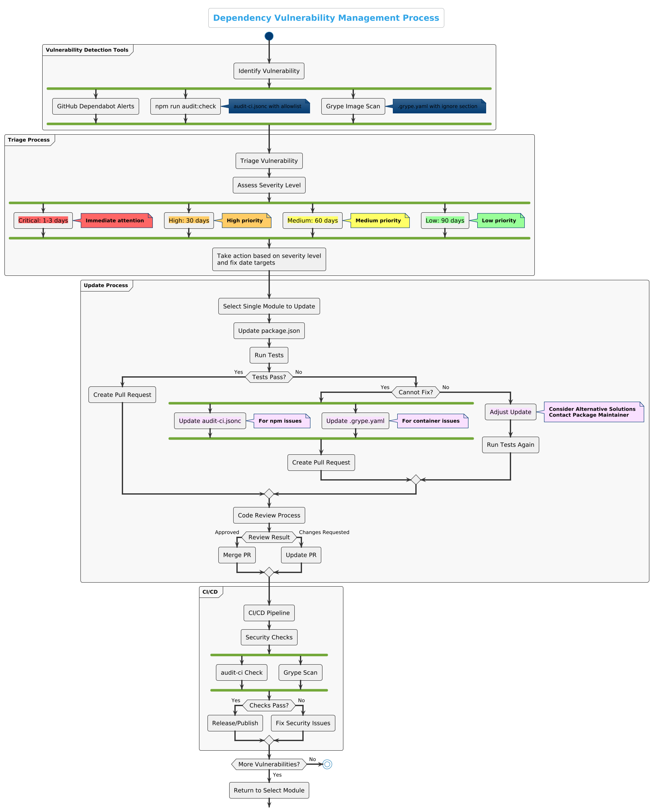

# Guide de gestion des vulnérabilités de dépendances Mojaloop

Ce guide décrit le processus de gestion des vulnérabilités de sécurité dans les dépendances des dépôts GitHub de l'organisation Mojaloop.

Ce guide se concentre principalement sur les vulnérabilités des dépendances. Pour les vulnérabilités découvertes dans le code source propre à Mojaloop (et non dans les dépendances), veuillez envoyer des informations détaillées par email à security@mojaloop.io et suivre la politique de Divulgation Coordonnée des Vulnérabilités (CVD).

La politique CVD de Mojaloop prévoit un processus structuré pour le signalement, la validation et la remédiation des vulnérabilités dans le code Mojaloop. Elle garantit une divulgation responsable qui équilibre le besoin de protéger les utilisateurs tout en fournissant des informations transparentes sur les problèmes de sécurité. Cette politique inclut des délais clairs pour la réponse, la validation, la remédiation et la divulgation publique, permettant à l’équipe Sécurité de Mojaloop de traiter les vulnérabilités de façon coordonnée et d’en minimiser le risque pour les adoptants et utilisateurs du logiciel.

## Table des matières

- [Résumé exécutif](#executive-summary)
- [Vue d'ensemble](#overview)
- [Guide de démarrage rapide](#quickstart-guide)
- [Guide détaillé](#detailed-guide)
  - [1. Comprendre ce qu’est une vulnérabilité et où les trouver](#1-understanding-what-is-a-vulnerability-and-where-to-find-them)
  - [2. Flux de gestion pour les mises à jour de vulnérabilités de dépendances](#2-processflow-for-handling-dependency-vulnerability-updates)
  - [3. Guide pratique pour les mises à jour de package.json](#3-practical-guide-to-packagejson-updates)
  - [4. Bonnes pratiques de revue de code pour les PRs de sécurité](#4-code-review-best-practices-for-security-prs)
  - [5. Intégration des développeurs et formation sur la gestion des vulnérabilités de dépendances](#5-developer-onboarding-and-dependency-vulnerability-management-education)
  - [6. Amélioration continue](#6-continuous-improvement)
  - [7. Conclusion](#7-conclusion)
- [Outils et ressources](#tools-and-resources)
- [Documentation associée](#related-documentation)

## Résumé exécutif

Ce guide propose une approche structurée pour le traitement des vulnérabilités de sécurité dans les dépendances des dépôts Mojaloop. Il répond au besoin actuel d’un processus standardisé pouvant aider les développeurs à comprendre les rapports de vulnérabilités (notamment les alertes GitHub Dependabot, résultats de npx audit et des scans grype), à appliquer les correctifs appropriés et à prioriser les mises à jour de sécurité à travers l’ensemble de la base de code.

## Vue d’ensemble

Le processus de gestion des vulnérabilités des dépendances de Mojaloop vise à :
- Identifier les vulnérabilités de sécurité dans les dépendances et le code
- Évaluer l’impact et la sévérité des vulnérabilités
- Prioriser les efforts de remédiation
- Suivre et vérifier les correctifs
- Maintenir la conformité en matière de sécurité

## Guide de démarrage rapide

Ce guide de démarrage rapide fournit les étapes essentielles pour la gestion des vulnérabilités dans les dépôts Mojaloop sans informations préalables. Pour des explications détaillées, voir les sections complètes ci-après.

### 1. Détecter les vulnérabilités

- Lancez `npm run audit:check` pour identifier les vulnérabilités des packages npm
- Vérifiez les alertes GitHub Dependabot dans l’onglet Sécurité de votre dépôt (si vous avez accès à l’onglet Sécurité)
- Utilisez Grype pour analyser les images de conteneurs, déclenché automatiquement si vous utilisez Mojaloop orb pour CircleCI et le rapport peut être consulté sur CircleCI (si vous avez accès à CircleCI)

### 2. Évaluer et Prioriser

- **Critique** : Corrigez sous 1 à 3 jours ouvrés
- **Élevé** : Corrigez sous 30 jours
- **Moyen** : Corrigez sous 60 jours
- **Faible** : Corrigez sous 90 jours

### 3. Processus de correction

1. Agir selon la sévérité et les dates cibles de correction
2. Sélectionnez un seul module à mettre à jour
3. Mettez à jour la dépendance vulnérable dans package.json
4. Exécutez les tests comme indiqué dans le README du dépôt pour vérifier la fonctionnalité
5. Si les tests passent, créez une pull request
6. Si les tests échouent et que vous ne pouvez pas corriger :
   - Ajoutez à la allowlist dans audit-ci.jsonc (pour les packages npm)
   - Ajoutez à la section ignore dans .grype.yaml (pour les vulnérabilités en conteneur)
7. Incluez tous les détails sur la vulnérabilité corrigée dans la PR

### 4. Modèle de PR

```markdown
## Correction de sécurité : [GHSA-ID ou CVE-ID]

### Détails de la vulnérabilité
- Sévérité : [Critique/Élevé/Moyen/Faible]
- Package affecté : [nom du package]
- Versions vulnérables : [plage de versions]
- Version corrigée : [numéro de version]

### Description
Brève description de la vulnérabilité et de son impact potentiel.

### Modifications
- Mise à jour de [nom du package] de [ancienne version] à [nouvelle version]

### Tests
- [X] Tests unitaires réussis
- [X] Tests d’intégration réussis
- [X] Tests manuels effectués
```

### 5. Revue et fusion

- Veillez à ce que la mise à jour corrige correctement la vulnérabilité
- Vérifiez que les modifications dans package.json sont minimales
- Confirmez que tous les tests passent
- Contrôlez l’absence d’effets de bord inattendus
- Fusionnez après approbation

## Guide détaillé

Les sections suivantes apportent des explications complètes, des informations contextuelles et des procédures détaillées pour la gestion des vulnérabilités dans les dépôts Mojaloop.

## 1. Comprendre ce qu’est une vulnérabilité et où les trouver

Une vulnérabilité est identifiée par un identifiant CVE (Common Vulnerabilities and Exposures), qui est un identifiant standardisé pour les vulnérabilités de sécurité connues publiquement.

### Systèmes d’identifiants de vulnérabilité : CVE et GHSA

#### CVE (Common Vulnerabilities and Exposures)
Les CVE sont des identifiants standardisés pour les vulnérabilités de cybersécurité connues publiquement, maintenus par la société MITRE et financés par le département américain de la Sécurité intérieure. Chaque CVE a un identifiant unique au format CVE-YYYY-NNNNN (année-numéro).

#### GHSA (GitHub Security Advisory)
Les identifiants GHSA sont des identifiants spécifiques à GitHub utilisés dans la base de conseils de sécurité GitHub. Ils suivent le format GHSA-XXXX-YYYY-ZZZZ, où X, Y et Z sont des caractères alphanumériques.

#### Relation entre CVE et GHSA
- Un GHSA peut référencer un ou plusieurs CVE, car GitHub peut regrouper plusieurs vulnérabilités liées
- Tous les GHSAs n'ont pas un CVE correspondant, en particulier pour les vulnérabilités nouvellement découvertes
- GitHub assigne souvent un identifiant GHSA avant qu’un CVE ne soit attribué par MITRE
- Les deux systèmes décrivent les mêmes vulnérabilités mais peuvent contenir des informations légèrement différentes :
  - Les CVE sont la norme utilisée dans les outils et bases de données de sécurité
  - Les GHSAs contiennent souvent plus d’informations propres à l'écosystème et des conseils de remédiation pour les utilisateurs GitHub

#### Apparition des identifiants selon les différents outils

- **Alertes GitHub Dependabot** : Affichent à la fois les identifiants GHSA et CVE (lorsqu’un CVE est attribué)

  
  *Vue des alertes Dependabot dans GitHub Sécurité*
  
  
  *Alerte dependabot détaillée*

- **npm run audit:check** : Les résultats affichent les identifiants GHSA pour les vulnérabilités

  
  *Exécution du script npm run audit:check*
  
  
  *Augmentation du niveau de vulnérabilité accepté à low, précédemment moderate*

  
  *Allowlist d'un identifiant de vulnérabilité à ignorer lors de npm run audit:check*

- **Scan Grype** : Affiche les vulnérabilités portant des identifiants GHSA

  
  *Vulnérabilités détectées par Grype dans CircleCI*

#### Accéder aux informations détaillées d’une vulnérabilité

Les identifiants GHSA peuvent être utilisés comme URLs directes pour accéder à plus d’informations. Il suffit d’ajouter l’ID GHSA à l’URL de base des avis de sécurité GitHub :

```
https://github.com/[owner]/[repo]/security/advisories/[GHSA-ID]
```

ou utilisez l’URL générique de la base d’avis GitHub :

```
https://github.com/advisories/[GHSA-ID]
```

Par exemple, une vulnérabilité du package multer est accessible via :
https://github.com/expressjs/multer/security/advisories/GHSA-44fp-w29j-9vj5

De même, lorsqu’un CVE est attribué à une vulnérabilité, vous pouvez consulter son dossier officiel via :

```
https://www.cve.org/CVERecord?id=[CVE-ID]
```

Pour le même exemple multer, l’information CVE correspondante se trouve sur :
https://www.cve.org/CVERecord?id=CVE-2025-47935

#### Sources d’information sur les vulnérabilités

**Pages d’avis de sécurité GitHub :**
- Descriptions détaillées des vulnérabilités
- Versions affectées et corrigées
- ID CVE (lorsqu’attribués)
- Scores de sévérité (généralement CVSS)
- Conseils de remédiation
- Références à des issues et commits liés

**Pages d’enregistrement CVE :**
- Descriptions officielles des vulnérabilités
- Références vers des ressources liées
- Produits et versions affectés
- Informations standardisées sur la sévérité
- Informations d’attribution

Lors de l’investigation de vulnérabilités, il est souvent utile de consulter les deux sources, car elles peuvent contenir des informations complémentaires.

En travaillant sur des vulnérabilités Mojaloop, vous pouvez rencontrer les deux types d’identifiants :
- CVE dans les bulletins et outils généraux (npm audit)
- GHSA dans les alertes GitHub Dependabot et dans les fichiers de configuration .grype.yaml

La section des alertes Dependabot d’un dépôt GitHub est accessible dans l’onglet Sécurité > Alertes de vulnérabilité. Cliquez sur Dependabot pour obtenir la liste des alertes, puis sur une alerte pour voir le détail.

Note : Votre compte GitHub doit disposer de l’autorisation d’accès à l’onglet Sécurité et Dependabot doit être activé sur le dépôt en question. Contactez un administrateur GitHub Mojaloop si besoin.

### 1.1 Niveaux de sévérité des vulnérabilités

Les vulnérabilités sont classées selon quatre niveaux de sévérité :

- **Critique** : Nécessite une attention immédiate. Généralement exécution de code à distance, contournement d’authentification ou autres failles graves menant à la compromission du système.
- **Élevé** : Vulnérabilités sérieuses à corriger avant la fin d’un incrément de programme (PI), cible de 30 jours. Elles peuvent inclure des vulnérabilités par injection, une désérialisation non sécurisée ou des failles de type cross-site scripting pouvant entraîner une exposition significative de données.
- **Moyen** : Risques modérés à corriger dans le PI en cours si possible, cible de 60 jours.
- **Faible** : Problèmes mineurs à faible risque à traiter si possible sous 90 jours.

**Note sur les identifiants CVE :** Quand un rapport de vulnérabilité ne mentionne pas de CVE, cela peut signifier :
1. La vulnérabilité vient d’être découverte (pas encore de CVE attribué)
2. Il s’agit d’un problème lié à l’implémentation spécifique au sein de votre projet
3. C’est une dépendance de développement qui n’affecte pas la production

L’absence de CVE ne signifie pas que la vulnérabilité n’est pas importante – elle doit tout de même être évaluée selon sa sévérité et son impact potentiel.

### 1.2 Comprendre les plages de versions dans les alertes Dependabot

Les plages de versions dans les alertes Dependabot indiquent quelles versions d’un package/dépendance sont affectées. Notez que dans une alerte Dependabot, le "package" correspond à une dépendance du package.json d’un projet NodeJS. Les dépendances et leurs packages suivent la gestion sémantique de version. Comprendre ces notations est crucial :

- **`<=M.m.p`** : Toutes les versions inférieures ou égales à la version spécifiée sont vulnérables.
  - Exemple : `<=1.2.3` signifie toutes les versions jusqu’à 1.2.3 inclus.

- **Plage `>M.m.p <M.m.p`** : Définit une plage de versions vulnérables entre deux seuils exclusifs.
  - Exemple : `>1.0.0 <1.2.0` signifie toutes les versions après 1.0.0 et avant 1.2.0.

Autres spécificateurs fréquents :

- **Caret (`^`)** : Permet les changements ne modifiant pas le chiffre non nul le plus à gauche.
  - Exemple : `^1.2.3` autorise toutes les versions à partir de 1.2.3 jusqu’à 2.0.0 non inclus.
  - Pour `^0.2.3`, versions de 0.2.3 à 0.3.0 non inclus.
  - Pour `^0.0.3`, versions de 0.0.3 à 0.0.4 non inclus.

- **Tilde (`~`)** : Permet les mises à jour du patch si une version mineure est spécifiée.
  - Exemple : `~1.2.3` autorise toute version de 1.2.3 jusqu’à 1.3.0 non inclus.

## Sources de vulnérabilité

Les vulnérabilités peuvent être introduites via :
1. Dépendances directes
2. Dépendances transitives
3. Environnements d’exécution
4. Composants d’infrastructure
5. Code personnalisé

## Détection et Évaluation

### Outils de détection des vulnérabilités

Mojaloop utilise plusieurs outils pour détecter les vulnérabilités :

1. **Alertes GitHub Dependabot**
   - Détection automatique des vulnérabilités dans GitHub
   - Informations détaillées sur les versions affectées et les correctifs
   - Disponible sous l’onglet Sécurité de GitHub
   - **Assets scannés :** dépendances NodeJS déclarées dans les package.json des dépôts GitHub

2. **npm audit via audit-ci**
   - S’exécute localement via `npm run audit:check`
   - Configurable via `audit-ci.jsonc` avec allowlist pour les problèmes connus
   - Intégré dans les pipelines CI/CD pour éviter le déploiement de code vulnérable
   - **Assets scannés :** dépendances NodeJS directes et transitives (package.json et package-lock.json)

3. **Scan d’images Grype**
   - Scanner de vulnérabilités d’images de conteneur
   - Configurable par `.grype.yaml` avec section d’ignorés pour soucis connus
   - Analyse les vulnérabilités dans les images conteneur et leurs dépendances
   - **Assets scannés :** images Docker, incluant les images de base, paquets OS installés et dépendances applicatives
   - NOTE : Grype scanne aussi les images Docker si le dépôt en produit, des vulnérabilités peuvent y figurer ; si oui, une mise à jour de l’image de base dans le Mojaloop CircleCI orb est nécessaire.

### Fichiers de configuration pour la gestion des vulnérabilités

1. **audit-ci.jsonc**
   - Contient une liste d’autorisation des vulnérabilités à ignorer temporairement
   - À utiliser si une vulnérabilité ne peut pas être corrigée immédiatement
   - Utilise les ID GHSA pour identifier les vulnérabilités à ignorer
   - Doit inclure une justification et un suivi pour chaque vulnérabilité autorisée
   - Exemple :
     ```json
     {
       "allowlist": [
         {
           "id": "GHSA-XXXX-YYYY-ZZZZ",
           "reason": "Pas encore de correctif, plan B en place, suivi sur issue #123"
         }
       ]
     }
     ```

2. **.grype.yaml**
   - Fichier de configuration pour le scan Grype
   - Contient une section ignore avec des ID GHSA
   - Utilisé pour les vulnérabilités spécifiques au conteneur non traitables immédiatement
   - Exemple :
     ```yaml
     ignore:
       - vulnerability: GHSA-XXXX-YYYY-ZZZZ
         package:
           name: nom-package
           version: 1.2.3
         until: "2023-12-31"
         reason: "Étude de solutions alternatives, pas exploitable dans notre contexte"
     ```

### Scan automatisé
- Scan régulier des dépendances via npm audit
- Scan des images conteneur
- Scan de vulnérabilités de l’infrastructure
- Analyse statique du code

### Revue manuelle
- Revues de code de sécurité
- Tests d’intrusion (pentest)
- Modélisation de menace
- Audits de conformité

## 2. Flux de gestion pour les mises à jour de vulnérabilités de dépendances

Le schéma suivant illustre le processus de gestion des vulnérabilités de dépendances pour les dépôts Mojaloop :



### 2.1 Processus standard

1. **Triage**
   - Révision régulière des alertes GitHub Dependabot.
   - Classification selon la sévérité (Critique, Élevé, Moyen, Faible).
   - Suivi des vulnérabilités dans un projet GitHub privé dédié aux issues de sécurité. Accès restreint, sur demande : contactez le comité Sécurité Mojaloop si besoin d’accès.

2. **Processus de mise à jour**
   - **Étape 1** : Choisissez un seul module (service Mojaloop ou librairie) avec vulnérabilité signalée.
   - **Étape 2** : Mettez à jour la dépendance incriminée dans le package.json.
   - **Étape 3** : Effectuez des tests de fumée pour garantir que la fonctionnalité n’est pas rompue. Voir le README du dépôt.
   - **Étape 4** : Si les tests sont OK, créez une pull request.
   - **Étape 5** : Proposez une PR pour chaque module avec un seul patch correctif de sécurité.
   - **Étape 6** : Ajoutez dans la PR les détails de la vulnérabilité corrigée : ID CVE, dépendances mises à jour dans package.json, et toute information contextuelle utile.

3. **Principes importants**
   - **Isolation** : Un correctif de vulnérabilité à la fois.
   - **Pas d’agrégation** : Aucun regroupement de correctifs de sécurité non liés.
   - **Historique propre** : Rebasez les commits pour garder l’historique propre.
   - **Tests systématiques** : Lancez systématiquement les tests requis (voir README).

### 2.2 Cadre de priorisation

- **Sévérité critique** : Attention immédiate ; objectif : 1 à 3 jours ouvrés.
- **Sévérité élevée** : Corriger avant la fin du PI actuel, cible 30 jours.
- **Sévérité moyenne** : Corriger avant la fin du PI actuel si possible, cible 60 jours.
- **Sévérité faible** : Traiter lors des cycles de maintenance courants, cible 90 jours.

### 2.3 Critères d’évaluation des vulnérabilités

Mojaloop suit les bonnes pratiques OpenSSF et OWASP. Les décisions finales relèvent du comité Sécurité Mojaloop.

Pour décider de corriger ou d’ignorer :
- Si un correctif existe, il doit être appliqué.
- Une vulnérabilité ne doit être ignorée ou ajoutée à la liste d’autorisation que si le correctif rompt des fonctionnalités existantes, ce qui doit être confirmé soit par l’échec des tests automatisés (tels que décrits dans le README du dépôt concerné), soit par des tests manuels.
- Pour les failles « zero-day », le comité Sécurité Mojaloop précisera la marche à suivre au cas par cas.

## 3. Guide pratique pour la mise à jour de package.json

### 3.1 Outils recommandés

- **npm run audit:check** : Pour rechercher les vulnérabilités ; le script doit aider à identifier les vulnérabilités et doit correspondre à celles listées dans Dependabot
  ```bash
  npm run audit:check
  ```

- **npm run dep:check & npm run dep:update** : Pour gérer les mises à jour de dépendances, attention aux modifications massives
- **.ncurc.yaml** : Pour déclarer les dépendances à exclure des upgrades (dernier recours)

### 3.2 Étapes pas à pas

1. **Identifier le package vulnérable** :
   ```bash
   npm audit
   ```

2. **Mettre à jour un package unique** :
   ```bash
   # Pour les dépendances directes
   npm update [nom-du-package]
   
   # Pour corriger une vulnérabilité spécifique
   npm run audit:fix

   # Pour les cas complexes qui cassent la compatibilité
   npm audit fix --force  # À utiliser avec précaution
   ```

3. **Tester la mise à jour :**
   ```bash
   npm test
   # Lancez aussi les autres tests projet
   ```

4. **Commit et création de PR :**
   ```bash
   git checkout -b fix/security-vulnerability-[CVE-ID]
   git add package.json package-lock.json
   git commit -m "fix: mise à jour [package] pour [CVE-ID]"
   git push origin fix/security-vulnerability-[CVE-ID]
   ```

### 3.3 Gestion des cas complexes

Quand `npm run audit:fix` ne résout pas :

1. **Dépendances sans correctifs disponibles :**
   - Vérifiez si la faille est réellement exploitable dans votre contexte.
   - Étudiez un remplacement.
   - Contactez le mainteneur du package.
   - Documentez la faille et l’évaluation du risque.

2. **Si la correction casse la fonctionnalité :**
   - Si les tests échouent, aucune solution immédiate :
     - Pour npm : Ajouter à la allowlist `audit-ci.jsonc`
     - Pour les conteneurs : Ajouter à la section ignore de `.grype.yaml`
   - Documentez la raison, le numéro d’issue, explication du risque, date cible de résolution et toute mesure compensatoire.

3. **Intégration CI/CD :**
   - Les contrôles de sécurité sont intégrés aux pipelines
   - Les vulnérabilités critiques font échouer le pipeline sauf si correctement ignorées
   - Toutes les vulnérabilités ignorées doivent être revues régulièrement
   - Les scans doivent détecter en continu de nouvelles vulnérabilités

### 3.4 Gestion des vulnérabilités des conteneurs

Pour les images Docker :

1. **Configuration Grype :**
   - Grype est utilisé pour scanner les images conteneur
   - Pour la configuration détaillée, voir [documentation Mojaloop CI Config Orb](https://github.com/mojaloop/ci-config-orb-build?tab=readme-ov-file#vulnerability-image-scan-configuration)

2. **Sécurité de l’image de base :**
   - Les services Mojaloop utilisent généralement les images Node.js Alpine
   - L’image de base courante : [node:22.15.1-alpine3.21](https://hub.docker.com/layers/library/node/22.15.1-alpine3.21/images/sha256-d1068d8b737ffed2b8e9d0e9313177a2e2786c36780c5467ac818232e603ccd0)
   - Cette page liste les vulnérabilités de l’image de base et le scan grype les détecte aussi.

## Stratégie de mise à jour

Pour corriger les vulnérabilités :
1. Suivez la séquence de mise à jour du dépôt ([Guide de mise à jour Mojaloop](./mojaloop-repository-update-guide.md))
2. Priorisez les failles critiques et à haute sévérité
3. Considérez l’impact sur les services dépendants
4. Testez en profondeur hors production
5. Planifiez des mises à jour coordonnées entre les services concernés

## 4. Bonnes pratiques de revue de code pour les PRs de sécurité

1. **PR focalisées** : Chaque PR doit traiter une seule vulnérabilité.

2. **Informations requises dans les PRs** :
   - ID CVE ou identifiant de vulnérabilité
   - Niveau de sévérité
   - Description de la vulnérabilité
   - Description du correctif
   - Tests effectués
   - Évaluation de l’impact potentiel

3. **Checklist de review** :
   - Vérifiez que la mise à jour corrige effectivement la faille
   - Vérifiez que les modifs à package.json sont minimales
   - Vérifiez que tous les tests passent
   - Confirmez que les tests de fumée décrits dans le README ont été suivis
   - Vérifiez qu’il n’y a pas d’effets de bord inattendus

4. **Modèle de description de PR** :
   ```markdown
   ## Correction de sécurité : [CVE-ID]
   
   ### Détails de la vulnérabilité
   - Sévérité : [Critique/Élevé/Moyen/Faible]
   - Package concerné : [nom-du-package]
   - Plages de versions vulnérables : [plage]
   - Version corrigée : [numéro]
   
   ### Description
   Brève description de la vulnérabilité et de son impact potentiel.
   
   ### Modifications
   - Mise à jour de [nom-du-package] de [ancienne version] à [nouvelle version]
   
   ### Tests
   - [X] Tests unitaires réussis
   - [X] Tests d’intégration réussis
   - [X] Tests manuels réalisés
   - [X] Utilisation du dispositif de tests (test harness) sur le poste de travail du développeur
   - [X] Harness de tests CI/CD ou tests Golden Path effectifs
   
   ### Notes additionnelles
   Toutes autres informations pertinentes.
   ```

## Signalement et communication

- Centralisez le suivi des vulnérabilités et limitez l’accès aux besoins
- Documentez tous les problèmes identifiés
- Suivez l’avancée des corrections
- Communiquez sur l’état aux parties prenantes
- Respectez les principes de divulgation responsable

## 5. Intégration des développeurs et formation gestion des vulnérabilités

Pour utiliser la gestion des vulnérabilités comme point de départ pour les nouveaux devs de Mojaloop :

### 5.1 Ressources pédagogiques

- Créer une section dédiée dans la doc pour la gestion des vulnérabilités
- Inclure des exemples pratiques et des tutoriels pas-à-pas
- Proposer des liens vers les ressources Node.js sécurité

### 5.2 Processus de mentorat

1. **Vulnérabilités simples assignées** : Débutez les nouveaux devs par la correction de failles à faible priorité.
2. **Reviews en binôme** : Les PRs des nouveaux sont relues par des développeurs expérimentés.
3. **Montée en autonomie** : Confiez progressivement des tâches de sécurité plus complexes.

### 5.3 Mise à jour de la documentation

- Maintenir une base de connaissances sur les vulnérabilités fréquentes dans le code
- Documenter les leçons apprises lors des corrections précédentes
- Mettre à jour ce guide de gestion des vulnérabilités au fil de l’évolution des processus

### 5.4 La sécurité dans le développement quotidien

Lors de l’intégration, ce document sera partagé et la conformité vérifiée lors des revues de code (PRs). Plusieurs outils open source d’analyse de sécurité IDE sont à l’étude pour améliorer encore le flux de travail des développeurs.

## Meilleures pratiques

1. **Prévention**
   - Mises à jour régulières des dépendances
   - Pratiques de développement centrées sur la sécurité
   - Tests de sécurité automatisés
   - Bonnes pratiques de codage sécurisé

2. **Réponse**
   - Voies d’escalade claires
   - Délais de réponse définis
   - Revues de sécurité régulières
   - Supervision continue

3. **Documentation**
   - Suivi des vulnérabilités
   - Procédures de remédiation
   - Rapports d’incidents de sécurité
   - Leçons apprises

## 6. Amélioration continue

### 6.1 Revues de sécurité régulières

- Revues hebdomadaires des nouveaux rapports de vulnérabilités
- Suivi des métriques de délai de résolution par sévérité
- Comparatif avec les standards du secteur

### 6.2 Automatisation

- Étudier l’adoption de DefectDojo (open source) pour centraliser et automatiser la gestion du cycle de vie des vulnérabilités
  - [Communauté DefectDojo](https://defectdojo.com/community)
  - [Dépôt GitHub DefectDojo](https://github.com/DefectDojo/django-DefectDojo)
  - [Projet OWASP DefectDojo](https://owasp.org/www-project-defectdojo/)
  - [Documentation DefectDojo](https://docs.defectdojo.com/en/about_defectdojo/about_docs/)
- Implémenter des hooks pre-commit pour la vérification des dépendances
- Planifier des jobs réguliers d’audits de sécurité

### 6.3 Partage de connaissances

- Rédiger et maintenir documentation et formation sur la gestion des vulnérabilités
- Créer des vidéos pas-à-pas pour corriger les failles courantes
- Établir un programme de ‘security champions’ dans la communauté

## 7. Conclusion

En appliquant cette approche structurée, la communauté Mojaloop assure une gestion cohérente, rapide et efficace des problèmes de sécurité. Ce processus renforce la sécurité du code tout en offrant une excellente porte d’entrée pour intégrer de nouveaux développeurs et renforcer la culture sécurité.

La gestion des vulnérabilités de dépendances ne se limite pas à corriger des problèmes : il s’agit avant tout de développer une culture de la sécurité.

## Outils et ressources

- [Qu’est-ce qu’un CVE ?](https://www.ibm.com/think/topics/cve)
- [Documentation Mojaloop](https://docs.mojaloop.io/)
- [Node.js – Bonnes pratiques de sécurité](https://nodejs.org/en/learn/getting-started/security-best-practices)
- [Documentation npm Audit](https://docs.npmjs.com/cli/v10/commands/npm-audit)
- [Spécification SemVer](https://semver.org/)
- [Calculateur npm Semver](https://semver.npmjs.com/)
- [Fonctionnalités de sécurité GitHub](https://docs.github.com/en/code-security)
- [Guide rapide GitHub Dependabot](https://docs.github.com/en/code-security/getting-started/dependabot-quickstart-guide)
- [Mojaloop CI Config - Configuration du scan de vulnérabilité image](https://github.com/mojaloop/ci-config-orb-build?tab=readme-ov-file#vulnerability-image-scan-configuration)
- [Communauté DefectDojo](https://defectdojo.com/community)
- [Dépôt GitHub DefectDojo](https://github.com/DefectDojo/django-DefectDojo)
- [Projet OWASP DefectDojo](https://owasp.org/www-project-defectdojo/)
- [Documentation DefectDojo](https://docs.defectdojo.com/en/about_defectdojo/about_docs/)
- npm audit
- GitHub Security Advisories
- Outils de scan de conteneur
- Outils d’analyse statique
- Systèmes de surveillance de sécurité

## Documentation associée

- [Guide de stratégie de mise à niveau](./upgrade-strategy-guide.md)
- [Guide de mise à jour des dépôts Mojaloop](./mojaloop-repository-update-guide.md)
- [Dépannage du déploiement](./deployment-troubleshooting.md)
- [Politique de Divulgation Coordonnée des Vulnérabilités Mojaloop](https://docs.mojaloop.io/community/contributing/cvd.html) 